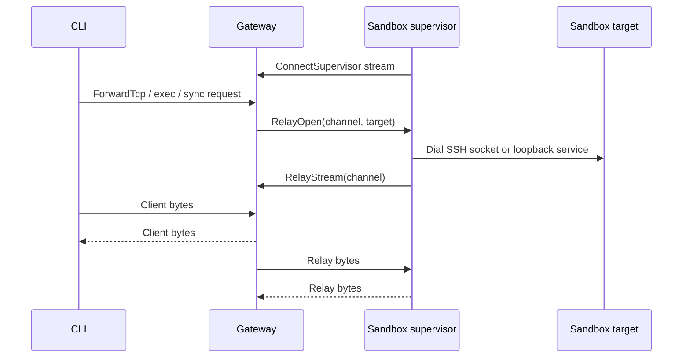

# Gateway

The gateway is the OpenShell control plane. It exposes the API used by the CLI,
SDK, and TUI; persists platform state; manages provider credentials and
attachments; and asks compute runtimes to create or delete sandbox workloads.

## Responsibilities

- Authenticate clients and sandbox supervisor sessions.
- Serve gRPC APIs for sandbox lifecycle, provider management, policy updates,
  settings, logs, watch streams, and relay forwarding.
- Serve HTTP endpoints for health, WebSocket tunnels, and edge-auth flows.
- Persist domain objects in SQLite or Postgres.
- Resolve endpoint-bound provider environments for sandbox supervisors.
- Coordinate supervisor relay sessions for connect, exec, file sync, and
  service forwarding.
- Persist the canonical main-process instance ID and normalized exit code on
  sandbox status. Exit code zero transitions the sandbox to `Completed`;
  nonzero results transition it to `Error/MainProcessFailed`. Infrastructure
  failures also use `Error`, with a distinct reason and no fabricated command
  result.

The gateway does not enforce agent network policy at request time. That happens
inside each sandbox, where the supervisor and proxy can observe local process
identity.

The live supervisor session is the readiness authority for its main-process
instance. The supervisor reports its normalized result through the
sandbox-authenticated `ReportMainProcessExit` RPC, and the gateway rejects
results from stale instance IDs. Foreground creation carries a one-shot
attachment intent to the process supervisor. The supervisor durably reports the
result immediately, accepts that declared SSH attachment even when the process
has already exited, sends the retained output and exit status, and waits for the
peer's channel close before finalizing the result for ephemeral cleanup.
Detached commands carry no attachment intent, so they finalize and exit
immediately without a grace period. Finalization is persisted separately from
the exit result; the gateway deletes an ephemeral sandbox only after the
finalized supervisor session disconnects.

Local Docker development builds the supervisor image separately from the
`openshell-sandbox` workload runtime. Cross-platform runtime extraction uses
the sandbox image, which exports `/openshell-sandbox`.

## Configuration Boundary

The gateway accepts exactly schema version 2. Missing, legacy, and future
versions fail before runtime construction, and driver settings belong only to
`[openshell.drivers.<name>]`. The process does not migrate legacy files.
Package lifecycle code may replace an exact package-generated v1 default, but
it preserves edited configurations for explicit operator migration.

Gateway listener TLS and sandbox supervisor TLS are separate inputs. A selected
local Docker, Podman, or VM driver requires a complete guest bundle whenever
the gateway listener uses TLS; package-managed local TLS can supply that bundle.
Kubernetes instead projects guest credentials through its configured Secret.
The gateway validates this requirement before constructing the selected driver.

## Protocol and Auth

Gateway validation and concurrency errors use the standard rich gRPC error
envelope. Shared field validators attach `google.rpc.BadRequest`, and conditional
write conflicts attach `google.rpc.ErrorInfo` with a stable reason and current
version when available. `google.rpc.RetryInfo` expresses a minimum retry delay;
it does not establish that a mutation is safe to repeat. SDKs retain the original
transport status, metadata, and unknown details alongside decoded fields.
SDK deletion waits recognize missing-resource status through typed error wrappers
without suppressing other failures.

Ordinary user-callable unary mutations explicitly opt into durable request
admission when the client supplies a UUID. Typed adapters
check current authorization before looking up a caller/method/workspace-scoped
key. The payload fingerprint excludes that UUID and canonicalizes protobuf maps.
An atomic, quota-checked insert chooses one executor; owned execution survives
client cancellation. Success is persisted before acknowledgment. Errors or
interruption leave permanent unresolved claims, never stealable leases.

Admission rows live outside user workspace namespaces and are bounded per caller.
Successes expire after 24 hours; cleanup uses the unique admission incarnation
and version so an old cleaner cannot delete a new attempt. Replay stores only
resource references and reviewed public scalar/diagnostic receipts, never
credential-bearing response snapshots. It checks original identities and current
authorization and never substitutes a same-name resource. Sandbox responses are
live projections of the original UUID; normal status reconciliation does not
invalidate replay. Refresh status additionally requires the original grant epoch
and no deletion timestamp, including a timestamp at the Unix epoch.
Other resource projections retain exact-version guards. Terminal delete receipts
do not require the deleted target or parent to remain present.

Sandbox, service, provider/profile, and policy/config adapters use keyed payload
fingerprints derived from existing gateway JWT or primary TLS private material.
Replicas must share that material; missing keys or key changes fail closed without
changing admission identity. Workspace/template adapters retain their original
format. Intercepted requests carry the original decoded payload only in a private
in-memory extension. Replay reauthorizes original and current effective scopes,
requires the same effective payload, and reruns current interceptor validation.
Interceptors cannot mutate the request UUID. Server-marked replay suppresses
post-commit observation, which remains best-effort rather than an outbox.
Credential capabilities require separate contracts.

Both exec RPCs share keyed admission but defer completion to the SSH producer.
The initial interactive Start uses the exec request schema under a distinct RPC
namespace; later stdin and resize frames are not replayable inputs. Admission
resolves the public sandbox name and workspace, durably binds both original and
effective sandbox UUIDs, and rejects same-name replacements. When the original
and effective selectors match, both authorization lookups must resolve the same
workspace and sandbox identities before admission. A different effective target
is allowed only when the selector changes. The owner checks the effective UUID
again before relay opening, then hands its CAS-only finalizer to the owned producer,
releasing the shared admission-worker permit after handoff. Only a confirmed
remote exit records a terminal marker and starts 24-hour retention. Synthetic
timeouts, disconnects without exit confirmation, and persistence failures leave
permanent unresolved claims. Duplicates never launch, attach, or replay output:
pending records report uncertainty, and terminal records report stream
unavailability. Existing transport cancellation behavior remains unchanged.
Exec timeouts retain the public duration's precision and presence: an absent
timeout is unbounded, while an explicit zero is a finite timeout.

The gateway listens on one service port and multiplexes gRPC and HTTP traffic.
The default local single-user deployment mode is mTLS user authentication:
clients present a certificate signed by the local deployment CA, and the
gateway maps the verified certificate subject to a user principal. Kubernetes
deployments use mTLS for transport only and require OIDC or a trusted access
proxy for user authentication unless the explicit unsafe local-development
`allow_unauthenticated_users` switch is enabled.
When that service port is bound to loopback, the listener can also accept
plaintext HTTP on the same port for sandbox service subdomains only. That local
browser path is enabled by default and disabled with
`--enable-loopback-service-http=false`; it never serves gateway APIs, auth,
health, metrics, or tunnel routes. The plaintext service router also rejects
browser requests whose Fetch Metadata, Origin, or Referer headers indicate a
cross-origin or sibling-subdomain request.

The normative public contract rules live in the
[protobuf API conventions](../proto/README.md). Public API fields follow one
entity-reference convention. `name` identifies the
primary resource targeted by an RPC. A role field such as `sandbox`, `provider`,
`service`, or `workload_template` identifies an entity referenced while
operating on another resource or relationship. Entity references never append
`_name`; their string value is already the canonical name.

Public workspace-scoped RPCs declare `workspace_scope` first and use the typed
`WorkspaceSelector`. A request that targets one workspace selects a non-empty
canonical workspace name; `default` is an ordinary explicit name, not an
omitted-value fallback. Only sandbox, sandbox template, provider, and service
collection list RPCs accept `all_workspaces`, after Platform Admin
authorization. Provider-profile requests may omit the selector to address the
platform profile scope. The authenticated sandbox bootstrap request may also
omit it because the gateway resolves the immutable sandbox identity before the
supervisor has learned its workspace. Canonical sandbox
IDs remain internal metadata used at authentication, persistence, and
compute-driver boundaries; public callers do not use them as sandbox
references. The gateway resolves the name to the persisted sandbox record only
after authorizing the selected workspace. A
sandbox principal is instead resolved by the immutable ID in its authenticated
identity, then checked against the requested name and workspace. Missing and
unauthorized references use the same response within each principal class so
the resolver does not expose an object-existence oracle. Sandbox, sandbox
template, provider, and service collection list RPCs use the same field with an
all-workspaces marker. Platform-global policy operations omit both `sandbox`
and `workspace_scope`, while sandbox policy operations require both.

Docker and Podman supervisors use host networking and connect through the
gateway's primary listener. On Linux, local supervisors use the primary
loopback endpoint. Sandbox JWT authentication and the generated sandbox RPC
allowlist remain the authorization boundary; the gateway does not negotiate or
bind compute-driver-specific listeners.

The `rpc_auth` classification is the source of truth for supervisor access.
Marking an RPC as `sandbox` or `dual` makes it callable by an authenticated
sandbox principal on the primary listener. Review such changes as
authorization-surface changes.

Operators can configure a gateway-wide gRPC request rate limit. The limit is
applied only to gRPC API traffic after protocol multiplexing; health, metrics,
and local sandbox-service HTTP routes are not rate limited by this control.

Gateway interceptors run in one middleware layer on the `openshell.v1.OpenShell`
gRPC service after authentication and before tonic dispatches to individual
handlers. At startup the gateway calls each configured interceptor's `Describe`
RPC, validates declared bindings against the compiled OpenShell descriptor set,
and builds an immutable execution plan. Only unary OpenShell methods in the
gateway's explicit interceptable-method allowlist are decoded through the
descriptor set into protobuf JSON, evaluated through configured phases, and
re-encoded before the handler sees the request. New RPCs are non-interceptable
until deliberately added to this allowlist. Interception remains centralized:
allowlisting a unary RPC does not require method-specific gateway
instrumentation.

Remote extension clients share `openshell-extension-core` transport and bearer
primitives. When gateway JWT signing is configured, the gateway mints
short-lived, exact-audience EdDSA credentials for middleware and interceptors,
rotates their in-memory slots without rebuilding clients, and publishes the
public verification key at `/.well-known/jwks.json` alongside OIDC-shaped
discovery metadata at `/.well-known/openid-configuration`. HTTPS extensions can
pin an operator-provided CA while retaining endpoint-hostname verification.

Extension credentials reuse the sandbox signing key and are separated from
sandbox-to-gateway admission tokens by exact audience and by an explicit
`typ` of `openshell-ext+jwt`, so a verifier that checks either one alone
cannot confuse the two. After authenticated `Describe` succeeds, a service may
advertise `expected_audience` as a post-authentication consistency assertion;
a mismatch against operator configuration fails gateway startup. A strict
verifier may reject an incorrect audience before returning the manifest. A
registration may opt out of extension authentication entirely with
`allow_insecure_transport`, which permits a plaintext endpoint, attaches no
credential, and warns at every startup. Credential minting is bounded per
sandbox because it resolves the caller's effective policy.

Each configured interceptor selects a binding policy. `dynamic` accepts valid
manifest declarations and preserves the compatibility behavior. `allowlist`
enables only operator-configured RPCs and phases, while `exact` requires the
configured and declared sets to match. Strict policies match by RPC rather than
manifest binding ID, so renaming a binding does not change authority. Provider
profile sources remain a separate operator-controlled capability.

The protobuf schema marks dedicated credential, token, and refresh-material
fields with a custom secret option. The middleware recursively omits those
fields from every request and post-commit response sent to an interceptor while
retaining the complete protobuf operation for handler dispatch. JSON Patch
paths and source paths cannot select an omitted field or replace a containing
object. There is no configuration that exposes annotated fields.

`SubmitPolicyAnalysis` is interceptable because proposed chunks can eventually
change active policy through the gateway's approval workflow. An interceptor
may therefore reject policy proposals while permitting telemetry-only requests.
Gateways without a matching binding retain the standard proposal behavior.

The descriptor codec uses protobuf's standard `oneof` semantics. If binary
input contains multiple alternatives from one group, the last member on the
wire wins. The middleware converts that selected value to ProtoJSON and
re-encodes it before dispatch, so the interceptor and handler observe the same
canonical request. ProtoJSON input that names multiple alternatives remains
invalid.

Modification results are atomic per binding. After applying one binding's full
JSON Patch list, the middleware re-encodes the candidate as the request's
protobuf type and decodes those accepted bytes back to canonical ProtoJSON.
Invalid candidates follow that binding's failure policy: fail-open restores the
exact pre-binding operation, while fail-closed rejects the request before
handler dispatch. Later bindings only observe the same schema-valid operation
that the handler will receive; protobuf map entry ordering is not treated as a
semantic difference.

Each interceptor evaluation selects exactly one phase payload:
`modify_operation`, `validate`, or `post_commit`. Modification and validation
payloads carry the protobuf JSON operation entering that phase. Post-commit
payloads carry the successful committed response instead of echoing the
request. Only the `validate` payload can also carry optional read-only
`current_state`; modification and post-commit evaluations never receive it. The
gateway does not yet load method-specific state, so the field remains absent;
an absent state is distinct from an explicitly empty object. Method-specific
state schemas and persistence-version binding are deferred until a concrete
consumer requires them.

Post-commit evaluation is strictly observational. A binding that includes
`post_commit` must resolve to `fail_open`, or interceptor initialization fails.
After a handler returns success, failures never replace the committed response.
Binding failures emit the standard fail-open warning and counter; response
observation or evaluation failures outside binding policy emit warnings and the
`openshell_gateway_interceptor_post_commit_observation_failures_total` metric.
The gateway reconstructs the original response frames, including trailers and
body errors, before evaluating the observer.

Interceptor manifests can also vend provider profile catalogs. No profile is
compiled into the gateway: configuration selects the exact ordered source set
from the stored user source and named profile-capable interceptors. Omitting the
setting selects the user source alone, so a gateway with nothing imported serves
an empty catalog; selecting only an interceptor makes it authoritative by
omission. Every selected source uses the same snapshot,
semantic-validation, and duplicate-detection path. Duplicate normalized profile
IDs fail instead of creating source precedence. The gateway treats configured
interceptors as trusted sources and does not verify signature annotations in
their profile payloads.

The CLI exposes reusable profile definitions through `openshell profile`, with `list` and `describe` reading the same effective catalog used by provider creation. Export, import, update, lint, and delete share that top-level command group. Workspace selection and explicit platform scope apply at the existing profile API boundary; `openshell provider` manages credential-bearing instances.

Each logical gateway request captures the selected sources into one validated,
immutable effective catalog before deriving provider behavior. Policy layers,
credential scope, injected environment material, dynamic token grants, and
provider-environment revisions use that same catalog. Each configured source is
therefore fetched at most once per request, and a source revision change becomes
visible on the next request instead of partway through the current request. The
capture emits debug diagnostics with the combined catalog revision, source fetch
count, and profile count; it never logs provider credentials or profile material.

Supported auth modes:

| Mode | Use |
|---|---|
| mTLS user auth | Local single-user Docker, Podman, and VM gateway access. |
| Plaintext | Local development or a trusted reverse proxy boundary. |
| Unauthenticated local users | Trusted Kubernetes dev or fully trusted proxy deployments only. |
| Cloudflare JWT | Edge-authenticated deployments where Cloudflare Access supplies identity. |
| OIDC | Bearer-token auth for users, with browser or device-code PKCE and client credentials login. Discovery and JWKS retrieval require HTTPS, reject redirects, and pin JWKS to the issuer origin or an explicit origin allowlist. JWKS validation accepts RS256, RS384, RS512, PS256, PS384, PS512, ES256, ES384, and EdDSA (Ed25519) signing keys. |

The CLI persists the scopes requested during OIDC login in gateway metadata and
reuses them when refreshing an access token. This preserves the intended API
resource selection for identity providers that bind access-token audiences to
OAuth scopes.

Python and Go SDK client-credentials providers can use the same registered
issuer, client ID, audience, and scope metadata; the TypeScript provider accepts
those fields explicitly. All three own a separate in-memory lifecycle, repeat
the grant before expiry, and never persist the client secret or acquired access
token into the CLI token cache. They require TLS when sending renewable bearer
credentials to non-loopback gateways. This keeps non-interactive SDK
authentication independent from refresh-token rotation and shared disk state.

Gateway health and user authentication are separate probes. `OpenShell.Health`
remains unauthenticated so deployment and load-balancer health checks do not
depend on user credentials. The CLI uses the existing, side-effect-free
`OpenShell.GetGatewayInfo` capability query as its protected authentication
probe. `Unauthenticated` means the credentials were rejected, while
`PermissionDenied` proves authentication succeeded before the caller failed
the capability query's admin authorization check. The CLI combines the health
and capability results so a reachable gateway with an expired or rejected
token is reported as connected but unauthenticated.

Sandbox supervisor RPCs authenticate with explicit sandbox credentials; mTLS
does not grant sandbox identity. Kubernetes deployments use the
gateway-minted JWT bootstrap path: the supervisor starts with a projected
ServiceAccount token, exchanges it for a gateway-minted sandbox JWT, and uses
that JWT on subsequent gateway RPCs.
User-facing RPCs are authorized by descriptor-declared role and scope policy
when OIDC or edge identity is enabled. The OIDC admin role grants platform-wide
access and bypasses workspace membership checks. Workspace Admin and Workspace
User roles are durable membership records keyed by workspace and authenticated
subject. Handlers resolve the resource workspace and require sufficient
membership after the middleware validates the global role and optional scope.
The authenticated `GetCurrentUser` endpoint exposes the gateway's validated
user subject, display name, roles, scopes, and identity provider for CLI
identity inspection without client-side token decoding.

Sandbox secrets are gateway-signed JWTs bound to a single sandbox ID. Docker,
Podman, and VM drivers deliver the initial token through supervisor-only
runtime material; Kubernetes supervisors exchange a projected ServiceAccount
token through `IssueSandboxToken`. The gateway delegates that opaque credential
to the selected compute driver's `AuthenticateSandbox` RPC. A capable driver
returns the authenticated sandbox ID and an opaque runtime identity. The
gateway requires both a matching durable sandbox record and the exact
driver/runtime identity recorded at provisioning before returning the current
generation-bound session JWT. Session authentication checks the durable runtime
generation and token lineage for every sandbox RPC, so a replaced runtime and
legacy unbound tokens cannot retain provider or control-plane access. The
gateway admits only explicitly typed, generation-bound session JWTs for sandbox
RPCs. It does not accept the pre-session untyped JWT format. The
Kubernetes driver uses its own named configuration to run TokenReview and
verify the live pod and controlling Sandbox CR. Its runtime identity binds the
namespace, immutable Sandbox CR UID, and supervisor Pod UID. Restart preserves
the namespace and CR UID, rejects ambiguous label matches, and rotates only the
Pod-bound portion of the identity. The bootstrap path accepts
both `agents.x-k8s.io/v1beta1` ownerReferences from newer Agent Sandbox
controllers and `agents.x-k8s.io/v1alpha1` ownerReferences from existing
deployments. Supervisors renew gateway JWTs in memory before expiry only while
the sandbox record still exists. Each successful refresh atomically stores the
new gateway-token ID in that sandbox record. The immediately consumed bearer
can recover that same successor for 30 seconds when the request matches, but it
cannot authorize ordinary RPCs or choose another successor. Advancing the
successor removes that retry path across every gateway replica. Short
`gateway_jwt.ttl_secs` lifetimes still bound the exposure of a current bearer
that has not yet been refreshed. Omitting `gateway_jwt.ttl_secs` selects
non-expiring launch-scoped gateway and Sandbox Protocol tokens for local
single-player Docker, Podman, and VM gateways; both token profiles carry
`exp = 0`. Typed extension JWTs retain a 900-second default when the field is
omitted. Kubernetes and other shared deployments should set a positive TTL.
Explicit zero is rejected.

Gateway JWT signing-key rotation is currently an offline operator action. The
runtime loads one active signing key and one matching public verification key
from the configured secret at startup. To rotate that key material today,
operators must delete or replace the JWT key secret, let certgen recreate it,
and restart the gateway pods. This invalidates outstanding supervisor tokens;
running supervisors recover by re-running their bootstrap path where available
or by reconnecting after sandbox restart. Online rotation with multiple
verification keys keyed by `kid` is tracked separately.

Sandbox JWTs are not user credentials. The gRPC router accepts
`Principal::Sandbox` only on the supervisor-to-gateway RPC allowlist
(`ConnectSupervisor`, `RelayStream`, token renewal, config sync, policy status,
log push, and policy-analysis callbacks). Handlers then compare the
authenticated sandbox ID with any sandbox ID or name resolved from the request.
Supervisor control and relay streams require a matching sandbox principal before
the gateway registers the session or bridges relay bytes.

## HA Supervisor Ownership

In multi-replica Kubernetes deployments, every gateway pod can accept client
RPCs, but a sandbox supervisor maintains one active stream to one gateway
replica at a time. The connected replica publishes a short-lived supervisor
owner record in the shared Postgres object store with its replica id, peer DNS
endpoint, supervisor instance id, and connection epoch. Ownership does not move
because another gateway receives a client request. It changes only when the
supervisor opens a new control stream, usually after the previous owner pod is
terminated or the stream breaks. A reconnect from the same supervisor instance
with a newer epoch can supersede the previous owner before the TTL expires, and
heartbeats from the active connection renew that current owner record.
Cleanup from an older connection checks the shared owner record before and
after changing sandbox readiness. It cannot demote a sandbox after a newer
replica has published replacement ownership.

Session-bound operations such as exec, TCP forwarding, file sync, and sandbox
service routing first check the local session registry. If the supervisor is
owned by another gateway replica, the serving gateway opens an internal
`PeerRelay` stream to that owner and asks it to open the supervisor relay. This
keeps client traffic working when a Kubernetes Service routes the client to a
non-owner gateway pod. If a peer owner is stale or unreachable during a rollout,
the serving gateway retries ownership lookup until the normal relay wait
deadline. Each retry re-reads the owner record, so a supervisor reconnect or
heartbeat can surface a new owner; if no fresh reachable owner appears before
the deadline, the client operation fails rather than electing an owner itself.
Provider-readiness reports, endpoint-status reports, and provider-status reads
also follow the durable owner record through unary peer RPCs. The owning replica
validates the current supervisor session and keeps the in-memory evidence; a
non-owner never accepts evidence from a stale local session or projects a
remote session as disconnected.

Nothing redistributes established sessions, so after a rolling restart the last
surviving replica holds most sessions and a new replica serves none until
sandboxes reconnect. That skew decays only as sandboxes churn. Client traffic
stays correct throughout because a non-owner relays to the owner.

File upload and download use tar-over-SSH through the same relay path. A gateway
pod termination drops the active SSH proxy byte stream, so the CLI retries the
whole sync operation with a fresh SSH session instead of attempting mid-stream
resume.

Gateway peer RPCs authenticate with Kubernetes ServiceAccount identity rather
than a shared secret. Helm mounts a projected, pod-bound token with audience
`openshell-gateway-peer`; the receiving gateway validates it through
TokenReview, checks the live pod UID and chart selector labels, and authorizes
only the internal peer RPC methods. When gateway TLS is enabled, peer clients
also trust the chart CA, present the chart-generated client certificate for
mTLS, and verify the stable gateway Service DNS name even when connecting to a
Deployment pod IP.

`WatchSandbox` uses the local update bus for same-replica writes. On
multi-replica backends one shared poller per gateway observes resource-version
changes made by other replicas and feeds that bus for all local watchers,
avoiding a database poll per client stream. SQLite deployments do not run the
poller because they are single-replica and the local bus already sees every
write.

Mutations whose invariants span sandbox, provider-profile, policy, or provider
records take a process-local mutex and a shared PostgreSQL advisory lock. The
database session remains dedicated to the request and closes when the guard is
dropped, which releases the lock on normal completion, cancellation, or error.
SQLite deployments use only the local mutex because they are single-replica.

## API Surface

The gateway API is organized around platform objects and operational streams:

| Area | Examples |
|---|---|
| Sandbox lifecycle | Create, list, delete, watch, exec, SSH session bootstrap, ForwardTcp service forwarding. |
| Providers | Store provider records, discover credentials, resolve runtime environment. |
| Policy and settings | Get effective sandbox config, update sandbox policy, manage global settings. |
| Observability | Push sandbox logs, stream sandbox status and logs to clients. |

Domain objects use shared metadata: stable server-generated IDs, human-readable
names, creation timestamps, and labels. Crate-level details live in
`crates/openshell-core/README.md`.

### Watch streams

`WatchSandbox` merges three per-sandbox sources into one client stream: status
snapshots, server/sandbox logs, and platform events. Logs and platform events
are resumable; a shared per-sandbox allocator stamps each with a `cursor`.
Cursor-ordered delivery is guaranteed for the replay phase: on resume the
buffered events from both sources are sorted before emission. Live events are
monotonic within each source, but the two sources are read independently, so a
client should order across sources by `cursor` rather than by arrival. Status
snapshots and warnings are re-read on demand and carry an empty cursor.

#### Cursor spaces

A sandbox's cursors live in a **cursor space**: a `{epoch, seq}` pair, where the
epoch is a UUID minted on the first publish and `seq` counts from 1. The epoch
is dropped by `TracingLogBus::remove`, so a teardown — or a gateway restart —
retires the space, and the next publish mints a new one. A sequence number alone
cannot distinguish a caught-up client from one holding a cursor out of a space
that no longer exists, because the replacement space reuses the same numbers;
the epoch answers *which counter issued this*, which is the question resume
validation actually has to ask. Behind multiple replicas the same rule makes a
reconnect to a different replica fail loudly rather than return the wrong
events.

On the wire a cursor is an opaque, fixed-width token. Clients may only compare
two cursors from one stream and keep the greater; the encoding zero-pads `seq`
so that byte-wise comparison matches sequence order, which is what lets every
SDK track a high-water mark without parsing. A stream only ever observes one
epoch — a reset closes both resumable broadcast receivers, ending the stream
rather than switching spaces mid-flight — so that comparison is always well
defined where clients are allowed to use it. The gateway does not rely on it:
server-side ordering runs on the raw `u64` seq carried alongside each event in
`CursoredEvent`, never on the token.

The gateway holds a bounded in-memory tail per sandbox. Loss is reported with
two distinct, documented behaviors:

- **Recoverable lag** — a broadcast receiver falls behind and the server skips
  ahead. The stream emits a `SandboxStreamWarning` event and continues. Since
  cursors are opaque, the warning is the client's only signal.
- **Unrecoverable gap** — the server sends a snapshot, then terminates with
  `OUT_OF_RANGE`. Three cases reach it: the tail was trimmed past the requested
  cursor, the cursor's epoch does not match the sandbox's current space, or no
  space exists because nothing has been published since teardown. The status
  tells the client to restart with an empty cursor; retrying the same token
  fails identically. A token the gateway could not have issued is rejected
  earlier, as `INVALID_ARGUMENT` on the call itself.

Both resumable sources draw from one cursor space, so the server merges them by
seq before emitting rather than draining each in turn: on resume it replays only
events after the client's cursor, and without one it replays each bus's retained
tail. Either way the batch leaves in ascending cursor order. The two tails are
bounded independently (`log_tail_lines` and `event_tail`), so merging orders
whatever each bus kept; it does not align their depths.

The broadcast receivers are subscribed before replay, so an event buffered during
initialization could appear in both replay and the live receiver; the producer
tracks the highest replayed seq and suppresses live events at or below it, so
each event is delivered once. That mark is per source. The two tails are read at
different instants and bounded independently, so one shared mark would let the
deeper source censor the shallower one — with `event_tail` unset the mark rises
to the newest buffered log while no platform event is replayed at all, and
platform events published during initialization are discarded as duplicates of a
replay that never ran. Subscribing never mints a cursor space, so a
resume against a torn-down sandbox cannot create the space its stale cursor is
then checked against. Clients track the highest observed `cursor` and pass it as
`resume_after_cursor` on reconnect.

The epoch is validated twice on resume: once before reading the tails and again
once both are in hand, before anything is emitted. The check and each read take
their locks separately, so a teardown plus a republish can retire the validated
space and install a replacement in between; the reads would then apply the old
space's seq to the replacement's buffers, and a trimmed-range check that only
compares numbers would report no gap while skipping the replacement's lower
events. The second look ends the stream with `OUT_OF_RANGE` instead.

## Persistence

The gateway persistence layer is a protobuf object store. Domain services store
typed protobuf messages as opaque binary payloads, while the database keeps a
small set of indexed metadata columns for lookup, listing, versioning, and
workflow state. The implementation lives in the
[gateway persistence module](../crates/openshell-server/src/persistence/mod.rs);
backend-specific SQL lives in the SQLite and Postgres migration directories
under `crates/openshell-server/migrations/`.

The storage schema is intentionally narrow:

| Column | Purpose |
|---|---|
| `id` | Stable gateway-generated object ID and primary key. |
| `object_type` | Logical resource kind, such as `sandbox`, `provider`, `provider_profile`, `ssh_session`, `sandbox_policy`, or `draft_policy_chunk`. |
| `name` | Human-readable name, unique within an object type when present. |
| `scope` | Optional owner or namespace for scoped/versioned records, such as a sandbox ID for policy revisions. |
| `version` | Optional monotonically increasing version for scoped records. |
| `status` | Optional workflow state for records such as policy revisions or draft policy chunks. |
| `dedup_key` and `hit_count` | Optional policy-advisor fields for coalescing repeated observations. |
| `resource_version` | Monotonically increasing counter for optimistic concurrency control. Incremented atomically on each update. |
| `payload` | Prost-encoded protobuf payload for the full domain object. |
| `created_at_ms` and `updated_at_ms` | Gateway timestamps used for ordering and list output. |
| `labels` | JSON object carrying Kubernetes-style object labels for filtering and organization. |

### Protobuf API and storage boundaries

Public RPC contracts and durable protobuf formats have separate ownership. The `openshell.v1.OpenShell` service's request and response roots, streaming flags, and transitive message closure come from the public descriptor set generated by `openshell-core`. The `public_and_durable_schema_inventories_are_complete` test in `openshell-server` owns the counts and fingerprints and requires this inventory to be reviewed whenever it changes. Compute-driver, credential-driver, gateway-interceptor, and supervisor-middleware services are compiled contracts for internal extension boundaries.

`ReportEndpointStatus` is a sandbox-authenticated public gateway RPC. Its request, response, and `EndpointObservation` messages belong only to the public closure. `EndpointStatus` and `EndpointResult` also belong to the durable closure because `Sandbox.status.endpoint_statuses` persists them. The repeated status field uses a new wire tag; stored sandboxes without it decode with an empty endpoint list and retain their lifecycle fields. A fixed payload encoded with the earlier sandbox schema verifies that no database rewrite is required.

Allow and deny append requests carry `L7RuleTarget` to declare the rule, endpoint, and complete affected scope. The removed `host` and `port` fields remain reserved by number and name, and requests without a target are rejected. These mutation requests are not persisted formats.

`GetSandboxProviderStatus` and `ReportProviderReadiness` are unary public gateway RPCs. The first lets authorized users inspect a provider change; the second accepts installation reports only from the sandbox's current authenticated supervisor session.

`CreateSandboxRequest.service_exposures` is an additive public API field. Its
`SandboxServiceExposure` entries register service endpoints as part of sandbox
creation and are represented in the Rust, Python, TypeScript, and Go SDK create
options. The request-only exposure description is not durable; the gateway
persists the resulting `ServiceEndpoint` objects through the existing endpoint
store after it persists the sandbox. `SandboxResponse.service_urls` returns the
routed URLs keyed by service name for `CreateSandbox`; the empty key represents
the unnamed endpoint, and other sandbox operations leave the map empty.

The removed `NetworkBinary.harness` field remains reserved by number and name,
so protobuf implementations cannot reuse its wire slot or source identifier.
The durable-policy compatibility decoder reads the former boolean before Prost
discards it and migrates advisor provenance to the rule endpoint. A fixed
pre-0.1.0 policy payload verifies that the former wire format still decodes.

Storage-only messages live in the private, versioned
`openshell.storage.v1` package under `crates/openshell-server/proto`. The server
generates these types separately, so the public descriptor set and the Rust,
Go, Python, and TypeScript client generation inputs do not advertise them.
When a frozen scalar storage field cannot distinguish absence from its zero
value, gateway-owned object metadata annotations carry that presence bit rather
than extending the frozen message.

| Storage classification | Protobuf messages | Durable use |
|---|---|---|
| Encoded storage roots | `StoredProviderCredentialRefreshStateV2`, `StoredProviderProfile`, `PolicyRevisionPayload`, `DraftChunkPayload` | Complete protobuf payload stored in an object row or a scoped policy row. The frozen V1 refresh state remains available only for transactional upgrade decoding. |
| Nested storage-only type | `StoredRefreshMaterialDeletion` | Repeated child records inside provider refresh state. |
| SQL materializations | `StoredPolicyRevision`, `StoredDraftChunk` | Server-only typed results assembled from indexed columns and decoded payloads; not public RPC messages. |
| Public messages used directly as encoded storage roots | `Sandbox`, `SandboxWorkloadTemplate`, `Provider`, `Workspace`, `WorkspaceMember`, `SshSession`, `ServiceEndpoint` | The generated public type is also the persisted payload. `SshSession` is not in the current public RPC message closure. |
| Embedded encoded root | `SandboxPolicy` | Stored in policy rows and inside the JSON settings envelope. |
| Configuration operation storage root | `StoredConfigUpdateOperation` | One common operation resource stores the exact provider target, receipt projection, snapshot failure reason, and historical outcome. |
| Public dependencies of an operation | `ConfigUpdateOperation`, `ProviderMutationReceipt`, `ProviderReadinessReason` | Their complete message and enum closures are durable contracts. |

The descriptor-derived test owns the complete public, durable, and intersecting inventories and their reviewed fingerprints. The tables here record their roots and classifications. A synthetic sandbox-spec byte fixture verifies that an absent server-owned attachment epoch decodes to the valid empty initial identity; direct and template creation tests separately require the gateway to replace any caller-supplied epoch.

Public delete, membership-removal, and SSH-revocation responses use
`DeletionOutcome`, not a transport-success boolean. `COMPLETED` establishes
logical gateway deletion or revocation; it does not guarantee that downstream
platform garbage collection has finished. Sandbox deletion returns `ACCEPTED`
while its captured object ID remains in the store, and returns that ID so callers
can distinguish the original sandbox from a same-name replacement. Identity-aware
SDK deletion waits complete on absence or a different observed ID; name-only waits
continue until the name is absent. The existing owned deletion worker continues
after request cancellation.

Missing targets return `NOT_FOUND` unless `allow_missing` explicitly requests
`ALREADY_ABSENT`. Authorization, parent resolution, preconditions, and backend
failures remain errors. Already-revoked sessions complete without another write
after current authorization. The removed response booleans are reserved by name
and number; this coordinated pre-1.0 API change does not alter durable schemas.
The outcome alone does not provide request deduplication. Opted-in unary methods
require a request UUID for the admission contract.

Configuration admission adds `SandboxStatus.configuration_admission` at field
11 and optional `configuration_activated` at field 12, extending the public and
durable closures. New sandboxes explicitly store `false` until first acceptance;
acceptance stores `true` permanently, including across restart. Legacy rows
have neither field and conservatively retain static-policy restrictions. No
database rewrite is required. A pre-admission byte fixture verifies that legacy
phase and policy-version fields survive without fabricated admission or activation.
`SandboxStatus.provisioning` uses field 13 for gateway-owned attempt timing and
compute reclamation progress. Its timestamps survive supervisor reconnects and
ordinary driver status updates. Older records decode with no provisioning
record; timing must be adopted once and persisted, never reconstructed from the
object's frequently changing update timestamp. The additive message requires
no rewrite of existing payloads and leaves the frozen storage-v1 schema intact.
Stored settings JSON also carries per-key change IDs and commit timestamps,
including deletion tombstones. Legacy values acquire stable source identities
on read; a subsequent write preserves them. These clocks distinguish effective
edits from no-op writes without treating status updates as configuration edits.
With timestamp types, deletion outcomes, and optional mutation request IDs, the
admission contract brings the public closure to 298 messages and 21 enums, the
durable closure to 92 messages and 16 enums, and their overlap to 80 messages
and 16 enums. Mutation request IDs extend public request fields without adding
messages to these closures or changing the durable protobuf schema.

| Dual-purpose encoded root | Current decision |
|---|---|
| `Sandbox` | Defer a storage twin; govern its complete dependency closure as durable. |
| `SandboxWorkloadTemplate` | Defer a storage twin; govern its complete dependency closure as durable. |
| `Provider` | Defer a storage twin; govern its complete dependency closure as durable. |
| `Workspace` | Defer a storage twin; govern its complete dependency closure as durable. |
| `WorkspaceMember` | Defer a storage twin; govern its complete dependency closure as durable. |
| `SshSession` | Defer a storage twin; govern its complete dependency closure as durable. |
| `ServiceEndpoint` | Defer a storage twin; govern its complete dependency closure as durable. |
| `SandboxPolicy` | Defer a storage twin; govern its complete dependency closure as durable. |
| `ConfigUpdateOperation` | Persist the common historical outcome within `StoredConfigUpdateOperation`; govern its complete dependency closure as durable. |
| `ProviderMutationReceipt` | Persist the immutable provider projection within `StoredConfigUpdateOperation`; govern its complete dependency closure as durable. |
| `ProviderReadinessReason` | Persist only the closed snapshot failure category within the operation; govern its enum values as durable. |

The public/storage overlap is deliberate for the current format. Storage twins
for the public roots are deferred: introducing them would require a broad
conversion boundary, and Prost does not retain unknown fields through a
decode-and-reencode conversion. Each root therefore carries a reviewed decision
to remain dual-purpose, and its complete transitive dependency closure is also
a durable format. Important embedded dependencies include `ObjectMeta`,
`ProviderProfile`, `CredentialHandle`, `SandboxPolicy`, and
`NetworkPolicyRule`. Global and sandbox settings additionally store an encoded
`SandboxPolicy` inside their JSON envelope.

Public API compatibility and storage compatibility are reviewed independently:

- Public compatibility is evaluated from public service descriptors and SDK
  generation inputs. Storage-only packages must never enter that closure.
- `openshell.storage.v1` is frozen. Its test fingerprint covers message names,
  field numbers, cardinality, scalar wire types, referenced types, map-entry
  shapes, and optional presence. Keep its decoder available and introduce a
  new versioned package plus an explicit migration or fallback decoder for a
  format change; never reuse removed tags or names.
- Checked-in synthetic byte fixtures were encoded with the former
  `openshell.v1` declarations. Current storage types must continue to decode
  them semantically, which proves the package move does not require a database
  rewrite. Protobuf payload bytes do not encode a message's package name.
- A change to a dual-purpose public message or any transitive durable
  dependency requires both public-wire review and storage-migration review.
  Wire-incompatible changes require a migration or fallback decoder and a
  fixture for the earlier format.
- Mixed-version writers are unsupported. An older Prost writer can discard
  fields it does not know when it reads and rewrites a record, even when the
  newer field is wire-compatible.

Common resources use generic helpers that derive `object_type`, `id`, `name`,
and labels from protobuf metadata traits before encoding the full message into
`payload`. Policy revisions and draft policy chunks use the same table but also
populate `scope`, `version`, `status`, `dedup_key`, and `hit_count` so the
gateway can efficiently fetch the latest policy, track load status, and manage
advisor drafts without creating resource-specific tables.

Mutation admission uses a private, version-tagged JSON envelope in the same
object store. Its identity namespace stays stable across format changes, and an
unknown format fails closed. It contains explicit typed receipts, not arbitrary
public response payloads, and is not part of the protobuf storage closure.
Workspace create/delete admissions include the requested workspace name in the
key, but omit a workspace UUID guard. Different names have independent request-ID
namespaces; deletion receipts remain replayable after the target disappears.

Each sandbox policy revision stores the complete provenance annotation map
supplied with that update. The revision payload is the authoritative immutable
record; sandbox metadata receives the same annotations only as a convenience
projection and can retain keys from earlier revisions. Policy revision creation,
optional first-policy backfill, metadata projection, and superseding older
revisions commit in one database transaction. SQLite serializes this operation
with an immediate transaction, while Postgres locks the sandbox row. A failed
resource-version check or revision insert rolls back the entire operation.

SQLite is the default local store; Postgres is supported for deployments that
need an external database or multi-replica coordination. Both backends expose
the same `Store` API and the same logical schema. Backend differences stay
inside the adapters: for example, SQLite stores labels as JSON text and payloads
as `BLOB`, while Postgres stores labels as `JSONB` and payloads as `BYTEA`.
Domain code should depend on the object-store contract, not SQL dialect details.
This keeps the gateway data model portable across storage backends and leaves
room for future stores that can provide the same object, label, version, and
scope semantics.

For in-memory SQLite, the adapter retains a dedicated keepalive connection for
the store lifetime. Operational connection replacement therefore preserves the
shared in-memory schema and objects instead of creating an empty database.

Public protobuf APIs represent absolute times with `google.protobuf.Timestamp`
and elapsed time with `google.protobuf.Duration`. The integer
`created_at_ms` and `updated_at_ms` database columns are intentionally internal
bookkeeping values, not part of that public convention. On startup, both
storage backends transactionally rewrite legacy scalar time fields inside
protobuf payloads before serving requests. A malformed affected payload aborts
and rolls back startup migration. Legacy driver-provided condition strings that
cannot be represented as timestamps are dropped so an accepted historical
value cannot make the upgraded gateway unavailable.
Gateway and Sandbox Protocol token responses follow the same convention: a
present expiration timestamp carries the absolute deadline, while absence means
the issued token does not expire.

On-disk SQLite databases run in WAL journal mode with `synchronous=FULL`.
The adapter switches the file to WAL on a single connection before the pool
opens, then applies both settings to every pooled connection. WAL lets readers
proceed while a writer commits and reduces each commit to one WAL `fsync`,
which matters because gateway hot paths such as SSH session issuance and
revocation are many small autocommit writes. `synchronous` stays at `FULL`
because some of those writes tighten authorization: under `NORMAL`, a power
loss could roll back an acknowledged SSH session revocation and make the token
valid again. Writes that are safe to lose, currently only SSH session issuance
through `Store::create_relaxed`, use a second single-connection pool with
`synchronous=NORMAL`. Losing a minted token only invalidates it, and because
both pools share one WAL, the next `FULL` commit also makes earlier relaxed
commits durable. Deployments that need multiple replicas use Postgres, where
`create_relaxed` is an ordinary durable insert. WAL requires a local filesystem with working shared
memory, so the SQLite file must not live on a network mount, and backups must
use `sqlite3 .backup` or `VACUUM INTO` rather than copying the main file alone.

The SQLite adapter tightens the on-disk database file to mode `0o600` on every
connect so that provider API keys, SSH session tokens, and sandbox metadata are
not readable by other local users on shared hosts. The same restriction is
reapplied to the `<db>-wal` and `<db>-shm` sidecars that WAL mode creates,
which mirror the same sensitive contents.

Persisted state includes sandboxes, providers, provider profiles, provider
credential refresh state, SSH sessions, policy revisions, settings, deployment
records, and reusable sandbox workload templates. Provider refresh
state is stored as a separate object scoped to the provider instance through
`objects.scope`. Its non-secret configuration remains inline, while refresh
tokens, client secrets, private keys, and other secret source material are
stored through the active credential driver and represented by opaque handles.
The provider record keeps only the current injectable credential handles and
optional per-credential expiry timestamps. A refresh normally mints one
credential, but a strategy may co-mint several (AWS STS mints the access key,
secret key, and session token in one call); the refresh state pins the resolved
set of env keys it owns so collision checks reserve all of them before the
first mint. Provider records keep inline credential values only for legacy
records created before credential driver storage. New provider and
refresh-material writes keep driver-owned credential handles. When no external
credential driver is configured, gateways use server-owned encrypted database
credential storage for defense in depth. Multi-replica deployments can use that
default with a shared database and shared key-encryption key, or opt into an
external backend such as Vault or Kubernetes Secrets.

The Vault credential driver requires HTTPS for every non-loopback backend,
never follows HTTP redirects, and keeps standard certificate hostname
verification enabled. Operators can add private Vault trust roots with a PEM
CA bundle; the driver does not replace platform roots or expose a certificate
verification bypass.

Sandbox workload templates are workspace-scoped gateway resources. Workspace
admins create and delete them; workspace users can read and list them. A
template owns reusable workload intent: image, environment, CPU and memory
limits, GPU request, driver-specific config, and service-level hints. A sandbox
created from a template resolves that resource once and persists an ordinary
`SandboxSpec` snapshot. The create request still owns per-sandbox governance:
name, labels, annotations, provider attachments, and policy. The sandbox stores
template provenance as the template name and resource version used for the
snapshot, so later template edits or deletes do not mutate existing sandboxes.

OAuth refresh failures retain a gateway-owned recovery classification alongside
the refresh state. The gateway reads only a bounded error response and maps
recognized OAuth codes to retry, reauthorization, configuration repair, or
investigation without persisting issuer-controlled descriptions. Terminal
reauthorization failures remain parked until a manual retry or explicit refresh
reconfiguration. Configuration failures retry hourly so an externally repaired
clock, policy, or stored credential can recover without rapid endpoint traffic;
short-lived credentials still fail closed at their recorded expiry.

Credential handles remain bound to the driver that created them. Before the
0.1.0 compatibility boundary, gateways do not migrate inline refresh material
or move handles between credential drivers; operators reconfigure affected
grants when upgrading or changing backends.

### Optimistic Concurrency (CAS)

Every object row carries a `resource_version` that the database increments
atomically on each write. Concurrent mutations use compare-and-swap (CAS): the
writer reads the current version, applies changes, and writes back with a
`WHERE resource_version = <expected>` guard. If another writer updated the row
in between, the guard fails and the caller receives a `Conflict` error.

This matters for HA deployments where multiple gateway replicas share the same
Postgres database, and for single-node deployments where concurrent gRPC
handlers or the reconciler mutate the same sandbox.

**Compile-time enforcement.** The unconditional write methods `put` and
`put_message` are gated behind `#[cfg(test)]`. Production code must use
`put_if` with an explicit `WriteCondition` or `update_message_cas`. The
compiler rejects any other write path, making non-CAS writes structurally
impossible outside of tests.

Every write goes through one of three conditions:

- `MustCreate` -- insert-only. The database rejects the write with a
  `UniqueViolation` error if a row with that ID already exists. Handlers match
  on the structured `PersistenceError::UniqueViolation { .. }` variant to
  distinguish creation conflicts from other failures.
- `MatchResourceVersion(v)` -- update-only. The database rejects the write
  with a `Conflict` error if the current version differs from `v`.
- `Unconditional` -- test-only; not reachable in production builds.

**Creates.** All create paths use `MustCreate` and hydrate the response
directly from the `WriteResult` returned by `put_if`, which carries the
assigned `resource_version`, `created_at_ms`, and `updated_at_ms`. This
eliminates a read-after-write round trip and the race window that would come
with it.

**Updates.** The `update_message_cas` helper makes a single CAS attempt: it
fetches the current object, applies a mutation closure, and writes with a
`MatchResourceVersion` condition. On conflict the persistence layer returns a
`Conflict` error, which gRPC handlers map to `ABORTED` status so the client
(or the next watch/reconcile event) can retry with fresh state. There is no
automatic retry loop.

The helper accepts an `expected_version` parameter that selects between two
modes:

- **Server-driven** (`expected_version = 0`): the helper uses the version it
  just read from the database. Internal operations (reconciler, policy status
  reports, compute phase transitions) use this mode because the caller does
  not track versions.
- **Client-driven** (`expected_version != 0`): the helper validates that the
  caller's version matches the current database version before applying the
  mutation. If they diverge it returns `Conflict` without attempting the
  write. Client-facing operations that carry an `expected_resource_version`
  field use this mode: `AttachSandboxProvider`, `DetachSandboxProvider`,
  `UpdateProvider`, `UpdateProviderProfiles`, and `UpdateConfig` (policy
  backfill and sandbox annotation updates).

**Lists.** Public list RPCs follow AIP-158: requests carry direct `page_size`
and `page_token` fields, and responses carry `next_page_token`. The gateway
clamps page sizes to 1,000 and returns opaque base64url continuation tokens.
Tokens bind the RPC and every request parameter except `page_size`, contain no
authorization grant, and use immutable keyset cursors. Each page repeats normal
authentication and authorization. Pagination is resumable and keyset-based; it
does not provide a historical snapshot while the collection is mutated
concurrently.

Object-backed lists (`ListSandboxTemplates`, `ListSandboxes`, `ListServices`,
`ListProviders`, `ListWorkspaces`, and `ListWorkspaceMembers`) sort ascending
by `(created_at_ms, name, workspace, id)`. `ListProviderProfiles` sorts
ascending by `(id, scope)`, and `ListSandboxPolicies` sorts by descending policy
version. Provider attachments sort ascending by provider name.

The token wire format is a private shared protobuf used only by the gateway.
Public request and response messages repeat the standard AIP fields directly
instead of wrapping them in a shared pagination message.

The CLI returns paginated JSON and YAML as response-shaped envelopes containing
the resource collection and `next_page_token`; table output reports a non-empty
token on stderr. The TUI traverses complete workspace, provider, profile, and
sandbox collections in one cancellable background refresh task, never overlaps
periodic list refreshes, and discards results after a gateway or workspace
change.

Curated Rust, Python, Go, and TypeScript SDK list methods return lazy pagers.
Advancing a pager issues one list RPC and exposes its continuation token;
explicit `list_all` helpers are the only curated APIs that exhaust a collection.

**Migration.** This pagination contract is a breaking replacement for the
former `limit`/`offset` list APIs. Protocol clients must send `page_size` and
resume only with the returned `next_page_token`; an empty token is the sole
completion signal. SDK callers that need every item must use the explicit
full-iteration helper (for example, Rust's `list_all_sandboxes`) rather than
awaiting `list_sandboxes`, which now returns one-page `Pager` state. Callers
that need one page should advance that pager once and retain its token. Internal
full scans use the reusable iteration helpers from the persistence pagination
audit rather than manually advancing offsets.

Persistence distinguishes one-page operations from exhaustive scans.
`list_object_page` and `list_message_page` return one keyset page and its next
cursor. `collect_records` and `collect_messages` exhaust those pages, fail on
database or protobuf decode errors, and hydrate `resource_version` from the
authoritative database column. Internal callers that require every matching
record use the exhaustive helpers; bounded lookups continue to use page-level
methods.

**Deletes.** Delete operations are not yet CAS-protected -- the delete request
protos do not carry `expected_resource_version`. A `delete_if` primitive exists
in the persistence layer but is not wired into gRPC handlers.

**Coverage.** All `ObjectMeta`-bearing message types have write-condition
coverage:

| Type | Create | Update | List |
|---|---|---|---|
| Sandbox | `MustCreate` | `update_message_cas` | `list_messages` |
| Provider | `MustCreate` | `update_message_cas` | `list_messages` |
| ProviderProfile | `MustCreate` | `MatchResourceVersion` | `list_messages` |
| SandboxPolicy | scoped versioning | scoped versioning | scoped query |
| Settings | `Mutex`-guarded | `Mutex`-guarded | single-row |

Global settings updates use a Tokio `Mutex` to serialize multi-step
validation within a single gateway process, with CAS on the underlying
persistence write as defense in depth. In an HA deployment with multiple
gateways, the Mutex alone would be insufficient. Sandbox-scoped settings
rely entirely on CAS without a Mutex.

The `resource_version` is surfaced to clients through `ObjectMeta` in proto
responses. Provider profiles are the exception: custom profile get/list/export
responses copy the stored version onto the profile payload so exported YAML can
carry the expected version for safe single-profile updates. Profile update
requests also carry an explicit target profile ID; the payload ID must match the
target so an edited export cannot overwrite a different profile. Database
migrations backfill existing rows with version 1.

Provider profile imports, updates, and deletes hold the sandbox synchronization
guard while checking attached-sandbox dynamic token grant ambiguity or in-use
state and writing the profile record. Sandbox creation with initial providers and
sandbox provider attach/detach use the same guard, so gateway replicas cannot
interleave a profile mutation with a sandbox provider-set mutation that would
leave an ambiguous final dynamic-token state or a deleted custom profile that is
still referenced by a sandbox.

Policy and runtime settings are delivered together through the effective sandbox
config path. A gateway-global policy can override sandbox-scoped policy. The
sandbox supervisor polls for config revisions and hot-reloads dynamic policy
when the policy engine accepts the update.

External supervisor middleware registration is operator-owned configuration
under `[[openshell.supervisor.middleware]]`. At startup the gateway connects to
each service and validates its described bindings and operator body limit.
Policies attach a complete external middleware by its operator-owned registration
name. Manifest bindings are identified by operation and phase, and each manifest
may declare at most one binding for an operation and phase pair.
Attaching a registration does not require it to advertise every supported
operation. Supervisors select only the manifest bindings that match the current
operation; policy-local config identity remains internal audit metadata.
Before persisting a policy, the gateway asks each selected implementation to
validate its config. The effective sandbox config contains only the registered
services required by that policy; supervisors invoke those services directly on
the request path.

Provider credential expiry is enforced during gateway-to-sandbox credential
resolution and again by the sandbox placeholder resolver. This keeps expired
credentials from resolving even when a running sandbox still has retained
placeholder generations from an earlier provider credential snapshot.

All gateway-owned extension registries negotiate the same peer metadata envelope
before accepting work. Compute drivers, credential drivers, gateway interceptors,
and supervisor middleware retain their typed family manifests. Both the gateway
and extension run the shared validator against the startup exchange, enforcing
protocol-major compatibility and mutual required-capability sets before either
peer accepts the other. The gateway aggregates immutable, non-secret startup
snapshots for the protected gateway-info API; it does not publish transport,
authentication, or backend configuration.

Static credential delivery is capability-negotiated and endpoint-bound. The
gateway classifies each returned environment entry as either a credential or
non-secret provider configuration and associates every credential key with the
host, port, and path selectors from its effective provider profile. It withholds
static credential material from supervisors that do not advertise binding
support. If a selected provider profile has no usable endpoint, the gateway
withholds only that profile's static credential keys and their expiry and
binding metadata. It continues to return provider-generated non-secret
configuration, valid endpoint-bound static credentials from other attached
providers, and the dynamic credential snapshot. Provider environment revisions
include profile endpoint and binding changes.

The supervisor owns provider fetching, support negotiation, and credential resolution outside the workload. The authenticated sandbox boundary receives a revision and its prepared child environment from one snapshot; it preserves the issued placeholders without receiving the secret resolver or turning those placeholders into new references.

Provider mutations return immutable per-sandbox receipts that separate saved desired state from observed runtime installation. A receipt pins sandbox and provider identity, the attachment epoch, and the exact provider/configuration/policy fingerprints. Attachment-set changes replace the epoch in the same sandbox CAS write; credential updates stage distinct backend objects before publishing their handles and provider revision. This prevents a published revision from referring to an unfinished in-place credential write. Update receipts retain the sandbox target set selected before publication.

Each receipt projects a common configuration operation in the `config_update_operation` store; its receipt ID is the operation ID. The provider status path evaluates current installation evidence and records historical terminal outcomes through resource-version CAS. A previously applied operation does not bypass current session, freshness, or authority checks. The live provider projection can be pending after disconnection or superseded after another change even when historical operation state remains applied. Pending operations are evaluated through provider status queries; this path adds no background delivery engine or mutation replay contract.

When a provider mutation opts into admission with `request_id`, its replay record retains references to the original configuration operations and the original mutation ID. Replay returns those immutable receipts even if sandbox attachments have since changed; it does not select new targets or create replacement receipts. Missing operation evidence makes replay unavailable without executing the mutation again. Provider resources still require their original recorded version, and sandbox resources retain the replay contract's current-state projection.

Provider mutation and operation-result writes are separate. A result-storage failure can follow a saved mutation and returns structured uncertainty without a rollback or safe-retry claim. A failed initial snapshot remains failed rather than acquiring a different target during a later lookup. Operations contain only identities, revisions, timestamps, and closed reason categories.

The CLI recognizes the gateway's `CONFIG_OPERATION_STORAGE_UNCERTAIN` error reason and domain for attach, detach, and update. It reports fixed guidance to inspect and reconcile the saved change before retrying, while withholding arbitrary server messages and error metadata. An uncertain mutation never starts a readiness wait or automatic replay.

Provider receipts, installation status, and common operations represent absolute times with protobuf `Timestamp`; report intervals and evidence lifetimes use protobuf `Duration`. Receipt identity compares the full canonical timestamp without truncating nanoseconds. An absent observation or completion time represents missing evidence or an unfinished operation, independently of the Unix epoch.

Provider installation reports belong to the existing `ConnectSupervisor` session. Each report names that session, has an increasing sequence, and expires unless the supervisor reports again. Reconnection or disconnect invalidates prior observations; stored change records survive a gateway restart, but runtime evidence does not. Replaying an identical report cannot extend its lifetime.

Reports and status also compare the supervisor instance with the sandbox's
persisted current instance. A different supervisor becoming current invalidates
an older connection, including one retained by another gateway replica.
Observations stay local to the gateway holding the supervisor session. A status
request or report reaching another replica follows the shared owner record to
that gateway, which remains the sole authority for accepting and projecting the
session's evidence.

The supervisor reports success only after it installs the matching credentials, activates the effective policy, and receives an acknowledgment from the authenticated workload boundary that it installed the environment for future processes. Environment synchronization shares the process-launch lock, and its acknowledgment identifies the exact publication, including retries at the same provider revision. Failed policy installation cannot reuse evidence for a different installed policy. Ready and revoked statuses also recheck the requested sandbox, provider, attachment and configuration identities; revision fingerprints are compared only for equality. Revocation applies to future credential resolution and future processes. Requests already forwarded upstream can still finish.

Ordinary static credentials retain revision-scoped references. After update readiness, a newly launched process receives the updated reference; an existing process keeps its original revision. Installation completion does not retarget that reference or establish that an old upstream key can be retired.

## Provider Environment Resolution

The gateway resolves only the providers attached to a sandbox. It combines each
provider instance with its profile, returns non-secret configuration, and marks
credentials with the profile's host, port, and path boundaries. The supervisor
uses those bindings when it replaces credential placeholders in policy-allowed
requests.

Model selection, API protocol, request and response shapes, streaming behavior,
and endpoint URL construction remain responsibilities of the workload's native
client. The gateway does not parse or transform model API requests.

For `google-vertex-ai` providers created with CLI `--from-gcloud-adc`, the CLI
calls gateway `ConfigureProviderRefresh` with OAuth2 refresh material from gcloud
ADC, then `RotateProviderCredential` to mint the first access token before
reporting success. ADC-backed providers mint into `GOOGLE_VERTEX_AI_TOKEN`. A
successful create therefore yields an immediately usable provider; failures roll
back the provider record. Service-account JSON and private keys remain gateway-side
refresh bootstrap material; sandboxes receive minted access tokens instead.

## Supervisor Relay

Sandbox workloads maintain an outbound supervisor session to the gateway. This
lets the gateway open per-request byte relays without requiring inbound network
access to the sandbox workload.



The same relay pattern backs interactive SSH, command execution, file sync, and
local service forwarding. The gateway tracks live sessions in memory and
persists session records so tokens can expire or be revoked.

Graceful gateway shutdown closes supervisor-session admission before stopping
local compute. It then signals the remaining control sessions to exit and waits
up to ten seconds for their cleanup, including conditional deletion of persisted
ownership. Pending connection setup and sessions already removed from the live
registry remain tracked until cleanup finishes. This lets a replacement
supervisor claim ownership immediately after restart without deleting a newer
replica's claim. An incomplete drain is reported as a shutdown error. Closing
these control sessions does not stop Kubernetes-owned workloads.

Relay liveness has two backstops so a reset supervisor session cannot leave a
request parked forever. The gateway runs server-side HTTP/2 keepalive on
supervisor connections, and each exec relay's SSH client uses SSH keepalive: an
exec channel may be legitimately silent for a long time (e.g. an agent whose
stdout is redirected to a file), so the exec is never ended on output-idle
alone — instead an unanswered keepalive on a wedged or orphaned relay closes the
channel and returns the exec with an error. Once a command reports its exit
status, the gateway also bounds how long it waits for the trailing channel close.

Interactive exec treats normal request-stream EOF as the end of stdin and resize
input. The gateway sends SSH EOF while keeping the output channel open until
command completion. Input errors terminate the operation rather than masquerading
as normal EOF. The input and output pumps are owned by the exec operation, so
timeout or response abandonment cannot leave a detached stdin task behind.
The pumps share polling fairly, and request processing yields cooperatively even
for ignored resize messages, so sustained input cannot monopolize the operation.
The CLI keeps piped input in the unary request when the complete encoded
request fits the gateway's decoder limit, preserving compatibility with older
gateways. Larger input uses this stream with bounded frames, with or without a
PTY, and closes the input side at pipe EOF.

Go and TypeScript interactive-exec helpers distinguish process exit from stream
completion. They consume the final gRPC status before reporting success and retain
an observed exit code if transport completion fails. Callers must drain output
concurrently with waiting for completion.

TypeScript starts interactive exec eagerly and uses a bounded output queue between
the background receiver and the consumer. Cancellation wakes a receiver blocked
on that queue. Go exposes input closure through an optional session capability,
preserving the original interface for existing implementations. TypeScript also
preserves its original session interface; SDK-created sessions expose lifecycle
controls through an extended interface.

`ForwardTcp` is the client-facing byte stream for SSH and service forwarding.
The first frame is a `TcpForwardInit` that carries the workspace-scoped sandbox
name, an authorization token from `CreateSshSession`, and an explicit target:
`target.ssh` for the sandbox SSH socket or `target.tcp` for a loopback service
inside the sandbox. The gateway validates the token and sandbox readiness,
sends a targeted `RelayOpen` to the supervisor, then bridges
`TcpForwardFrame::Data` to `RelayFrame::Data` until either side closes.

Browser service URLs use the same supervisor relay path after host-based
routing resolves `sandbox--service.<service-routing-domain>` to a stored
service endpoint. Accepted service routing domains are derived from wildcard
DNS SANs configured on the gateway server certificate, with
`openshell.localhost` available by default for loopback gateways. TLS-enabled
loopback gateways print `http://` URLs when loopback plaintext service HTTP is
enabled; non-loopback TLS gateways continue to print `https://` URLs.

For `target.tcp`, the gateway only accepts loopback destinations such as
`localhost`, `127.0.0.0/8`, or `::1`. The gateway never needs to know or dial a
sandbox pod IP; supervisors connect outbound and bridge only the explicit target
requested for that relay.

## PKI Bootstrap

`openshell-gateway generate-certs` is the one place local mTLS materials and
sandbox JWT signing material are created. Deployment paths use it as follows:

| Output mode | Selector | Layout |
|---|---|---|
| Kubernetes Secrets | (default) `--namespace`, `--server-secret-name`, `--client-secret-name`, `--jwt-secret-name` | Two `kubernetes.io/tls` Secrets with `tls.crt` / `tls.key` / `ca.crt` plus one Opaque sandbox JWT Secret with `signing.pem` / `public.pem` / `kid`. |
| Kubernetes JWT-only Secret | `--namespace`, `--jwt-only`, `--jwt-secret-name` | One Opaque sandbox JWT Secret with `signing.pem` / `public.pem` / `kid`. |
| Filesystem | `--output-dir <DIR>` | `<dir>/{ca.crt, ca.key, server/tls.{crt,key}, client/tls.{crt,key}, jwt/{signing.pem,public.pem,kid}}`. Also copies client materials to `$XDG_CONFIG_HOME/openshell/gateways/openshell/mtls/` for CLI auto-discovery. |

On Kubernetes, the Helm chart runs the command via a pre-install/pre-upgrade
hook Job using the gateway image itself -- no separate cert-generation image,
no extra mirror burden in air-gapped environments. In the default built-in PKI
path the hook creates TLS and sandbox JWT Secrets. When cert-manager is enabled,
cert-manager owns TLS Secrets and the hook runs with `--jwt-only` so the
required sandbox JWT Secret still exists before the gateway workload mounts it,
even if `pkiInitJob.enabled` remains true. On package-managed local
gateways, the same command runs from the systemd
unit's `ExecStartPre` to bootstrap PKI into the configured local TLS directory
on first start. The Linux package unit defaults that directory to
`~/.local/state/openshell/tls` through `OPENSHELL_LOCAL_TLS_DIR` so certificate
generation and runtime auto-detection use the same path across systemd
versions.

The bootstrap paths share the same idempotency contract: all requested targets
present -> skip; partial requested state -> fail with a recovery hint; nothing
requested present -> generate and write. This guards continuity across restarts
and upgrades while still recovering cleanly if an operator deletes everything
and starts over.

When `grpcRoute.backendTLSPolicy.enabled=true`, the certgen hook also creates a
`ConfigMap` containing the CA certificate (`ca.crt`) used by the Gateway proxy
to validate the backend pod's TLS certificate. The CA is always read from the
authoritative server Secret (not the in-memory bundle) so that enabling
BackendTLSPolicy on an existing release uses the CA that actually signed the
server certificate. The ConfigMap is reconciled on every hook run: if the CA
changes (rotation, re-issue), the ConfigMap is updated in place. In built-in PKI
mode the ConfigMap is created in the same pre-install hook. In cert-manager
mode, a separate post-install/post-upgrade hook Job polls for the cert-manager-
issued server Secret and then creates or updates the ConfigMap, because
cert-manager Certificate resources are regular release objects applied after
pre-install hooks.

The `server.tls.enableMtls` value controls whether the gateway requires client
certificates. When `enableMtls` is `false`, the gateway runs HTTPS-only without
client certificate verification (use OIDC for identity instead). BackendTLSPolicy
requires `enableMtls=false` because the ingress proxy cannot present client
certificates to the backend.

Operators who manage TLS PKI with cert-manager enable `certManager.enabled`;
cert-manager takes precedence over built-in TLS generation and the chart still
renders the JWT-only hook. Operators who pre-create all TLS and JWT Secrets can
disable both `pkiInitJob.enabled` and `certManager.enabled`.

## Configuration

The gateway reads its configuration from three sources, merged in this
precedence (highest first):

```
Gateway CLI flag  >  gateway OPENSHELL_* env var  >  TOML file  >  built-in default
```

The TOML file is opt-in via `--config <PATH>` / `OPENSHELL_GATEWAY_CONFIG`.
Driver implementation settings live exclusively in TOML driver tables. The
selector is the singular `[openshell.gateway] compute_driver`; legacy
`compute_drivers` lists are rejected. See `docs/reference/gateway-config.mdx`
for worked per-driver examples and RFC 0003 for the full schema.

Each installation has an operator-assigned gateway name. Configure it with
`[openshell.gateway].name`, `--name`, or `OPENSHELL_GATEWAY_NAME`.
The built-in default is `openshell`; the Helm chart defaults it to the chart
fullname so every replica in one installation reports the same identity.
Operators must set a globally distinct name when one telemetry collector serves
installations in multiple Kubernetes namespaces or clusters.
The name identifies the gateway installation independently of client-side
aliases, network names, and the sandbox JWT issuer.

`database_url` is env-only and rejected when present in the file
(`OPENSHELL_DB_URL` / `--db-url`).

### Driver ownership

`[openshell.gateway]` contains gateway process settings only. Each selected
driver reads its own configuration exclusively from
`[openshell.drivers.<name>]`; values are never inherited from gateway scope.
Kubernetes owns `namespace`, `default_image`, `supervisor_image`,
`client_tls_secret_name`, `service_account_name`, `host_gateway_ip`,
`enable_user_namespaces`, and `sa_token_ttl_secs`. Docker uses
`sandbox_label` instead of the legacy `sandbox_namespace` name. Podman and VM
likewise own their image, endpoint, and runtime settings in their tables.

`image_pull_policy` uses the shared canonical vocabulary
`always | if_not_present | never | newer`. Drivers translate it to their runtime
APIs; `newer` is supported only by Podman and rejected by Docker and Kubernetes.

### OTLP export

The gateway already uses Rust's `tracing` framework for structured log events
and request-span context consumed by stdout and the sandbox log bus. OTLP export
adds an OpenTelemetry layer to the same subscriber. That layer turns selected
`tracing` spans into distributed traces; it does not export log events or
replace the existing logging paths.

`[openshell.gateway.otlp]` is the only enablement path for OpenTelemetry
export: the table's presence is the on-switch, and `OTEL_EXPORTER_OTLP_ENDPOINT`
is ignored so enablement has a single source. TOML decides whether and where
to export; the SDK's `OTEL_*` variables tune how. Transport is OTLP over gRPC
only. Shared provider, resource, and tracing-layer construction lives in
`openshell-otel`, along with shared HTTP/tonic trace-context propagation and
gRPC failure recording.

The `tower_http` `TraceLayer` in `multiplex.rs` opens a span per inbound request,
and that span continues incoming W3C trace context when present or starts a new
trace otherwise. It is named for the RPC and carries the request ID that also
appears in the gateway's logs — the identifier that lets an operator pivot
between a trace and its log lines. Store and compute-driver spans become
children of the request span. Reconciliation, provider refresh, and
driver-watch loops create their own operation spans because they have no
inbound request to provide a parent. gRPC status is recorded when response
trailers arrive. Gateway spans carry resource attributes for the gateway
identity and configured compute driver.

The gateway forwards OTLP configuration, its configured gateway name, and W3C
trace context to managed external drivers. Built-in drivers use dedicated
in-process providers that preserve the same RPC trace boundary. A shared
compute-driver tracing descriptor derives provider layers and standalone
installation from each driver's service identity, and routes both the shared
RPC boundary target and that driver's crate target prefix. A shared RPC tracer
owns unary and streaming boundary outcomes. Each driver
exports to the configured collector under its own service name and carries the
gateway name and configured compute driver as resource attributes.
Compute-driver client and server spans share the fully qualified protobuf
operation name, such as `openshell.compute.v1.ComputeDriver/CreateSandbox`,
in both the span name and `rpc.method`; the current RPC semantic conventions
integrate the service into that fully qualified method and do not emit
`rpc.service`. `service.name` and span kind distinguish the two sides.
Backend-prefixed spans describe implementation work beneath that boundary.
Streaming `WatchSandboxes` spans remain open for the stream lifetime on both
sides. A terminal stream status records its outcome;
consumer teardown without a terminal status leaves the span status unset.

Two invariants shape the failure behavior. Telemetry is diagnostic, so no OTLP
failure stops the gateway from serving: a malformed endpoint is logged at
startup and disables export. Export is best-effort — the SDK logs runtime
failures, and a failed batch is dropped rather than retried. Buffered spans
flush after the server loop exits so `SIGTERM` does not drop in-flight traces.

### Package-managed gateway registry

The CLI reads its active-gateway and per-gateway metadata from
`$XDG_CONFIG_HOME/openshell/`. It also looks for a package-manager owned
system config root at `/etc/openshell`, using the same layout as the per-user
config root: `active_gateway` plus `gateways/<name>/metadata.json`. Packages
or runtimes that need a different location can override that root with a
non-empty absolute `OPENSHELL_SYSTEM_GATEWAY_DIR`; empty or relative values
fall back to `/etc/openshell` and emit a warning. The CLI falls back to this
system config when no per-user `metadata.json` exists; malformed user metadata
still shadows the system entry, but stray empty directories do not.

System entries are read-only from the CLI, so `gateway remove` rejects a pure
system entry instead of pretending to delete package-manager owned state.

## Operational Constraints

- Gateway TLS and client certificate distribution are deployment concerns owned
  by the operator or packaging layer.
- Compute runtimes own the mechanics of starting workloads and injecting the
  gateway endpoint. Docker and Podman supervisors use host networking; local
  Linux supervisors use the gateway's primary loopback endpoint. Kubernetes
  uses the gateway Service rendered by Helm. VM supervisors use their
  runtime-specific host route.
- Docker Desktop requires host networking to be enabled and cannot combine it
  with Enhanced Container Isolation. Set an explicit remote `grpc_endpoint`
  when the gateway is not reachable on the Docker daemon host.
- Podman Machine uses gvproxy's host-loopback route on macOS. Native Linux
  Podman uses the primary loopback endpoint.
- Gateway restarts recover persisted objects from storage, but live relay
  streams must be re-established by supervisors.
- User-facing behavior changes must update published docs in `docs/`; this file
  should only record stable architecture.
