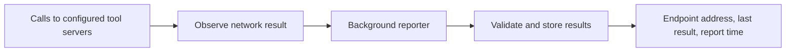

# Sandbox

A sandbox is the runtime boundary where agent code executes. A compute driver
creates it and connects two dedicated components: `openshell-sandbox` inside
the workload boundary and `openshell-supervisor` outside it.

## Runtime Model

Each sandbox has three trust levels:

| Component | Role |
|---|---|
| Supervisor | Owns gateway credentials, admitted policy, L7 proxying, SSH, and gateway relays. It never executes inside the agent workload. |
| Sandbox | Runs as the same non-root identity as the agent, installs the workload seccomp listener, applies the Landlock baseline, owns child processes, and mediates the protected supervisor channel. |
| Agent child | Inherits the sandbox network listener and runs with zero capabilities, `no_new_privs`, Landlock, and the final syscall filter. |

The runtime grants neither trusted component nor agent child any Linux
capability inside the workload. Drivers resolve one exact non-root UID, GID,
and supplementary-group set before launch. The sandbox and all of its children
use that immutable identity, so no in-workload privilege transition is needed.
The supervisor uses its own driver-defined identity and has no workload-creation
or backend-admin authority.

The compute driver provisions separate protected configurations and one
mutually authenticated gRPC connection over a private Unix socket, Kubernetes
TCP Service, or VM vsock channel. Independent bidirectional `Exchange` RPCs
carry lifecycle, exec, TCP, and forwarding traffic, while one persistent
bidirectional `Mediate` RPC carries multiplexed DNS traffic. General application
UDP is unsupported; UDP DNS remains mediated by the supervisor.
Both ends size HTTP/2 flow control so the connection window exceeds the
per-stream window times the concurrent-stream limit plus a reserve. Relays whose
workload stops reading therefore stall only their own streams and cannot starve
DNS, exec, or control traffic of connection-level credit. The supervisor caps
concurrent TCP relay and pending-accept streams below the stream limit, so new
workload connections queue before control exchanges lose stream slots.
The sandbox probes HTTP/2 connection liveness every five seconds and closes
connections that miss a ten-second acknowledgement deadline. Closing a
connection freezes the owned workload process tree and cancels its stream
bridges before releasing the exclusive DNS mediation lease. The supervisor has
30 seconds to reconnect, replay attach, and reconfirm the boundary. Every
supervisor process generates an ephemeral instance ID, and the sandbox pins the
first ID it accepts for its process lifetime. The same process can therefore
recover a dropped transport, but a replacement supervisor cannot reuse launch
credentials to claim the existing runtime generation. Confirmation resumes the
workload; expiration terminates it. A credential replacement does not displace
the active connection until the new connection is confirmed. Idle healthy
connections remain usable.
A failed stream alone does not trigger reconnection. The supervisor first
reconfirms on the current connection and keeps it if the boundary answers.
Otherwise it closes that transport before replaying attach, and retries while
the sandbox still reports the equal-epoch connection as active, until the
boundary observes the disconnect. The sandbox reports attach and confirm
rejections as typed errors rather than closing the stream.
TCP mediation accepts use the same authenticated transport recovery as process waits. A healthy idle accept has no timeout. An interrupted pending open fails closed, while a replacement accept waits for new workload traffic; decisions and established byte streams are not replayed. Boundary rejections and failed recovery remain terminal to the proxy.

A renewed Sandbox Protocol bearer is authenticated even when its credential epoch is unchanged. The supervisor confirms that bearer on the active physical connection and records its fingerprint only after confirmation succeeds, preserving pending streams and the mediation session. Changing the credential epoch still requires an authenticated replacement connection.

Local single-player Docker, Podman, and VM gateways propagate an omitted
`gateway_jwt.ttl_secs` value to both launch-scoped credential profiles. Those
credentials use `exp = 0`, so host suspension cannot strand the supervisor
after a refresh deadline passes. Shared deployments retain expiring credentials
and a durable compute-platform bootstrap identity.

Unauthenticated TLS handshakes have a separate bounded asynchronous pool and
five-second deadline, never consuming authenticated control slots or threads.
The socket broker reserves the TCP control-listener port against workload
connections, including loopback aliases. Unix control listeners reject workload
descendants using kernel peer credentials and process ancestry, while ordinary
workload loopback and Unix services remain available.
NetworkPolicy is an outer reachability fence, not a confidentiality boundary.
Each sandbox generation receives a fresh CA and distinct server/client leaves;
both endpoints bind the same workload identity and immutable driver resource
claims. Driver crates do not appear in generic process, network, SSH, or
session code.

The supervisor exposes readiness only after the sandbox is confirmed and the
gateway access plane is registered. Driver-owned channel directories limit
reachability, while mutual authentication and channel epochs prevent endpoint
replacement from granting authority.

## Startup Flow

1. The driver resolves the immutable workload identity, installs the outer
   network fence, validates its native evidence, and starts `openshell-sandbox`
   with one-use bootstrap state. Docker inspects container networking,
   Kubernetes verifies its NetworkPolicy, and VM drivers inspect the guest
   device model; those native schemas remain in their driver crates.
2. The sandbox consumes and unlinks bootstrap material, proves the admitted
   runtime posture, and listens on the protected driver channel. It does not
   run untrusted code yet.
3. `openshell-supervisor` loads policy and runtime settings from the gateway,
   attaches to the sandbox, and verifies the driver's generation and evidence.
4. The sandbox installs its seccomp notification broker and Landlock baseline,
   validates its mechanism-specific audit evidence, and reports backend-neutral
   enforcement properties. The supervisor must accept those properties and
   their immutable session and resource binding before it sends the launch
   permit. Other isolation backends may establish the same properties with
   different mechanisms and retain their detailed evidence in backend-owned
   audit data.
5. The sandbox starts the canonical process through its single workload
   launcher. The supervisor starts SSH and registers its gateway session.
6. Exec, signaling, PTY, DNS, TCP, and loopback-forwarding operations cross the
   authenticated channel for the lifetime of the sandbox generation.

The shared isolation contract receives only normalized outer-fence guarantees:
egress is default-deny, there is no unmanaged egress path, the evidence is bound
to the sandbox generation, revocation has been verified, and controller loss
fails closed. A digest commits those guarantees to the native
evidence without teaching the shared contract about container networks,
Kubernetes objects, VM devices, or accelerator resources.

The component that owns the outer fence also validates its native evidence and
makes that projection explicitly. In the current Docker, Podman, Kubernetes,
and VM placements, that component is the compute driver. A delegated isolation
backend may own the fence and make the same projection instead. Non-empty native
evidence alone does not establish a guarantee:

| Current enforcement owner | Native evidence | Guarantees projected by the owner |
|---|---|---|
| Docker | Pinned container ID, `network_mode=none`, and no unexpected network attachments | No workload route establishes default-deny, revocation, and controller-loss behavior; the attachment inspection establishes that no unmanaged route exists. |
| Podman | Pinned container ID, `--network=none`, and no unexpected network attachments | The same container-network facts establish the same four guarantees. |
| Kubernetes | NetworkPolicy UID and resource version, ingress and egress isolation, and zero workload egress rules | The persisted, selecting policy establishes default-deny and continued denial after revocation or controller loss; zero egress rules establish that no unmanaged route is permitted. |
| VM | Generation and zero guest network devices | The absent NIC establishes all four guarantees; approved traffic uses the separate supervisor-owned channel. |

The shared contract checks that all four guarantees are present, that the
projection names the admitted generation, and that its evidence digest matches
the value passed to the workload-side runtime. It does not infer guarantees or
interpret the native fields.

When the admitted main process exits, its status and retained terminal output
remain available. The confirmed sandbox and supervisor-owned access plane continue
to serve policy-authorized exec and loopback forwarding until explicit stop or
delete tears down the boundary and terminates any remaining workload processes.

Completed exec output handles can be reclaimed, but execution request IDs remain
reserved for the boundary generation. The sandbox accepts at most 4,096 exec
attempts per generation, then rejects new attempts rather than forgetting replay
protection. A disconnected attachment does not authorize another execution.
While an exec handle is retained, independent waits return its stable exit or
signal status, whether or not an output attachment is open or the main process
has exited. Waiting never holds the exec registry lock, so other operations can
still signal or attach to the process.

## Isolation Layers

OpenShell uses overlapping controls rather than a single sandbox primitive:

| Layer | Purpose |
|---|---|
| Filesystem policy | Landlock restricts the paths the agent can read or write. |
| Process policy | Sandbox and children run as one immutable non-root identity with zero capabilities. |
| Seccomp notification | Virtualizes supported INET sockets and sends DNS/TCP decisions to the supervisor without nftables or proxy environment variables. |
| Outer network fence | The component that owns network enforcement prevents any missed or unsupported kernel path from escaping. Current examples are Docker `network_mode=none`, a NIC-less VM, and Kubernetes NetworkPolicy. |
| Policy proxy | Evaluates destination, binary identity, TLS/L7 rules, SSRF checks, and inference interception. |

The supervisor may enrich baseline filesystem allowances for proxy support
files. GPU allowances are added by the workload-side sandbox only when the
immutable driver resource claims request a GPU and GPU devices are visible
inside the workload. Host supervisor device discovery must not influence these
allowances; a CPU-only VM preserves read-only `/proc` even on a GPU host.
These internal allowances must stay sandbox-scoped and avoid exposing host
secrets. For example, MXC governed egress grants the generated public CA bundle
while the ephemeral CA private key remains in the host proxy's memory.
This limitation does not prevent MXC sandboxes from launching in general.
Filesystem policies work normally, and a `process_container` sandbox with
governed egress enabled can still enforce `network_policies` through the host
proxy. The limitation applies only when the effective policy contains
`network_middlewares`, which select built-in or remote services that inspect or
transform network traffic. The MXC host proxy does not currently receive the
gateway registry that resolves those services. MXC therefore rejects such a
policy synchronously during `CreateSandbox`, before it inserts runtime state or
invokes `wxc-exec`, rather than running a chain with missing implementations.
Remove the middleware entries or use a compute driver whose sandbox supervisor
receives the gateway middleware registry.

The mandatory self-protection baseline is separate from optional workload
filesystem policy. It requires Landlock ABI v3, including pathname truncation
protection. Rules cover individually opened root children except `/.openshell`;
the sandbox opens entries relative to a pinned root descriptor without following
symlinks. An image-provided alias cannot grant access to the protected subtree.
The reserved `/.openshell` root must itself be a real directory if present;
a symlink or non-directory aborts preparation so private child mounts cannot
redirect into an allowed subtree.

## Network and Inference

See [Sandbox Limits](sandbox-limits.md) for the current numeric safety ceilings,
their ownership, terminal behavior, and known gaps.

### Standalone network proxy

`openshell-supervisor --role=network-proxy` runs the policy proxy without an
Isolation Backend or `openshell-sandbox`. It accepts explicit HTTP proxy and
CONNECT requests on a loopback listener and applies the same local Rego rules,
YAML policy data, destination checks, and L7 enforcement used by supervised
sandboxes:

```shell
openshell-supervisor \
  --role=network-proxy \
  --listen=127.0.0.1:3128 \
  --tls-dir=/tmp/openshell-proxy-tls \
  --policy-rules=/path/to/sandbox-policy.rego \
  --policy-data=/path/to/sandbox-policy.yaml
```

The standalone listener cannot observe which process opened a connection, so
this role evaluates endpoint and protocol rules without binary identity. It
does not launch a workload, attach a Sandbox Runtime, fetch gateway policy,
inject provider credentials, or provide exec and lifecycle operations. The
listener is loopback-only. TLS interception writes its generated public CA and
combined trust bundle to `--tls-dir`; when omitted, the supervisor uses a
process-specific directory under the system temporary directory.

The sandbox installs one seccomp user-notification listener on a dedicated
launcher thread. Every canonical and exec process inherits that listener. It
virtualizes supported INET sockets before they enter the agent FD table, copies
bounded syscall inputs from the notifying task, resolves the calling binary,
and blocks external `connect` until the supervisor returns a policy decision
and relay stream. Connected data stays on ordinary kernel sockets, so the
notification path is limited to socket setup and pointer-bearing operations.
Blocking listener accepts retain native workload socket flags. A broker-owned
watchdog interrupts an accept when its seccomp notification is cancelled or the
broker stops, including when readiness disappears before the accept syscall.
The sandbox reserves `SIGUSR2` with a non-restarting no-op handler for these
broker threads; startup rejects a conflicting handler. This signal disposition
is process-global kernel state, while registrations and cancellation state are
owned by the broker. Workload exec resets the caught handler to its default.
The broker copies pointer-bearing syscall arguments from a same-UID workload
child with `process_vm_readv` / `process_vm_writev`, falling back to
`/proc/<pid>/mem` when those system calls are unavailable or blocked. Runtime
qualification keeps the trusted broker non-dumpable and proves read/write
access against a dumpable child, matching the production process topology.
It never treats access to the broker's own memory as workload evidence.

This sandbox runtime requires Landlock ABI v3 (Linux 6.2, or an equivalent
vendor backport). The seccomp listener is installed in one of two cancellation
modes, and the launch confirmation enforces the invariant
`cancellation || task_memory_writes_disabled`:

- **Killable** (`SECCOMP_FILTER_FLAG_WAIT_KILLABLE_RECV`, Linux 5.19+): the
  notified workload thread waits kill-only, so a non-fatal signal cannot resume
  a mediated syscall between notification validation and the broker's result
  write. Full mediation, including task-memory output writes.
- **LegacyReadOnly** (kernels < 5.19, e.g. RHEL 9.x / 5.14): the flag is
  unavailable (`EINVAL`), so the listener falls back to a plain notifier and the
  broker refuses every task-memory *output* write to stay cancellation-safe.
  Concretely, in this mode `getpeername`, `accept`/`accept4` **with a non-null
  peer-address argument**, and `sendmmsg` paths that write per-message lengths
  fail closed with `EOPNOTSUPP`. `accept` with a null address, and socket
  creation, `connect`, `bind`, `listen`, `sendto`, and `sendmsg` continue to
  work — they use copied inputs, scalar responses, or atomic `ADDFD_SEND`, none
  of which write into workload memory. Some server workloads whose accept
  wrappers request the peer address will therefore not run until the kernel
  provides `WAIT_KILLABLE_RECV` (a distribution backport); outbound-oriented
  workloads are unaffected.

Input mediation, DNS/TCP authorization, and outer-fence enforcement are
identical in both modes. The selected mode is emitted in the sandbox
qualification output (`seccomp_listener_mode`).

DNS uses an exact sandbox-local resolver at `127.0.0.53:53`. The driver sets the
nameserver and permits an unprivileged bind to port 53. UDP and TCP DNS requests
are forwarded through the supervisor, which applies hostname-based DNS policy.
The Podman driver supplies that resolver configuration as a driver-owned,
read-only secret mounted at `/etc/resolv.conf`; the workload remains on
`network=none` and receives no host aliases directly. For
`host.openshell.internal`, the supervisor returns the trusted concrete host
destination carried in its runtime descriptor rather than relying on Podman's
workload-side host-gateway injection.
DNS sender identity is explicitly unavailable: native writes can come from an
inheriting process or after exec, and neither the connecting binary nor a later
descriptor-owner snapshot proves who sent an already queued query. Consumers
must not use this unavailable identity to grant binary-specific access. TCP
connection authorization still uses decision-time binary identity.

The sandbox retains only bounded DNS socket-admission records, consumes TCP
records on accept, and reclaims closed UDP records when capacity is reached.
The kernel delivers replies from the configured nameserver address, including
for strict musl and c-ares resolvers. No proxy environment variable, nftables
rule, or workload network namespace setup is part of enforcement. The supervisor
retries failed DNS accepts with backoff, preserving service across a channel
reconnect.

External TCP opens wait at most 30 seconds for a supervisor decision, then fail
with `ETIMEDOUT` and release their worker quota. An approval is tied to the
original socket identity; replacing the descriptor during policy evaluation
cannot transfer that approval to another socket.

The outer fence remains mandatory. If notification handling misses a syscall,
loses the supervisor, exceeds a bound, or encounters an unsupported socket
type, the request fails and the outer fence still blocks direct egress.

CONNECT and absolute-form forward HTTP are explicit-proxy adapters over the same
egress pipeline. Each adapter normalizes its request into an egress intent, and
the shared authorization result carries the process evidence and endpoint
metadata used by destination validation and relay selection. Network action,
matched policy, endpoint configuration, and exact-host authorization are
evaluated as one atomic snapshot from one policy generation. Destination validation
returns an unopened connector so adapters retain their existing response and
upstream-dial timing. CONNECT prepares a generation-pinned relay context before
entering shared TLS-terminated or plaintext HTTP relays; non-HTTP traffic uses
the shared raw byte relay after the existing adapter gates. Forward HTTP retains
its guarded single-request relay while sharing authorization, request context,
policy-pinning, and destination boundaries.
Adapter-specific response and OCSF event shapes remain at the protocol boundary.
HTTP response framing and connection persistence are separate decisions. After
forwarding a complete closing response (explicit `Connection: close` or HTTP/1.0
without keep-alive), the relay flushes and shuts down downstream writes before
ending the exchange, including TLS close notification. Response middleware
preserves this lifetime rule; persistent responses remain eligible for reuse.

An explicit `protocol: tcp` endpoint with a valid DNS hostname opts into native
DNS and transparent TCP when the selected runtime advertises that substrate.
Hostless `allowed_ips` and literal-IP selectors remain available only to the
legacy explicit-proxy path when `protocol` is omitted. The shared supervisor
answers only eligible DNS names, returns an epoch-scoped synthetic address, and
publishes the expiring name, endpoint, ports, policy generation, and validated
real addresses as one correlation. A connection to that synthetic address is
captured before the bypass fence, mapped back to its workload process, authorized
through the same egress pipeline, and dialed only through the pinned addresses.
Omitted protocol endpoints retain explicit-proxy behavior.

Provider credential placeholders are resolved through the live provider state
for each HTTP request, after destination and L7 policy admission. A static
credential resolves only when the request host, port, and path match an endpoint
in that provider's effective profile. CONNECT, absolute-form forward HTTP,
request targets, headers, supported request bodies, SigV4 signing, and opted-in
WebSocket text rewriting use the same scoped resolver. Provider refresh swaps
credential values and endpoint bindings atomically. An invalid or unavailable
refresh revokes the previous static credential state instead of leaving a
partially active or last-known-good static set. Invalid metadata preserves the
supplied dynamic snapshot, while a fetch failure preserves the currently active
dynamic snapshot.

Across the protected sandbox/supervisor channel, the provider environment revision remains
an opaque content fingerprint and has no numeric ordering semantics. The
network supervisor assigns a separate, connection-local monotonic generation
to each distinct environment it publishes. The process supervisor applies only
newer generations, which accepts descending fingerprint values while rejecting
duplicate or delayed supervisor messages.

Gateway-managed refresh credentials use an opaque workload handle derived from
the sandbox, provider identity, credential key, refresh authorization epoch,
and canonical endpoint boundary. The handle remains stable while the gateway
rotates the short-lived value, so an already-running process keeps one
placeholder and each request resolves against the current token. Explicit
refresh reconfiguration, provider replacement or detachment, and endpoint
boundary changes produce a new handle and revoke the old one. Supervisors do
not retain old values for these handles. Public provider updates cannot replace
or delete the refresh-owned primary credential or co-minted outputs; internal
CAS rotation and explicit refresh lifecycle operations own those values.
Unmanaged static credentials retain the bounded revision-generation behavior.

Route selection and policy evaluation use a syntax-only redacted request target;
they do not materialize real credentials. Cross-endpoint placeholder use returns
HTTP 403. After a WebSocket upgrade it closes the connection with policy
violation code 1008. Both paths emit a denied activity event and a detection
finding without logging the placeholder, environment key, secret, or query.

For inspected HTTP traffic, the proxy can enforce REST method/path rules,
WebSocket upgrade and text-message rules, GraphQL operation rules, and
MCP method, tool, and supported params rules or generic JSON-RPC method rules
on sandbox-to-server request bodies. MCP and JSON-RPC inspection buffers
bounded request bodies. MCP `tools/call` tool names are checked against the
spec-recommended syntax by default before policy evaluation, with a per-endpoint
`mcp.strict_tool_names` compatibility opt-out. Generic JSON-RPC policies do not
support `params` matchers; generic JSON-RPC rules match only the method.
JSON-RPC responses and server-to-client MCP messages on response or SSE streams
are relayed but are not currently parsed for policy enforcement.

Every `protocol: mcp` endpoint carries a canonical, nonempty `mcp.versions` allowlist drawn from OpenShell's exact revision registry: `2025-03-26`, `2025-06-18`, and `2025-11-25`. A policy author may omit the entire `mcp` object when using the other endpoint defaults, or omit `mcp.versions` while setting another MCP option. Both forms resolve immediately to the exact allowlist `["2025-11-25"]`; omission never means latest or all known revisions. Defaulting applies only when the corresponding YAML key is absent: `mcp: null`, `versions: null`, and an explicit `versions: []` are invalid. At protobuf ingress, an empty repeated field means omission and uses the same default because protobuf repeated fields do not preserve presence. Normalization stores and serializes the materialized allowlist in semantic order, so adding a supported revision to the registry never widens a previously normalized policy. An explicit nonempty allowlist remains available as an advanced compatibility or downgrade control. The registry is a closed set rather than a date range, so duplicate or padded values, unknown dates, and moving aliases such as `draft` or `latest` are rejected. The sessionless `2026-07-28` revision is not accepted until OpenShell supports its distinct per-request runtime contract. A version names a core protocol revision only; there is no policy syntax for layering a separately named SEP onto it. The registry owns immutable batch-shape metadata: `2025-03-26` permits nonempty same-side top-level JSON-RPC batches, which OpenShell's planned enforcement caps at 64 members, while `2025-06-18` and `2025-11-25` prohibit top-level arrays. These are declared profile facts, not current forwarding claims. The allowlist does not yet select request parsing or forwarding behavior. Later response-aware runtime state must observe the successful server response, require the selected revision to be in the allowlist, and apply that one exact profile without a union or fallback; OpenShell must not bind the client proposal in `initialize` as though it were the server-selected revision.

For admitted HTTP requests, the proxy can run an ordered supervisor middleware
chain after L7 policy evaluation and before credential injection. Destination
host selectors choose the chain independently of the network rule that admitted
the request. Policy-local map keys identify configs, while built-in names or
operator-owned registration names identify implementations.

Built-ins run in-process against a borrowed view of the chain's current HTTP
request state. Operator services retain the bounded protobuf/gRPC contract, and
the remote adapter materializes an owned HTTP evaluation only when a request
crosses that transport boundary. Both paths support bounded bidirectional
WebSocket sessions, so a manifest advertises capabilities independently of
transport.
When a stage ends, the remote adapter sends its terminal event, half-closes the
request stream, and briefly drains the response stream before releasing the
transport. This keeps a queued terminal event from being canceled with the
bidirectional RPC.
The runtime keeps three states distinct: host selection attaches policy configs,
manifest operation and phase bindings select the active chain, and the parsed
message type determines whether that chain can inspect an individual payload.
An attachment without a WebSocket binding is not a failed WebSocket stage.
Binary messages are outside the V1 text-message binding. Both cases pass through
with informational coverage telemetry rather than applying `on_error`.
The chain runner owns shared sequencing, deadlines, backpressure, and response
validation. `openshell-policy` validates policy-owned structure, and the active
middleware registry validates implementation-owned config. The generic
registry and chain runner live in `openshell-supervisor-middleware`; first-party
implementations live in `openshell-supervisor-middleware-builtins`.

The selected middleware chain can also inspect the final HTTP response before
it returns to the workload. Stages select header-only, whole-body, or streaming
inspection independently. The relay owns response framing when body bytes can
change. Preflight exposes upstream `Content-Length`, `Content-Encoding`, and
`Content-Range` as read-only metadata, while the relay emits final framing
separately from middleware-visible headers. Stage failures follow policy-local
`on_error`; explicit denials always block delivery. Once delivery has started,
blocking aborts the response.

The network supervisor represents the destination-selected request and response
pair as one `HttpMiddlewareExchange`. It retains the full chain, runner, request
identity, and policy generation while request and response bindings are selected
independently. The HTTP response adapter owns wire parsing, downstream commit
state, generation fences, framing, and transport error classification. The
generic middleware crate owns stage selection, remote stream lifecycle, ordered
body processing, limits, and result validation.

The supervisor installs policy and middleware registry changes as one runtime
generation and preserves the last-known-good generation if preparation fails.
Policy-only updates reuse the connected registry, so an external middleware
outage cannot block unrelated policy changes.

For authenticated operator middleware, the supervisor requests credentials by
registration name through `RefreshSandboxToken`. The gateway resolves names
against the effective policy and mints exact-audience credentials. The
supervisor keeps them in refreshable in-memory slots outside stable middleware
configuration, so rotation neither changes `config_revision` nor reconnects
the registry. Public custom-CA PEM travels with the stable registration.

The slots live in a supervisor-owned `ExtensionCredentialStore` shared by every
gateway connection the supervisor opens, so the registry's clients and the
polling loop that rotates them observe the same credentials. Configuration
polling runs far more frequently than credentials expire, so the loop rotates
only when a credential is missing or has passed four fifths of its lifetime,
and bounds its sleep by the soonest rotation deadline.

Middleware cannot observe injected credentials, introduce credential
placeholders, or mutate supervisor-owned credential, routing, or framing
headers. Body transformations are re-evaluated
against body-aware L7 policy before later stages or the upstream can observe
them. Requests, results, chain length, execution time, and diagnostics are
bounded; external free-form diagnostic text is not exposed in responses or
security logs. See
[Supervisor Middleware](../docs/extensibility/supervisor-middleware/index.mdx) for
an introduction, or the [configuration guide](../docs/extensibility/supervisor-middleware/configure.mdx)
for service registration and policy attachment.

Inference providers use the same egress path as other external services. An
attached provider profile contributes endpoint and binary policy. The proxy
then resolves the provider's credential placeholder only when both policy and
the profile's endpoint binding authorize the native request. Model selection,
request shape, headers, streaming, and timeouts remain client concerns.

In proxy-required networks, the supervisor chains upstream TLS tunnels through
a corporate forward proxy with HTTP CONNECT instead of connecting directly,
once policy and SSRF checks pass. Only TLS (CONNECT) egress is chained:
plain-HTTP requests always dial the destination directly, because forwarding
plain HTTP through a proxy requires absolute-form request forwarding rather
than CONNECT tunneling and is out of scope. The proxy configuration is an
operator-owned boundary delivered on the supervisor's command line
(`--upstream-proxy` and friends) by the compute driver; sandbox and template
environment — and `ENV` values baked into the sandbox image — cannot
influence it, since none of these can alter the argv the driver sets. The
conventional `HTTPS_PROXY`/`HTTP_PROXY`/`NO_PROXY` variables a sandbox
controls are ignored on this path. Operator `NO_PROXY` destinations and
loopback always dial directly; add driver-injected host aliases (e.g.
`host.containers.internal`) to the operator `NO_PROXY` list when the corporate
proxy cannot reach the container host. `NO_PROXY` matching is port-aware and
resolution-aware: an entry with a `:port` qualifier only bypasses that port,
and IP/CIDR entries also match hostnames through their validated resolved
addresses, with the direct dial limited to the addresses the entry contains. `http://` and `https://` proxy URLs in explicit
`scheme://host:port` form are supported — the scheme and port are both
required, and a path, query, or fragment is rejected. For an `https://` proxy
the supervisor wraps the connection to the proxy in TLS before the CONNECT
handshake, verifying the proxy certificate against the built-in and system
roots plus the optional operator CA bundle (see below). Local DNS resolution
and SSRF validation still run before the proxied dial, and the CONNECT
target sent to the corporate proxy is a validated resolved address, so the
proxy performs no DNS resolution of its own and the tunnel stays bound to
the answer that passed SSRF and `allowed_ips` validation. The hostname still
travels inside the tunnel (TLS SNI, application `Host`). In split-horizon
networks, point the gateway host at the corporate resolver so internal names
validate to their internal addresses; the `proxy_connect_by_hostname`
opt-in exists as a
last resort for proxies whose ACLs filter on hostnames and reject IP CONNECT
targets — with it, the proxy resolves the name itself and its ACLs become
the effective egress control for proxied TLS. (Resolving through the proxy's
own DNS view, e.g. DoH tunneled via CONNECT, is a possible future
enhancement and out of scope.) Workload proxy variables are removed from the
protected launch environment; transparent socket mediation does not depend on
them.

The canonical main process receives the declared workload environment before
supervisor-only values are stripped and provider placeholders are injected.
Template environment is treated like user-provided sandbox environment. It can
shape the workload child, but it cannot override driver-controlled identity,
gateway endpoint, TLS, relay socket, proxy, provider, or supervisor coordination
variables. Drivers and the supervisor rewrite those reserved values after image
and template environment are considered.

The configuration is fail-closed: a setting that is present but invalid — an
empty value, an unsupported or malformed proxy URL, an unreadable auth file or
CA bundle, a malformed credential, or an auth file, `NO_PROXY` list, or CA
bundle set while no proxy URL is configured — is fatal to supervisor startup
instead of being treated as unset, so a misconfiguration can never silently
degrade to direct dialing or unauthenticated proxy access. Only an omitted
argument means "no proxy". The driver validates the same rules at
sandbox-create time through validators shared with the supervisor
(`openshell_core::driver_utils::parse_upstream_proxy_url` and
`parse_upstream_proxy_credential`).

An optional operator CA bundle (`--upstream-proxy-ca-bundle`, a supervisor-only
PEM path) extends the trust boundary for corporate proxies. A CA certificate is
not secret, but the supervisor is still its only configuration authority. It is
trusted in two places: the TLS handshake with an `https://` proxy, and —
because a TLS-intercepting proxy (mitmproxy, squid `ssl-bump`) re-signs
tunneled server certificates with the same CA — the sandbox combined trust
bundle (`write_ca_files`) and the L7 upstream re-encryption store
(`build_upstream_client_config`). Folding it into both means intercepted
upstream handshakes succeed and sandbox workload processes trust the re-signed
certificates; trusting it only for the proxy-listener handshake would leave
every intercepted upstream connection failing. The bundle is valid with either
an `http://` or `https://` proxy (an intercepting proxy can be reached over
plain HTTP) and is fail-closed: an unreadable or certificate-free file is fatal.

How the bundle reaches the supervisor is driver-specific. Drivers that run the
supervisor locally bind-mount the operator's file. The Kubernetes driver cannot:
the supervisor Pod is scheduled remotely, and a trust anchor for every upstream
the sandbox reaches must not be sourced from the workload namespace, where it
would widen to anyone holding write access there. The gateway instead reads the
PEM from its own filesystem and stages it into the per-generation supervisor
bootstrap Secret, which is immutable, so the anchor cannot change underneath a
running sandbox.

Proxy credentials are never embedded in the URL: an inline `user:pass@` is
rejected because it would be stored in `gateway.toml` and exposed in container
metadata. Operators supply credentials via `proxy_auth_file`; the driver
stages them as a supervisor-only secret mounted at a fixed path and passes only
that path on the supervisor's command line. The supervisor reads the
file and builds the `Proxy-Authorization: Basic` header; a credential that is
empty, contains control characters, or is not in `user:pass` form is fatal on
both sides.

The VM driver starts `openshell-supervisor` on the host and
`openshell-sandbox` as capability-free guest PID 1. Corporate proxy arguments,
credentials, private CA keys, policy, and gateway credentials stay host-side.
Both libkrun and QEMU guests are NIC-less; intercepted workload connections
cross the authenticated vsock channel. A gateway-host proxy is addressed as
`host.openshell.internal`, which the host supervisor normalizes to `127.0.0.1`.

The Docker driver runs `openshell-supervisor` in a separate companion container.
Its private named volume contains supervisor bootstrap and channel material.
The workload container receives only `openshell-sandbox`, public interception
CA material, and the other sandbox half of the authenticated channel.

For Kubernetes, the operator configures a Secret name and key rather than a
gateway-host file path. Kubernetes projects that Secret only into the separate
supervisor Pod. The sandbox Pod never mounts corporate-proxy credentials
or the interception CA private key.

The Basic header travels over the plain-TCP connection to the `http://` proxy,
so it is readable on the network path between sandbox host and proxy.
Configuring `proxy_auth_file` therefore requires the explicit opt-in
`proxy_auth_allow_insecure = true`. Both the
driver (at sandbox-create time) and the supervisor (at startup) reject an
auth file without the acknowledgement, and the acknowledgement without an
auth file, so credentials are never sent in cleartext without an explicit
operator decision.

## Tool server connection status

A sandbox can be `Ready` while a call to an external tool server fails. For configured endpoints that use MCP over HTTP, OpenShell records the last observed network result beside the endpoint's address. Users can identify the server and distinguish policy denial, unavailable credentials, TLS or network failure, and an upstream HTTP rejection without combining client and supervisor logs. These observations do not affect sandbox lifecycle readiness.



The gateway exposes one record per configured endpoint in `Sandbox.status.endpoint_statuses`. Each record contains its address, an opaque identifier, a typed result, and the time the gateway accepted that result. The address remains available when evidence resets to `NoObservedExchange`. Ordinary sandbox conditions continue to describe lifecycle and platform state.

Network observers send only the endpoint identifier and a fixed result classification, without credentials, payloads, or raw upstream errors. Requests capture observation authority before selecting policy or credentials, then bind the selected policy hash and provider revision to that capture. Observation handles also identify the installed endpoint inventory and supervisor authority, so a concurrent update cannot attribute an old request to a new configuration, and reinstalling the same configuration cannot revive an obsolete request. The sandbox reporter coalesces observations and retries an immutable snapshot through `ReportEndpointStatus`. Bounded delivery can drop observations, so endpoint status is not a complete request history.

The gateway validates the reporting supervisor's session, configuration revisions, and report sequence before atomically storing results. Global policy writes share the report's synchronization boundary. An effective policy change resets all endpoint evidence; repeated acknowledgements and metadata-only policy revisions preserve it. A provider environment change resets evidence for endpoints that depend on those credentials. Supervisor disconnection or replacement and gateway restart also invalidate observation authority. Identical report retries leave timestamps unchanged. After an inventory reset, still-valid pending evidence can be accepted again if an acknowledgement was lost, advancing the report time without another exchange.

These are passive observations with no expiry. `HttpResponseReceived` means the server returned a final HTTP status below 400, including a protocol upgrade; that response can still contain an MCP error. Informational responses alone do not establish success. MCP protocol-version and request-body policy rejections produce `PolicyDenied`. A failure before the HTTP path is known updates status only when the host and port identify one distinct endpoint. Ambiguous failures remain in structured events and logs. Results combine callers and effective ports for an endpoint. Consumers that need current tool availability must verify an actual operation. The sandbox management guide explains the public fields and results.

## Credentials

Provider credentials are stored at the gateway and fetched by the supervisor at
runtime. The supervisor injects resolved environment variables into the initial
agent process and SSH child processes. Driver-controlled environment variables
override template values so sandbox images cannot spoof identity, callback, or
relay settings.

Supervisor bootstrap identity and provider workload-identity sockets never
enter the sandbox workload. The authenticated channel carries only the
policy-authorized provider environment intended for child launch and public
trust material intended for TLS clients.

Credential placeholders in mediated HTTP requests can be resolved by the proxy
when policy allows the target endpoint. Secrets must not be logged in OCSF or
plain tracing output. The supervisor uses revision-scoped
placeholders for unmanaged rotating credentials and identity-stable opaque
handles for gateway-managed refresh credentials. Provider environment keys
beginning with `v<digits>_` or `s<64 lowercase hex characters>_` are reserved
for those placeholder namespaces.

Provider profiles can also declare dynamic token grants. For matching HTTP
endpoints, the supervisor obtains or exchanges OAuth2 access tokens, caches
them, and injects them before forwarding the request. `client_credentials`
grants use the supervisor SPIFFE JWT-SVID directly as the client assertion.
`token_exchange` grants ask the gateway to broker an intermediate token using a
stored provider subject credential and the gateway's own SPIFFE JWT-SVID; the
supervisor then exchanges that intermediate token for the final upstream token
using its own JWT-SVID. The gateway validates that its own JWT-SVID has the
requested audience, a SPIFFE subject, and a non-expired `exp` claim when
present. It also validates that the stored subject credential is declared by the
provider profile, and that the supervisor JWT-SVID is a well-formed
three-segment JWT with a SPIFFE subject in the same trust domain as the gateway
SVID. The gateway verifies the supervisor JWT-SVID signature with JWT bundles
fetched from its SPIFFE Workload API. Token grant endpoints are HTTPS-only
except for loopback and Kubernetes service DNS hosts, and returned access tokens
must be bearer-compatible before they are cached or injected. Token response
lifetimes are capped and cached with an expiry margin unless a profile supplies
an explicit cache TTL override. Cache entries are scoped by the sandbox provider
environment revision so provider credential updates miss the old token cache
without changing endpoint matching semantics. Gateway-brokered intermediate
tokens are cached separately by provider resource version, supervisor SPIFFE
subject, and gateway SPIFFE subject, and their cache lifetime is capped by the
intermediate token response, stored subject-token expiry, and supervisor SVID
expiry.

For AWS endpoints that require request-level signing, the proxy supports SigV4
re-signing. When `credential_signing: sigv4` is set on an L7 endpoint, the proxy
strips the client's placeholder-based AWS auth headers, re-signs with real
credentials from the provider, and forwards the request upstream. The signing
endpoint must have a credential source before the policy generation activates:
an attached endpoint-bearing AWS profile whose boundary covers the endpoint, or
an attached endpointless AWS profile explicitly named by the endpoint's
`credential_binding.provider`. Policy activation rejects missing or mismatched
sources atomically. The signing mode is auto-detected from the client SDK's
`x-amz-content-sha256` header:

- **Signed body** (hex hash): buffers the request body, computes its SHA-256,
  and includes the hash in the signature. Used by Bedrock and most AWS services.
- **Streaming unsigned** (`STREAMING-UNSIGNED-PAYLOAD-TRAILER`): signs headers
  only and streams the body through without buffering. Used by S3 uploads with
  `aws-chunked` encoding.
- **Unsigned payload** (`UNSIGNED-PAYLOAD`): signs headers only with no body
  hash. Used by S3 over HTTPS for non-chunked requests.

Chunk-signed streaming modes (`STREAMING-AWS4-HMAC-SHA256-PAYLOAD` and other
`STREAMING-*` variants) are rejected — the proxy cannot reproduce per-chunk
signatures. Use `sigv4:no_body` for those clients.

Two explicit overrides are available: `credential_signing: sigv4:body` (always
buffer and hash) and `sigv4:no_body` (always unsigned). The `Expect:
100-continue` header is handled within the SigV4 path so clients like boto3
transmit the body before the proxy forwards to upstream.

The AWS region is extracted from the endpoint hostname. For non-standard
endpoints (VPC endpoints, custom proxies), set `signing_region` in the policy
endpoint to provide an explicit override. The proxy rejects requests when
neither hostname extraction nor `signing_region` yields a region.

`credential_signing` and `request_body_credential_rewrite` are mutually
exclusive on the same endpoint. The policy validator rejects policies that
set both.

## Connect and Logs

The supervisor runs an SSH server on a Unix socket inside the sandbox. The
gateway reaches it through the outbound supervisor relay, not by dialing the
sandbox workload directly. The relay supports:

- Attachment to the canonical main process through the `openshell-main` SSH
  subsystem. The supervisor owns its retained PTY or pipes, a 1 MiB replay
  buffer, and a single stdin lease across client disconnects. Ctrl-C interrupts
  the foreground process. For read-only attachments, Ctrl-C only exits the
  current viewer.
- Supervised CLI attachment. After an established SSH transport fails, the CLI
  remains alive, requests a fresh SSH session from the gateway, and reattaches
  to the same canonical main process within a bounded recovery window. It does
  not stop or restart the sandbox to recover the client connection. The same
  deadline bounds replacement-session RPCs. Process-targeted termination is
  forwarded to the SSH child, which the CLI reaps before exiting.
- Independent interactive shell sessions.
- Command execution. Commands run through a login shell (`bash -lc`) by default,
  so the first of the user's `.bash_profile`, `.bash_login`, or `.profile` is
  sourced (and `.bashrc` only if that file sources it). Callers set
  `ExecSandboxRequest.no_login_shell` to skip those files; the gateway signals
  this to the supervisor over the SSH `OPENSHELL_NO_LOGIN_SHELL` env request,
  which selects `bash -c` instead of `bash -lc`. Note `bash -c` still reads
  `BASH_ENV` when the child environment sets it.
- Tar-based file sync.
- Port forwarding where supported by the CLI/TUI surface.
- Persistent HTTP and WebSocket service routing through gateway-managed
  `ServiceEndpoint` records. `CreateSandboxRequest.service_exposures` registers
  named or unnamed endpoints as part of sandbox creation, and the gateway
  returns their routed URLs keyed by service name. The empty key identifies the
  unnamed endpoint. Routing starts only while the sandbox is ready. `sandbox
  create --expose PORT` uses the unnamed create-time endpoint and keeps the
  sandbox. The standalone service API can add, update, or remove endpoints
  later.

Sandbox logs are emitted locally and can also be pushed back to the gateway.
Security-relevant sandbox behavior uses OCSF structured events; internal
diagnostics use ordinary tracing.
The OCSF device describes the sandbox environment, with type ID Other and type
label `Sandbox`; its operating system is a separate attribute.
HTTP Activity records contain a request or response; early rejections with only
connection context use Network Activity. Producer regression tests validate
required fields and `at_least_one` constraints against the vendored OCSF 1.8
schemas.
Network Activity records identify at least one observed endpoint; connection
failures retain their known peer or listening endpoint.
Configuration diagnostics use Config State Change.
Unix socket relay and relay-control notifications, plus proxy and mediation
failures without an observed network endpoint, use Base Event.

## Policy Proposals

When an L4 CONNECT is denied, the proxy emits a `DenialEvent`. The denial
aggregator batches these events and flushes summaries to the gateway every 10
seconds (configurable via `OPENSHELL_DENIAL_FLUSH_INTERVAL_SECS`). The gateway
runs them through the mechanistic mapper, which generates a pending
`NetworkPolicyRule` proposal visible under `openshell rule get --status pending`.

L7 denials (HTTP 403 from method/path rules) are intentionally excluded from
mechanistic mapping. L4 denials carry only `host:port`, which a deterministic mapper can handle.
L7 denials carry method, path, query, and body context. The agent loop reads
the structured 403 and authors the narrowest rule. Mechanistically mapping L7
would either over-broaden rules or require path-templating logic that rots
quickly.

## Configuration Admission

Gateway-managed supervisors reconcile configuration before launching the main
process or exposing workload services. Admission covers the effective policy,
provider layers, credential bindings, and gateway-derived provenance. Explicit
user and global policy precedence is unchanged; an image without a policy uses
the restrictive baseline. An invalid image policy does not become a launchable
default.

The gateway tracks configuration admission independently of compute health.
A blocked startup remains `Provisioning` with a `ConfigurationInvalid` readiness
condition, even when the container backend reports readiness. Gateway management
operations remain available. The TUI summarizes configuration rejection in sandbox
NOTES alongside active port forwards; the detail view wraps the full diagnostic,
which is also available through sandbox inspection.
Replacing the policy or repairing providers allows
the same supervisor to reconcile and launch; it does not recreate the sandbox.
Startup retries continue reporting readiness, but unchanged configuration rejections
produce only one log event. A changed configuration or diagnostic emits a new
rejection event; successful repair emits a recovery event.
The gateway gives each initial provisioning attempt and explicit restart a
300-second repair window. Persisted configuration-source clocks reset the window
from the latest effective stored change, including settings deletion and provider
attachment changes. The first accepted rejection for that generation grants one
full window; repeated reports and reconnects do not extend it. Ready disarms the
timer. Failed desired updates to a running sandbox do not arm it.

A leader-owned scan runs independently of driver inventory. Expiry records
`Error`/`ProvisioningTimedOut` before reclaiming compute; cleanup progress and
backoff survive restart. Late runtime reports cannot replace that result. The
record and restartable storage survive cleanup, including for ephemeral creates.
Explicit start is blocked while cleanup is pending, then creates a fresh attempt
using the latest configuration. Configuration edits alone never restart an
expired sandbox. Legacy provisioning records receive one persisted rollout
window. Cross-object configuration serialization uses the gateway's existing
single-writer guard; enabling concurrent configuration writers still requires
the database-backed invariant work tracked by #1255.

Docker startup health remains unready during policy quarantine. A failed probe
does not terminate a live provisioning supervisor; the gateway deadline owns
that decision. Cleanup cancels pending driver startup before stopping compute
so a late startup failure cannot remove retained workload storage.

Static policy fields can be replaced before the first accepted activation.
A durable first-activation marker closes this repair window permanently, including
across stop/start and later rejected configurations. Legacy records without the
marker retain static-field immutability.
Admission validates policy composition; image and host setup failures, such as
an unresolved OCI user or unavailable isolation facilities, retain their existing
startup error behavior.

Acceptance identifies the effective policy hash/version, configuration revision,
provider-environment revision, and reporting supervisor instance. Startup captures
the matching provider environment and constructs the runtime before reporting
acceptance. Live reconciliation begins only after the main process has spawned,
so it cannot replace the configuration captured for that launch. Restart resets
admission and requires a fresh accepted configuration. Permanent gateway errors
and exhausted transient retries terminate startup; each RPC attempt has a
10-second deadline, including acceptance reports; only acknowledged configuration
rejections wait for repair within the gateway's provisioning deadline. Image discovery uses the authenticated
sandbox boundary control request deadline.

Policy and provider refreshes are prepared before publication. Publication
invalidates prior policy guards before exposing new provider material and swaps
the policy under the same publication locks. Rejected candidates cannot install
their credentials alongside the previous policy. Existing runtime fail-closed
checks remain necessary for in-flight traffic and invalid live updates.

The supervisor reads the workload image policy through an authenticated,
read-only `DiscoverPolicy` boundary request before attaching or launching the
workload. The boundary reads only the well-known policy paths, bounds the response,
and distinguishes missing policy from unreadable or invalid content. The supervisor
validates this candidate with gateway provider composition and obtains admission
before `Attach`, `Confirm`, networking startup, and `StartAgent`. Workload image
environment variables cannot configure the isolated supervisor.

## Policy Revision Acknowledgement

When the supervisor loads a sandbox-scoped policy from the gateway, it retains
the version, hash, source, and configuration revision returned with that exact
policy snapshot. After the OPA engine is built successfully, the supervisor
reports that revision as `LOADED`, which advances
`SandboxStatus.current_policy_version` and moves the revision out of `Pending`.
If policy construction fails, it reports the captured revision as `FAILED` with
the original construction error. It never infers revision identity by comparing
policy structure.

This holds even when the initial policy is enriched with baseline paths during
startup: the enriched revision the supervisor synced back to the gateway is the
revision it acknowledges, so a successfully constructed initial policy never
remains `Pending`. If the first poll returns a different revision, the supervisor
processes it through the normal reload path instead of treating it as already
loaded.

A newer sandbox-scoped revision can carry the same non-empty effective policy
hash as the currently loaded revision, for example when provenance changes
without changing enforcement content. The supervisor acknowledges that newer
revision without reloading identical policy. If the revision also requires
middleware or policy-runtime reconciliation, acknowledgement waits until that
reconciliation succeeds. Global policies, local overrides, equal or older
versions, and different hashes do not use this shortcut. Success telemetry is
emitted only after the gateway accepts the resulting loaded-status report.

Policy status delivery uses a FIFO background worker. Retryable delivery
failures retain the ordered update and retry with capped exponential backoff;
terminal errors are logged and discarded. The outbox is nonblocking and does
not discard updates because of a fixed queue capacity, so status endpoint
outages cannot block policy polling, enforcement, settings, or provider
refreshes and cannot permanently lose the initial acknowledgement.

Only sandbox-scoped revisions (`PolicySource::Sandbox`, version greater than
zero) use the policy revision acknowledgement API. Global policies use the
configuration admission contract without a sandbox policy revision acknowledgement.
Local Rego/data overrides remain available for standalone development; combining
them with a gateway-managed sandbox is rejected because the gateway cannot admit
the runtime policy it would enforce.

## Failure Behavior

- If gateway config polling fails, the sandbox keeps its last-known-good policy.
- If a live policy or middleware-registry update is invalid, the supervisor
  rejects the update and keeps the current runtime pair.
- If an operator-run middleware call fails, the selected config's `on_error`
  behavior decides whether to deny the request or continue without that stage.
- Existing raw byte streams are connection scoped. Dynamic policy changes apply
  to new connections or the next parsed HTTP request where the proxy can safely
  re-evaluate.
- If the supervisor relay drops, the sandbox stops the canonical agent and exec
  process groups, rejects new runtime operations, and closes mediated streams.
  A replacement supervisor has 30 seconds to authenticate, replay the identical
  attach, and reconfirm the boundary. Successful confirmation resumes the
  process tree; otherwise the sandbox sends `SIGTERM`, waits the normal stop
  grace period, sends `SIGKILL` to survivors, and makes the session terminal.
  Explicit supervisor shutdown uses the same terminal transition and requires
  an acknowledgement before treating the boundary as stopped.
- If the canonical main process exits, the supervisor durably reports the
  normalized result immediately. A foreground create declares a one-shot main
  attachment, so the supervisor accepts it even after a fast process exits,
  sends the retained output and SSH exit status, waits for the peer's channel
  close, and then finalizes ephemeral cleanup. With no declared or active
  attachment, it finalizes and exits without a grace period. The gateway waits
  for that finalized supervisor session to disconnect before deleting an
  ephemeral sandbox. Exit code 0 records
  `Completed/MainProcessCompleted`; nonzero and signal-normalized exits record
  `Error/MainProcessFailed`. Infrastructure failures also use `Error`, with a
  distinct condition reason and no fabricated canonical-process result. Runtime
  restart policies must not replace the canonical process.

## Shared Boundary Primitives

`openshell-isolation-interface` owns the common boundary protocol and Linux
mechanisms. Drivers provide the protected transport and immutable resource
identity; they do not implement their own process or network protocol. All
remote traffic uses one mutually authenticated gRPC connection. Independent
streams carry process control, exec output, and TCP bytes; a persistent
`Mediate` stream carries DNS queries and supervisor-produced answers. There is
no alternate raw-TLS application protocol or general UDP framing.

The shared process-signal mediator resolves each positive target PID or TID to
its thread-group leader, excludes the sandbox leader, retains a pidfd, and sends
the signal through that descriptor. It never continues the original numeric-PID
syscall after inspection. This prevents TID aliases or PID reuse from turning an
agent signal into a signal to the sandbox. Ordinary mediated `kill` reports the
broker as its sender, not the original calling agent's `SI_USER` identity.
Queued signals preserve permitted application siginfo payloads; they cannot
forge kernel-generated or `SI_TKILL` codes. Programs requiring original sender
identity must account for this mediation boundary.
