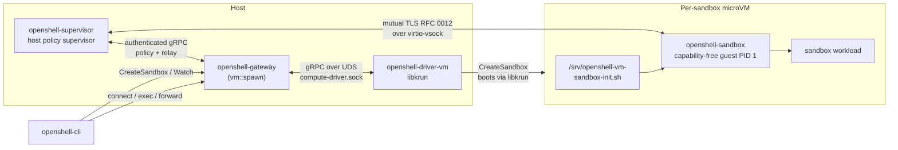

# openshell-driver-vm

> Status: Experimental. The VM compute driver is under active development.

Standalone libkrun-backed [`ComputeDriver`](../../proto/compute_driver.proto) for OpenShell. The gateway spawns this binary as a subprocess and talks to it over the `openshell.compute.v1.ComputeDriver` Unix-socket surface. `openshell-supervisor` runs as a native host process, while `openshell-sandbox` runs as capability-free PID 1 inside each microVM and applies guest-local isolation over virtio-vsock.

The driver embeds libkrun, libkrunfw, the guest OCI unpacker, the portable guest sandbox, and the custom kernel runtime. Each sandbox boots from a cached immutable bootstrap ext4 root disk plus a per-sandbox writable overlay disk. When the requested sandbox image differs from the bootstrap image, the driver prepares a read-only image ext4 disk inside a bootstrap VM and mounts that unpacked rootfs as the sandbox lowerdir.

## How it fits together

Caller driver config is disabled by default, including upload workflows
encoded in driver JSON. GPU devices and their trusted VFIO plumbing are
temporarily exempt from approval labels; existing GPU selection validation
still applies. Private rootfs staging does not authorize arbitrary host paths.
The gateway passes its common policy to its managed VM subprocess.
See [resource admission configuration](../../docs/reference/gateway-config.mdx#external-resource-admission).



The supervisor owns gateway credentials, admitted policy, provider resolution, middleware, the network proxy, and relay registration. The sandbox receives no gateway JWT. Each VM generation receives distinct sandbox and supervisor channel keys; the guest consumes and unlinks its private bootstrap files before launching the workload.

VM-specific RFC 0012 code under `src/isolation/` only chooses the vsock transport and binds immutable VM generation and image claims into the protected guest config and host descriptor. Lifecycle, authentication, process control, binary identity, forwarding, and streaming come from `openshell-isolation-interface` and `openshell-sandbox`.

## Quick start (recommended)

```shell
mise run gateway:vm
```

First run takes a few minutes while `mise run vm:setup` stages libkrun/libkrunfw/umoci and `mise run vm:supervisor` builds the portable Linux guest sandbox plus its small static guest-init helper. The development task also builds the native host supervisor. Subsequent runs are cached.

By default `mise run gateway:vm`:

- Listens on plaintext HTTP at `127.0.0.1:18081`.
- Uses `nvcr.io/nvidia/base/ubuntu:24.04` as the sandbox and bootstrap image.
- Configures the gateway installation name as `vm-dev` and registers the same
  name with the CLI by writing
  `~/.config/openshell/gateways/vm-dev/metadata.json`. It does not modify the
  workspace `.env`.
- Persists the gateway SQLite DB under `.cache/gateway-vm/gateway.db`.
- Places the VM driver state (per-sandbox `overlay.ext4`, image cache, and `run/compute-driver.sock`) under `/tmp/openshell-vm-driver-$USER-vm-dev/` so the AF_UNIX socket path stays under macOS `SUN_LEN`.
- Writes `.cache/gateway-vm/gateway.toml` with `[openshell.drivers.vm].driver_dir = "$PWD/target/debug"` so the freshly built `openshell-driver-vm` is used instead of an older installed copy from `~/.local/libexec/openshell`, `/usr/libexec/openshell`, or `/usr/local/libexec`.
- Enables OTLP trace export to `http://127.0.0.1:4317` only when a local collector is listening there. Otherwise, it omits the OTLP configuration to avoid repeated export failures.

For GPU passthrough (VFIO), pass `-- --gpu` and run with root privileges:

```shell
sudo -E env "PATH=$PATH" mise run gateway:vm -- --gpu
```

GPU passthrough uses VFIO and requires host support for IOMMU, root privileges
for bind/unbind operations, and a compatible sandbox image. The public GPU
overview lives in the repository `README.md`.

Point the CLI at the gateway with one of:

```shell
openshell --gateway vm-dev status
openshell gateway select vm-dev    # then plain `openshell <command>`
```

Override defaults via environment:

```shell
# custom port (fails fast if in use)
OPENSHELL_SERVER_PORT=18091 mise run gateway:vm

# custom gateway installation/CLI name + namespace
OPENSHELL_VM_GATEWAY_NAME=vm-feature-a \
OPENSHELL_SANDBOX_NAMESPACE=vm-feature-a \
mise run gateway:vm

# custom sandbox image
OPENSHELL_SANDBOX_IMAGE=ghcr.io/example/sandbox:latest mise run gateway:vm

# custom bootstrap image for the VM runtime used to prepare/boot target images
OPENSHELL_VM_BOOTSTRAP_IMAGE=ghcr.io/example/bootstrap:latest mise run gateway:vm
```

Teardown:

```shell
rm -rf /tmp/openshell-vm-driver-$USER-vm-dev .cache/gateway-vm
rm -rf "${XDG_CONFIG_HOME:-$HOME/.config}/openshell/gateways/vm-dev"
```

## Manual equivalent

If you want to drive the launch yourself instead of using `mise run gateway:vm` (i.e. `tasks/scripts/gateway-vm.sh`):

```shell
# 1. Stage runtime artifacts + guest sandbox into target/vm-runtime-compressed/
mise run vm:setup
mise run vm:supervisor          # builds the Linux guest sandbox and static guest-init helper

# 2. Build gateway, native host supervisor, and driver
OPENSHELL_VM_RUNTIME_COMPRESSED_DIR=$PWD/target/vm-runtime-compressed \
  cargo build -p openshell-gateway -p openshell-supervisor -p openshell-driver-vm

# 3. macOS only: codesign the driver for Hypervisor.framework
codesign \
  --entitlements crates/openshell-driver-vm/entitlements.plist \
  --force -s - target/debug/openshell-driver-vm

# 4. Start the gateway with the VM driver
mkdir -p /tmp/openshell-vm-driver-$USER-vm-dev .cache/gateway-vm
cat > .cache/gateway-vm/gateway.toml <<EOF
[openshell]
version = 2

[openshell.gateway]
compute_driver = "vm"
disable_tls = true

[openshell.drivers.vm]
default_image = "<compatible-image>"
grpc_endpoint = "http://127.0.0.1:18081"
driver_dir = "$PWD/target/debug"
state_dir = "/tmp/openshell-vm-driver-$USER-vm-dev"
EOF

target/debug/openshell-gateway \
  --config .cache/gateway-vm/gateway.toml \
  --compute-driver vm \
  --disable-tls \
  --db-url "sqlite:.cache/gateway-vm/gateway.db?mode=rwc" \
  --port 18081
```

The gateway resolves `openshell-driver-vm` in this order: `[openshell.drivers.vm].driver_dir`, conventional install locations (`~/.local/libexec/openshell`, `/usr/libexec/openshell`, `/usr/local/libexec/openshell`, `/usr/local/libexec`), then a sibling of the gateway binary.

## Gateway And Driver Configuration

Select the VM driver with `--compute-driver vm`, `OPENSHELL_COMPUTE_DRIVER=vm`, or `compute_driver = "vm"` in `[openshell.gateway]`. Configure VM-specific settings in `[openshell.drivers.vm]`.

| Configuration key | Default | Purpose |
|---|---|---|
| `grpc_endpoint` | empty | Required. URL the native host supervisor uses to reach the gateway. Host loopback such as `http://127.0.0.1:<port>` is valid. Legacy guest aliases are normalized to host loopback. This endpoint is never sent into the VM. |
| `state_dir` | `target/openshell-vm-driver` | Per-sandbox overlay disks, console logs, image cache, and private `run/compute-driver.sock` UDS. Relative paths are resolved to absolute paths at driver startup. |
| `driver_dir` | unset | Override the directory searched for `openshell-driver-vm`. |
| `default_image` | OpenShell base image | Sandbox image used when a create request omits one. |
| `bootstrap_image` | unset | VM runtime image used as the immutable bootstrap root disk. Falls back only to the operator-configured `default_image`; the driver refuses to start when both are empty. |
| `vcpus` | `2` | vCPUs per sandbox. |
| `mem_mib` | `2048` | Memory per sandbox, in MiB. |
| `overlay_disk_mib` | `4096` | Sparse writable overlay disk size per sandbox, in MiB. |
| `krun_log_level` | `1` | libkrun verbosity (0-5). |
| `guest_tls_ca` | unset | Historical key name for the host supervisor's gateway CA certificate. Required when `grpc_endpoint` uses `https://`; never copied into the guest. |
| `guest_tls_cert` | unset | Historical key name for the host supervisor's client certificate; never copied into the guest. |
| `guest_tls_key` | unset | Historical key name for the host supervisor's client private key; never copied into the guest. |
| `https_proxy` | unset | Corporate forward proxy (`http://host:port` or `https://host:port`) that host control chains policy-approved TLS CONNECT egress through. Host-loopback proxy URLs work because control runs on the gateway host. |
| `no_proxy` | unset | Comma-separated bypass list for the corporate proxy only. OpenShell policy evaluation still applies. |
| `proxy_auth_file` | unset | Gateway-host path to a validated `user:pass` credential file. Staged root-only into the per-sandbox overlay and removed with the sandbox; credentials never enter logs or process arguments. |
| `proxy_auth_allow_insecure` | unset | Required with `proxy_auth_file` against an `http://` proxy: acknowledges that Basic auth is cleartext on the connection to the proxy. |
| `proxy_connect_by_hostname` | unset | Send hostnames rather than validated IPs in CONNECT. Last resort for proxies whose ACLs reject IP CONNECT targets. |
| `proxy_ca_bundle` | unset | Gateway-host PEM CA bundle trusted for the corporate proxy and TLS-intercepted server certificates. The driver validates it and stages it at a fixed non-secret guest path in the protected overlay. Requires `https_proxy`. |
| `provider_spiffe_workload_api_tcp_endpoint` | unset | Explicit guest-reachable `tcp:IP:port` SPIFFE Workload API listener for provider token exchange. It requires `provider_spiffe_allow_guest_tcp = true`; a host UNIX socket is never silently exposed to a VM guest. |

The proxy settings are operator-owned and deployment-level: they are not accepted through `template.driver_config.vm`, and the driver passes them only to native host control. Every present-but-invalid value is fatal at gateway or sandbox startup rather than degrading to a direct dial.

See [`openshell-gateway --help`](../openshell-server/src/cli.rs) for the gateway process flag surface.

## Verifying the gateway

The gateway is auto-registered by `mise run gateway:vm`. In another terminal:

```shell
./scripts/bin/openshell status
./scripts/bin/openshell sandbox create --name demo --from <compatible-image>
./scripts/bin/openshell sandbox connect demo
```

First sandbox takes 10–30 seconds to boot (image fetch/prepare/cache + libkrun + guest init). If `--from` is omitted, the VM driver uses the gateway's configured default sandbox image. Without either `--from` or `--sandbox-image`, VM sandbox creation fails. Subsequent creates reuse the prepared image cache and create only a sparse per-sandbox `overlay.ext4` before boot.

`CreateSandbox` accepts the sandbox quickly and continues VM provisioning in the
background. The driver publishes platform events for image resolution, cache
hits/misses, layer pulls, rootfs preparation, overlay creation, and VM launcher
startup so the CLI can show progress through the existing sandbox watch stream.

The VM driver keeps two image caches. The bootstrap cache is a controlled
`rootfs.ext4` used to boot the guest init and OpenShell supervisor. The prepared
image cache is used when the requested sandbox image differs from the bootstrap
image: the host downloads registry layers into a valid OCI layout, attaches that
payload to a temporary bootstrap VM, and guest init runs `umoci raw unpack` onto
Linux-owned ext4 storage. The resulting disk is cached under
`<state-dir>/images/<cache-id>/rootfs.ext4` and attached read-only to later
sandboxes. Local Docker images are still exported as rootfs tar archives and
prepared inside the bootstrap VM. The driver checks that a prepared disk
contains the unpacked rootfs before caching it; on failure it caches nothing
and reports the image-prep console tail. Set `OPENSHELL_VM_IMAGE_PULL_CONCURRENCY` to
tune registry layer download parallelism (default `4`, maximum `16`).
Both caches are scoped by source image identity and OpenShell version, so an
OpenShell upgrade builds a fresh guest rootfs instead of reusing one with an old
embedded supervisor. Host-side bootstrap layer assembly preserves relative
symlinks that remain inside the rootfs, but rejects absolute or escaping
cross-layer symlink traversal before applying later files or whiteouts. The
layer applier performs rootfs mutations relative to opened directory handles
and creates destination files without following symlinks.
The requested sandbox image is never selected as the bootstrap image. Operators
must configure either `bootstrap_image` or `default_image`; when both are empty,
the driver fails during startup.

Each sandbox gets its own sparse writable
`<state-dir>/sandboxes/<id>/overlay.ext4`. Guest init mounts overlayfs as `/`
with the prepared image rootfs as lowerdir when present, otherwise the bootstrap
rootfs is used directly. Writes to `/sandbox` and other mutable paths land in
the overlay while cached image disks remain unchanged. The overlay disk must be
large enough to hold the compressed payload, unpacked rootfs, and sandbox writes
during the first prepare.

The driver also writes the accepted `DriverSandbox` launch request to
`<state-dir>/sandboxes/<id>/sandbox.pb`. If the gateway restarts, it starts a
new VM driver process. During graceful shutdown, the gateway first sends the
shared `StopSandbox` request for each persisted running-intent sandbox, which
stops its launcher while retaining the launch request and `overlay.ext4`.
After driver initialization, the gateway sends the idempotent `StartSandbox`
request for that retained intent. Explicitly stopped sandboxes remain excluded.

Stop writes a marker in the sandbox state directory before terminating
the launcher and releasing host GPU and network allocations. It retains
`sandbox.pb`, `overlay.ext4`, and lifecycle-extension state. Startup registers
marked sandboxes without launching compute. Start removes the marker and uses
the normal persisted restore path with the existing overlay. Delete removes the
entire sandbox state directory, including a stop marker and overlay.

The host control writes and syncs a terminal tombstone when the canonical main
process exits, before it reports completion and while it retains the boundary
for exec and forwarding. Driver startup reports that sandbox as terminal
instead of relaunching the VM, even when the process exited successfully.

The driver embeds a platform-native host supervisor and extracts it into
`<state-dir>/host-runtime`. It accepts a cached binary only when its SHA-256
content matches the embedded supervisor and it remains an executable regular
file. Replacement is written and synced under a temporary name, then atomically
renamed into place. `OPENSHELL_VM_SUPERVISOR_BIN` remains an explicit
development override.

## Logs and debugging

Raise log verbosity for both processes:

```shell
RUST_LOG=openshell_server=debug,openshell_driver_vm=debug \
  mise run gateway:vm
```

The VM guest's serial console is appended to `<state-dir>/<sandbox-id>/console.log`. Sandbox IDs must match `[A-Za-z0-9._-]{1,128}` before the driver uses them in host paths. The gateway-owned compute-driver socket lives at `<state-dir>/run/compute-driver.sock`; OpenShell creates `run/` with owner-only permissions and removes same-owner stale sockets. On clean shutdown, the gateway sends the managed driver `SIGTERM`, waits up to five seconds for it to flush telemetry and exit, then force-kills it if necessary and removes the socket. UDS clients must match the driver UID and provide the expected gateway process PID by default. Standalone same-UID UDS mode requires the explicit `--allow-same-uid-peer` development flag. TCP mode is disabled by default because it is unauthenticated; use `--allow-unauthenticated-tcp --bind-address 127.0.0.1:50061` only for local development.
The VM serial console is appended to `<state-dir>/sandboxes/<sandbox-id>/rootfs-console.log`. Host-supervisor stdout and stderr are written beside it as `supervisor.log` and `supervisor.err.log`. Sandbox IDs must match `[A-Za-z0-9._-]{1,128}` before the driver uses them in host paths. The gateway-owned compute-driver socket lives at `<state-dir>/run/compute-driver.sock`; OpenShell creates `run/` with owner-only permissions, removes same-owner stale sockets, and the gateway removes the socket on clean shutdown via `ManagedDriverProcess::drop`. UDS clients must match the driver UID and provide the expected gateway process PID by default. Standalone same-UID UDS mode requires the explicit `--allow-same-uid-peer` development flag. TCP mode is disabled by default because it is unauthenticated; use `--allow-unauthenticated-tcp --bind-address 127.0.0.1:50061` only for local development.

## Network isolation

VM sandboxes boot without a virtual NIC. The guest exposes only the protected
vsock channel used by `openshell-sandbox`; `openshell-supervisor` performs DNS,
policy evaluation, and external networking on the host. The driver does not
create TAP devices or install nftables/iptables rules.

## Prerequisites

- macOS on Apple Silicon, or Linux on aarch64/x86_64 with KVM
- Rust toolchain
- e2fsprogs (`mke2fs` or `mkfs.ext4`, plus `debugfs`) for root and overlay disk image creation and QEMU environment injection
- Guest-sandbox cross-compile toolchain (needed on macOS, and on Linux when host arch differs from the guest):
  - Matching static guest target: `rustup target add aarch64-unknown-linux-musl` (or `x86_64-unknown-linux-musl` for an amd64 guest)
  - `cargo install --locked cargo-zigbuild` and `brew install zig` (or distro equivalent). `vm:supervisor` cross-compiles the Linux guest `openshell-sandbox` and its matching `openshell-supervisor`.
- [mise](https://mise.jdx.dev/) task runner
- Docker or Podman socket on the local CLI/gateway host when building an image
  before `openshell sandbox create --from <image>`; the VM driver exports the
  image via the local container engine.
  Docker is tried first; if unavailable, the driver falls back to the Podman
  socket. On Linux, enable the Podman API socket with
  `systemctl --user start podman.socket`
- `gh` CLI (used by `mise run vm:setup` to download pre-built runtime artifacts)

## Releases

`openshell-driver-vm` is published as a normal OpenShell release artifact:

- development builds: the rolling `dev` release
- tagged builds: the corresponding `v*` release
- runtime tarballs: the rolling `vm-runtime` release, rebuilt on demand by
  `release-vm-kernel.yml`

On Debian-family Linux amd64 and arm64 systems, `install.sh` installs the
Debian package from the selected `OPENSHELL_VERSION` release tag. That package
includes `openshell-gateway` and `openshell-driver-vm`, but leaves
`OPENSHELL_COMPUTE_DRIVER` unset so the gateway uses its normal runtime
auto-detection. Set `OPENSHELL_COMPUTE_DRIVER=vm` to force the VM driver.

On RPM-family Linux x86_64 and aarch64 systems, `install.sh` installs the
`openshell` and `openshell-gateway` RPM packages from the selected release tag.
The RPM gateway package is configured for the Podman driver.

On Apple Silicon macOS, `install.sh` stages the generated `openshell.rb`
formula from the selected release in the `nvidia/openshell` Homebrew tap.
Homebrew installs `openshell`, `openshell-gateway`, and the self-contained
`openshell-driver-vm` with its embedded native supervisor. It ad-hoc signs the
driver with the Hypervisor entitlement in `post_install` and owns the `brew
services` gateway lifecycle. The service also leaves `OPENSHELL_DRIVERS` unset
so driver choice remains automatic unless the user explicitly overrides it.

## TODOs

- The gateway still configures the driver via CLI args; this will move to a gRPC bootstrap call so the driver interface is uniform across backends. See the `TODO(driver-abstraction)` note in `crates/openshell-gateway/src/vm.rs`.
- macOS local builds are codesigned by `tasks/scripts/gateway-vm.sh`; the generated Homebrew formula signs the release tarball driver for local installs.
