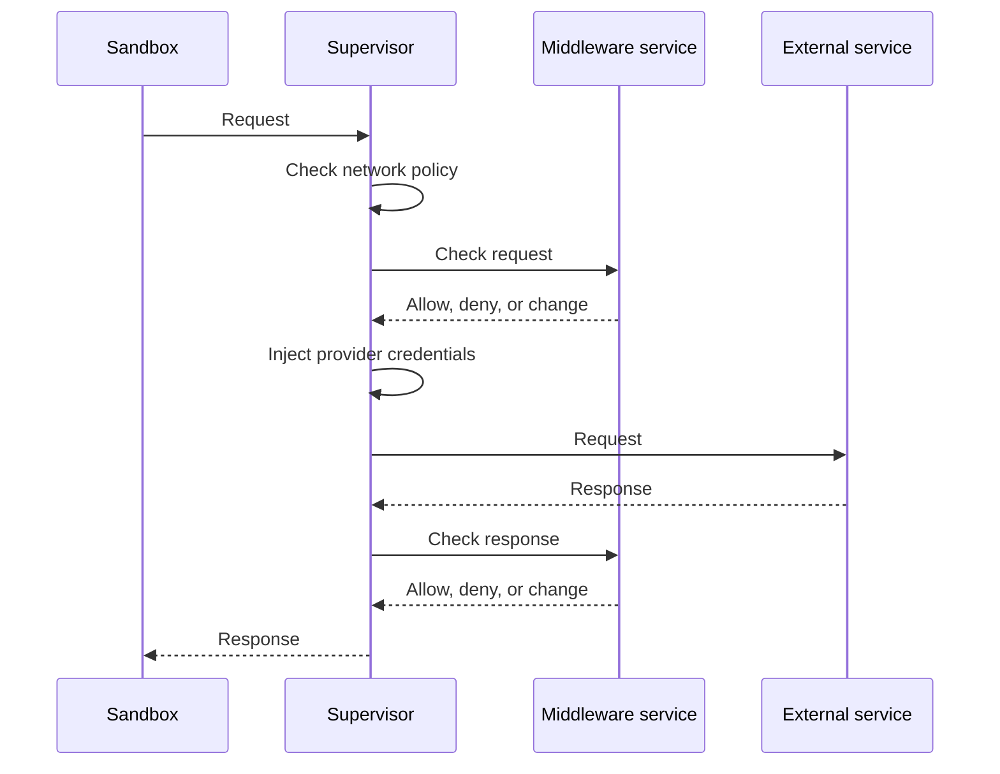

Supervisor middleware lets you inspect, block, or change the content that an agent sends and receives over the network. The sandbox supervisor, which enforces the sandbox's network policy, runs middleware as traffic passes between the agent and an external service.

## When to Use Middleware

A network policy decides whether an agent can call an API. Use middleware when you also need to check what the agent sends to that API or what the API returns, without changing the agent's code. For example, you can:

- Redact API tokens from outgoing request bodies.
- Reject requests that contain content your organization prohibits.
- Remove sensitive content from HTTP responses before the agent receives them.
- Check outgoing WebSocket text messages during a session.

The [content guard example](https://github.com/NVIDIA/OpenShell/tree/main/examples/supervisor-middleware-content-guard) shows a complete middleware service that performs checks like these.

## How Middleware Processes Traffic

The sandbox supervisor calls middleware after it checks network policy and before it forwards traffic to the external service:

OpenShell checks network policy first, so middleware only sees traffic that policy allows. It then selects middleware by destination host and runs it in the order you configure. OpenShell injects provider credentials after request middleware runs, so middleware never sees them.

Each middleware decides whether to allow, deny, or change the traffic. A denial blocks the request even when network policy allows it. If middleware fails or its service is unavailable, OpenShell blocks the affected traffic by default.

Middleware can handle three operations: HTTP requests, HTTP responses, and the text messages an agent sends over a WebSocket connection. Each middleware declares which operations it supports. [Supported Operations](/extensibility/supervisor-middleware/operations) describes each one.

## Current Limitations

- Middleware does not inspect WebSocket binary messages or messages that the external service sends to the agent.
- Response middleware cannot inspect the body of compressed, partial, or `Cache-Control: no-transform` responses.
- Middleware cannot inspect traffic to endpoints that use `tls: skip`.

If your deployment requires inspection of this traffic, middleware cannot enforce that requirement today.

## Configure Middleware

To add middleware to your sandboxes, start with configuration:

<Cards>

<Card title="Configuration" href="/extensibility/supervisor-middleware/configure">

Attach built-in middleware, register your own service, choose failure behavior, and observe middleware decisions.
</Card>

</Cards>

## Build Your Middleware Service

A middleware service is a gRPC server that implements the services in [`proto/supervisor_middleware.proto`](https://github.com/NVIDIA/OpenShell/blob/main/proto/supervisor_middleware.proto). The [content guard example](https://github.com/NVIDIA/OpenShell/tree/main/examples/supervisor-middleware-content-guard) is a complete service you can start from.

<Warning>

The middleware API is still evolving. Future versions will change it to make the contract consistent across HTTP requests, HTTP responses, and WebSocket messages. Expect to update your service when you upgrade OpenShell. [Protocol negotiation](/extensibility/extension-negotiation) detects incompatible versions at startup.

</Warning>

Every middleware service implements these RPCs:

- `Describe` returns the service manifest. The manifest lists the operations the service supports, with a payload limit and optional timeout for each. It also carries [protocol negotiation](/extensibility/extension-negotiation) metadata and the [expected audience](/extensibility/extension-authentication#confirm-the-audience-at-startup).
- `ValidateConfig` checks the `config` object from a policy entry. The gateway calls it before it accepts a policy.

The service then implements an evaluation RPC for each operation it supports, as described in [Supported Operations](/extensibility/supervisor-middleware/operations).

Most gRPC servers reject incoming messages larger than 4 MiB by default. Raise your server's limit to at least 4.5 MiB so that a maximum-size payload and the rest of the message fit.

These guides cover the rest of the service contract:

<Cards>

<Card title="Supported Operations" href="/extensibility/supervisor-middleware/operations">

When OpenShell calls your service, what it receives, and what it can return for HTTP requests, HTTP responses, and WebSocket messages.
</Card>

<Card title="Extension Authentication" href="/extensibility/extension-authentication">

How to verify that calls to your service come from your OpenShell gateway.
</Card>

<Card title="Protocol Negotiation" href="/extensibility/extension-negotiation">

How your service and OpenShell agree on a protocol version at startup.
</Card>

</Cards>
