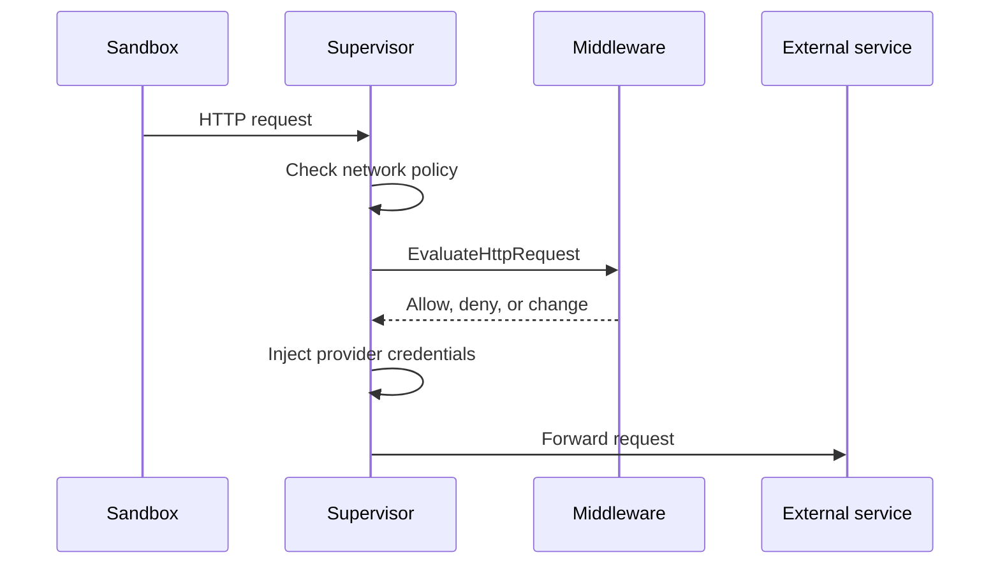
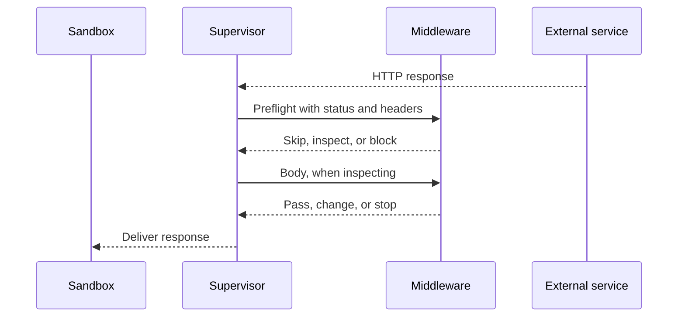
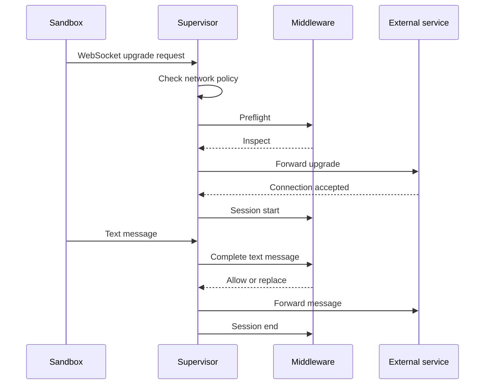

A middleware service handles one or more operations, such as HTTP requests or WebSocket messages. This page describes when OpenShell calls your service for each operation, what your service receives, and what it can return. The RPCs that every middleware service implements are described in [Build Your Middleware Service](/extensibility/supervisor-middleware#build-your-middleware-service).

## Operations and Phases

| Operation | Phase | When OpenShell calls your service | RPC |
| --- | --- | --- | --- |
| `HTTP_REQUEST` | `PRE_CREDENTIALS` | After network policy allows a request, before OpenShell injects provider credentials. | `EvaluateHttpRequest` |
| `HTTP_RESPONSE` | `PRE_RETURN` | After the external service responds, before the sandbox receives the response. | `HttpResponsePreReturn.Evaluate` |
| `WEBSOCKET_MESSAGE` | `PRE_CREDENTIALS` | When the sandbox opens a WebSocket connection, and for each text message it sends. | `EvaluateWebSocketSession` |

Your service declares each operation it supports as a binding, an operation and its phase, in its `Describe` manifest. OpenShell calls your service only for the operations it declares.

When several middleware match the same traffic, OpenShell calls them in ascending `order`, and each middleware sees the changes that earlier middleware made.

## Common Inputs and Results

Every operation includes a request context. The context always includes `sandbox_id`. Use it for authorization, persistence, and correlation. The context also includes `sandbox` and `workspace` names when available. Names can be reused, so use them only for display and logging.

Operations that include headers deliver them in wire order, and repeated headers stay separate. OpenShell removes credential, routing, and hop-by-hop headers before sending them to your service. It also removes framing headers from request input. Response preflight retains upstream `Content-Length`, `Content-Encoding`, and `Content-Range` as read-only metadata, unless `Connection` names them as hop-by-hop headers. Your service cannot change or remove these fields; OpenShell handles downstream framing.

Every result can include an optional reason code, findings, and metadata:

- A reason code identifies why your service denied traffic. OpenShell includes it in logs and in HTTP error responses. It must be 1-64 bytes long, start with a lowercase ASCII letter, and contain only lowercase ASCII letters, digits, and underscores. OpenShell treats an invalid code as a middleware failure.
- Findings report what your service detected, even when it allows the traffic. OpenShell logs how many findings your service reported, not their text.
- Metadata carries non-secret diagnostic details. OpenShell does not log it.

OpenShell never forwards free-form text from your service to the sandbox or to logs.

## HTTP

HTTP middleware can check a request before it leaves the sandbox, and the response before the sandbox receives it. A service can support either operation or both.

### Requests

OpenShell calls your service after network policy allows a request and before it injects provider credentials. Your service can allow, deny, or change the request.



<AccordionGroup>
<Accordion title="What Your Service Receives">

The request body, target, headers, and request context.

</Accordion>
<Accordion title="What Your Service Can Return">

- Allow the request unchanged.
- Deny the request with an optional reason code.
- Replace the body, up to the same payload limit as the input.
- Add, change, or remove headers.

When your service replaces the body, OpenShell checks the new body against body-aware policy, such as GraphQL, JSON-RPC, or MCP rules, before the next middleware or the external service sees it. A replacement cannot introduce an operation that policy denies.

</Accordion>
<Accordion title="Denials and Failures">

When your service denies a request, the sandbox receives a structured error and OpenShell does not contact the external service:

```json
{
  "error": "middleware_denied",
  "detail": "Request rejected by configured middleware",
  "policy": "api-policy",
  "middleware": "content-guard",
  "reason_code": "content_match"
}
```

When middleware fails, the sandbox receives `error: middleware_failed` instead.

</Accordion>
<Accordion title="Header Change Rules">

A result can include an ordered list of header changes. A `write` change sets how it treats an existing header with the same name:

- `append` adds another value.
- `overwrite` replaces all existing values.
- `skip` keeps the existing values.

A `remove` change removes all values for the name. OpenShell protects credential, routing, framing, and connection headers, and for responses also status, authentication challenge, content coding, range, and security policy headers. Header values cannot contain control characters, and request header values cannot contain OpenShell credential placeholders.

OpenShell applies each middleware's changes as a unit. If one change is invalid, it discards all of them and treats the result as a middleware failure.

</Accordion>
</AccordionGroup>

### Responses

OpenShell calls your service after the external service responds and before the sandbox receives the response. At preflight, your service can skip inspection, block delivery, or choose how to inspect the response. During inspection, it can change or block the response.



<AccordionGroup>
<Accordion title="Preflight and Body Modes">

The preflight includes the status and headers. A preflight result can skip inspection, block delivery with `block_delivery`, or inspect the response with one body mode:

| Mode | Behavior |
| --- | --- |
| `HEADERS_ONLY` | Inspects the status and headers without the body. |
| `WHOLE_BODY_BYTES` | Receives the complete body in one piece before OpenShell sends anything to the sandbox. |
| `STREAM_BYTES` | Receives the body in ordered pieces of at most 64 KiB, so delivery can start before the body ends. |

Body inspection is unavailable for responses without a body, partial responses, compressed responses, and responses with `Cache-Control: no-transform`. For those, a middleware that requests body inspection fails. Interim `1xx` responses pass through unchanged, and a `101` protocol upgrade skips response middleware.

</Accordion>
<Accordion title="What Your Service Can Return">

- Pass the response or body piece unchanged.
- Replace the body or a body piece.
- Add, change, or remove headers, with the same rules as requests.
- Block delivery with an optional reason code.

</Accordion>
<Accordion title="Blocking and Failures">

If your service blocks the response before OpenShell starts sending it, the sandbox receives `403 Forbidden` with the same `middleware_denied` error as a denied request. If middleware fails before then, the sandbox receives `502 Bad Gateway` with `error: response_delivery_failed`. If delivery has already started, OpenShell aborts the response in both cases.

The external service has already handled the request, so blocking its response does not undo it, and retrying the request may repeat side effects.

</Accordion>
<Accordion title="Trailers and Framing">

A service that inspects the body also receives trailers after the body. A preflight can declare new trailer names, and the service can then add them.

After middleware changes the body, OpenShell recalculates `Content-Length` and framing, so your service never handles transfer encoding.

</Accordion>
</AccordionGroup>

## WebSocket

WebSocket middleware checks the text messages the sandbox sends over a WebSocket connection.

### Messages

OpenShell calls your service when the sandbox opens a WebSocket connection, then for each text message the sandbox sends. Your service can allow, deny, or replace each message.



<AccordionGroup>
<Accordion title="Session Events">

OpenShell opens one bidirectional stream to your service for each connection and sends these events:

1. A preflight before contacting the external service. Your service returns `INSPECT`, `SKIP`, or `DENY`. `SKIP` closes the middleware stream and passes all messages without inspection by that middleware. `DENY` rejects the upgrade.
2. A session start after the external service accepts the connection. It includes the negotiated subprotocol.
3. Each complete text message from the sandbox, in order.
4. A session end when the connection closes, sent on a best-effort basis.

Your service returns a result for each preflight and message. Session start and end are notifications that need no result. When OpenShell closes its side of the stream, finish your side of the stream too.

</Accordion>
<Accordion title="Message Handling">

OpenShell reassembles fragmented messages and decompresses `permessage-deflate` messages before sending them, so your service always receives a complete UTF-8 text message. A replacement can be any text, including an empty string. OpenShell re-frames and, when needed, re-compresses the replacement before forwarding it.

OpenShell does not send binary messages, control frames, or messages from the external service to middleware. Binary messages pass through unchanged, and OpenShell records an `unsupported_message_type` coverage event. Message sequence numbers count binary messages too, so your service can see gaps between text messages.

Only middleware that declares `WEBSOCKET_MESSAGE` receives messages. Middleware that declares only `HTTP_REQUEST` still inspects the upgrade request, and OpenShell records a `binding_not_selected` coverage event for it.

</Accordion>
<Accordion title="Denials and Failures">

A denied message closes the connection with code `1008`. When middleware fails, OpenShell rejects the upgrade or closes the connection. With `fail_open`, OpenShell instead stops using that middleware for the rest of the connection.

</Accordion>
<Accordion title="Close Codes">

| Code | Meaning |
| --- | --- |
| `1002` | WebSocket protocol error. |
| `1007` | Invalid UTF-8 text. |
| `1008` | Middleware or policy denial. |
| `1009` | Text message exceeds the 4 MiB platform limit. |
| `1012` | A policy change requires the connection to restart. |
| `1013` | Message assembly capacity is full. |

</Accordion>
</AccordionGroup>

## Limits

| Limit | Applies to | Value |
| --- | --- | --- |
| Payload per middleware | All operations | The registration's `max_payload_bytes`, up to 4 MiB. Applies to a request body, a whole response body or one streamed piece, or one text message, and to each replacement. |
| Time per evaluation or stream exchange | All operations | The smaller of the registration `timeout` and the binding timeout in the service manifest. Accepted HTTP response and WebSocket streams have no connection-wide deadline. |
| Streamed body piece | HTTP responses | 64 KiB. |
| Time for all middleware on one streamed piece | HTTP responses | 30 seconds. |
| Fragments per message | WebSocket messages | 4,096. |
| Time to assemble a message | WebSocket messages | 30 seconds without progress, or 2 minutes in total. |
| Time to forward a message | WebSocket messages | 2 minutes. |

When a payload exceeds one middleware's limit, that middleware fails. Other middleware keep their own limits.

Middleware evaluation capacity in each sandbox is shared by all operations. When it is full, OpenShell returns `503 Service Unavailable` for an HTTP request before reading its body. When WebSocket message assembly capacity is full, OpenShell closes the connection with code `1013`.
