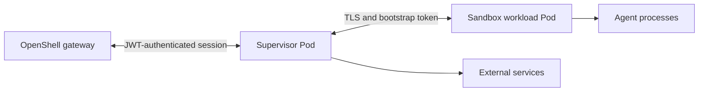

OpenShell runs each Kubernetes sandbox as two separately scheduled workloads.
The sandbox owns the agent process. The supervisor owns gateway credentials,
policy decisions, and upstream connections.

## Understand the Components

The Kubernetes driver always uses this placement:



`openshell-sandbox` runs as PID 1 in the workload container. It launches the
agent, applies Landlock and child seccomp filters, identifies the process behind
each network operation, and relays approved streams. `openshell-supervisor` runs
in a directly managed Pod. It authenticates to the gateway, evaluates policy,
handles L7 and provider transformations, and opens upstream connections.

Both containers run as the same namespace-resolved non-root UID and GID. Their
Pod specs set `allowPrivilegeEscalation: false`, drop every Linux capability,
and use `RuntimeDefault` seccomp. The sandbox installs an additional nested
seccomp user-notification filter without requesting a capability. Startup fails
closed if the runtime blocks the required seccomp or Landlock operations.

The supervisor Pod points directly to the Sandbox resource with a non-controller
owner reference. Kubernetes therefore removes it when the Sandbox is deleted,
while the Agent Sandbox controller remains the sole controller of the workload
Pod.

## Enforce Network Isolation

The driver creates one workload fence per sandbox namespace before it releases
any workload Pod:

```yaml
apiVersion: networking.k8s.io/v1
kind: NetworkPolicy
spec:
  podSelector:
    matchLabels:
      openshell.ai/boundary-role: workload
  policyTypes: [Ingress, Egress]
  ingress:
    - from:
        - podSelector:
            matchLabels:
              openshell.ai/boundary-role: supervisor
      ports:
        - protocol: TCP
          port: 5500
  egress: []
```

The empty egress list blocks direct DNS, gateway, node, metadata, and Internet
connections from every OpenShell workload in the namespace. The ingress rule
allows OpenShell supervisor Pods to reach sandbox TLS listeners. TLS, JWT
claims, session generation, and recorded Pod UIDs—not the NetworkPolicy—bind a
supervisor to its exact sandbox. Supervisors can reach cluster DNS, the gateway,
and policy-approved upstream destinations unless another namespace policy
restricts them.

Kubernetes policies are additive. Keep sandbox namespaces under administrative
control so another principal cannot add permissive policies, create Pods with
OpenShell labels, or read bootstrap Secrets. The cluster CNI MUST enforce both
ingress and egress `NetworkPolicy` in every sandbox namespace. Kubernetes accepts
policy objects even when no CNI enforces them; OpenShell does not test traffic
to verify enforcement.

## Bootstrap a Sandbox

Resource admission checks external references selected through the OpenShell-owned
Pod template before provisioning and again before releasing the workload's
scheduling gate. Kubernetes API-server and admission-webhook mutations of the
live Pod are trusted cluster-operator behavior and are not used as Workspace User
authorization inputs. PVCs and other supported external references require
operator approval labels, including same-namespace and read-only mounts.
Unexpected references, changed resource UIDs, and unsupported volume sources fail
closed. GPU device attachments are temporarily exempt. The driver rechecks
persisted references on restart and every 30 seconds during reconciliation;
confirmed revocation suspends compute, while transient lookup failures block new
launches and recovery.

See [External Resource Admission](../reference/gateway-config#external-resource-admission)
for label configuration and upgrade requirements. Admission cannot repair data
or credentials compromised before upgrade.

The driver creates each sandbox generation in a fail-closed order:

1. Create and validate the workload egress fence.
2. Create the Sandbox resource with a scheduling gate.
3. Inspect the admitted Pod identity, security context, DNS settings, and
   generation-specific Secret reference.
4. Create a gated supervisor Pod and separate immutable Secrets for sandbox and
   supervisor trust material. Outside shared mode, the supervisor Secret also
   carries the gateway client TLS material. In managed mode, the driver also
   creates immutable copies of the configured image-pull Secrets for the
   generation.
5. Remove both scheduling gates.
6. Publish readiness only after the supervisor attaches, confirms enforcement,
   and registers the gateway relay.

The trusted sandbox init container copies its Secret into a memory-backed
volume. The main container never mounts the projected Secret and removes the
staged bootstrap before it launches untrusted code. The supervisor receives an
audience-bound Kubernetes token, exchanges it for a sandbox-scoped JWT, and
keeps gateway and provider credentials outside the workload Pod.

Stopping a sandbox removes both the workload and supervisor Pods. Starting it
creates a new generation with new Secrets and a replacement supervisor Pod
while preserving the workspace PVC. The namespace-wide workload fence remains
in place across sandbox generations.

If provisioning is interrupted, recovery first confirms that the old workload
Pod is gone. It then deletes the recorded generation's Secrets by name and
clears the rollback state so the next generation can be created. Each
generation Secret is owned by its Pod, so Kubernetes garbage collection removes
any other generation. The Helm chart grants the gateway `create` and `delete`
access to Secrets for this lifecycle.

## Check Cluster Requirements

This architecture requires the following cluster behavior:

- Linux nodes and a container runtime that permits an unprivileged process to
  install a nested seccomp user-notification filter under `RuntimeDefault`.
- Landlock enabled and usable by the non-root sandbox process.
- A CNI that enforces `networking.k8s.io/v1` ingress and egress policies,
  including node-local and metadata destinations.
- Support for Pod scheduling gates and the safe
  `net.ipv4.ip_unprivileged_port_start=0` sysctl.
- Administrative control of sandbox namespaces and OpenShell role labels.

OpenShell actively probes the Linux primitives and validates the admitted Pod
before starting the agent. Treat a failed probe or changed security posture as
an unsupported runtime, not a degraded mode.
