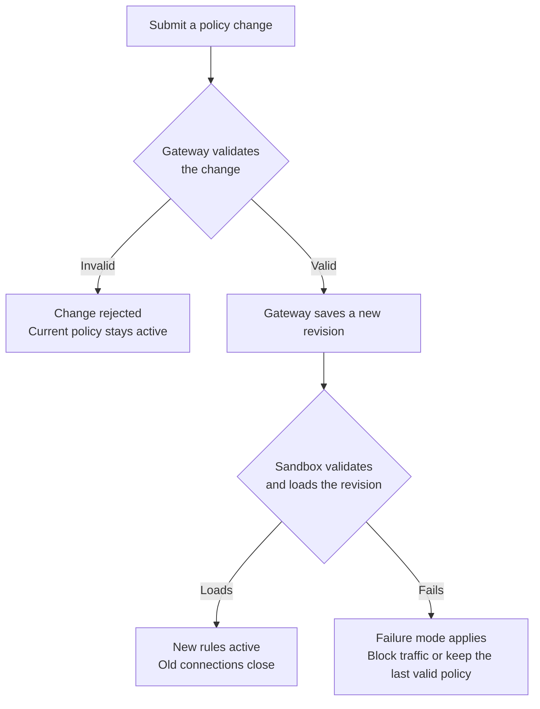

This page shows how to use the OpenShell CLI to manage a sandbox's policy, from
setting a policy when you create a sandbox to changing it while the sandbox
runs, confirming that the change took effect, and rolling it back. Run
`openshell policy --help` for every command and option.

## Create a Sandbox with a Policy

Pass a policy file when you create a sandbox. Filesystem, Landlock, and process
settings take effect only when the sandbox starts, so set them here:

```shell
openshell sandbox create --name my-sandbox --policy ./policy.yaml
```

The rest of this page refers to this sandbox as `my-sandbox`. If you omit the
sandbox name from an `openshell policy` command, the CLI uses the sandbox you
used most recently.

To use the same file for every sandbox you create, set
`OPENSHELL_SANDBOX_POLICY` instead of passing `--policy`:

```shell
export OPENSHELL_SANDBOX_POLICY=./policy.yaml
openshell sandbox create --name my-sandbox
```

Without either, the sandbox uses a policy from its image or the restrictive
[default policy](/reference/default-policy).

## Ship a Policy in an Image

To include a policy in a sandbox image, add it at `/etc/openshell/policy.yaml`:

```dockerfile
COPY policy.yaml /etc/openshell/policy.yaml
```

OpenShell uses the image policy only when the sandbox has no saved policy, so a
`--policy` file or `OPENSHELL_SANDBOX_POLICY` takes precedence. If the image
policy is invalid, the sandbox does not start until you [replace it with a valid
policy](#a-new-sandbox-stays-in-provisioning). OpenShell
does not fall back to the default policy.

## Inspect the Current Policy

A sandbox's policy has two views. The base policy is the policy you set for the
sandbox. The effective policy is the policy the sandbox enforces, which is the
base policy plus any rules that attached providers add. When an administrator
sets a gateway-global policy, it replaces both, so the effective policy is the
global policy. `--base` shows the base policy, and `--full` shows the effective
policy:

```shell
openshell policy get my-sandbox --base
openshell policy get my-sandbox --full
```

Edit from the base policy, because provider rules belong to their providers, not
to the sandbox's own policy. Use the effective policy to see everything the
sandbox can reach, for example to find out why a request is allowed.

To save the effective policy as a YAML file, for example to review it or to
check it with the [policy prover](/reference/policy-prover):

```shell
openshell sandbox get my-sandbox --policy-only > effective-policy.yaml
```

To see each revision of the policy and whether the sandbox loaded it:

```shell
openshell policy list my-sandbox
```

## Add or Remove Network Access

`openshell policy update` adds or removes network rules on a running sandbox. It
changes only the `network_policies` section, so you do not need a complete
policy file.

For example, to let `curl` in the sandbox make read-only requests to the GitHub
API:

```shell
openshell policy update my-sandbox \
  --rule-name github_readonly \
  --binary /usr/bin/curl \
  --add-endpoint api.github.com:443:read-only:rest:enforce \
  --wait
```

The endpoint sets the host and port, then the request rules. `read-only` allows
`GET`, `HEAD`, and `OPTIONS` requests, `rest` turns on HTTP request inspection,
and `enforce` blocks every other request. The `--binary` path must match the
executable inside the sandbox.

To allow another kind of request on an existing rule, add an allow rule. Name
the rule and repeat its complete binary list from the base policy, so the
command changes only that rule:

```shell
openshell policy update my-sandbox \
  --rule-name github_readonly \
  --binary /usr/bin/curl \
  --add-allow 'api.github.com:443:POST:/repos/*/*/issues' \
  --wait
```

`--rule-name` refers to the rule's key under `network_policies`, which can
differ from its `name` field. Use `--add-deny` the same way to block a request.
To remove the rule:

```shell
openshell policy update my-sandbox --remove-rule github_readonly --wait
```

To preview a change without applying it, replace `--wait` with `--dry-run`. A
preview does not guarantee that the sandbox will accept the change. Preview
`--remove-endpoint` in particular, because it removes the destination from every
rule that lists it.

## Replace the Complete Policy

`openshell policy set` replaces the whole policy. Use it for changes that
`policy update` cannot make, such as middleware, GraphQL, MCP, or JSON-RPC rules,
`tls: skip`, or credential settings. The new file replaces every section, so
start from the current base policy.

<Tabs>
<Tab title="Edit YAML">
Print the base policy:

```shell
openshell policy get my-sandbox --base
```

The command prints revision details followed by the policy. Save only the policy
YAML as `policy.yaml`, then edit the sections you want to change. Keep
everything else, including filesystem paths that OpenShell added when the
sandbox started.

Submit the edited file and wait for the result:

```shell
openshell policy set my-sandbox --policy policy.yaml --wait
```

</Tab>
<Tab title="Script with jq">
Save the base policy as JSON:

```shell
set -o pipefail
openshell policy get my-sandbox --base --output json \
  | jq -e '.policy' > base-policy.json
```

Edit `base-policy.json`, then submit it and wait for the result:

```shell
openshell policy set my-sandbox --policy base-policy.json --wait
```

</Tab>
</Tabs>

The next section describes how each part of the new policy takes effect.

## How Changes Take Effect

When you apply a change with `openshell policy update` or `openshell policy set`,
the network sections of the policy take effect in the running sandbox. The
startup sections do not:

| Change | Effect on a running sandbox | Required action |
|---|---|---|
| Network rules | The sandbox loads the new rules. Connections opened under the previous rules close. | Apply the change, then retry the request. |
| Middleware in `network_middlewares` | You can add, remove, or reconfigure built-in middleware and external services already registered with the gateway. | Apply the change with `openshell policy set`. |
| External middleware registration | Policy changes cannot register a service or change its gateway connection settings. | Update the gateway configuration and restart the gateway. |
| Added filesystem paths | The saved policy can change, but the running workload keeps its existing filesystem permissions. | Recreate the sandbox. |
| Removed filesystem paths, or changed workdir, Landlock, or process settings | OpenShell rejects the change after the workload starts. | Recreate the sandbox. |

When new network rules take effect, OpenShell closes connections that were
opened under the previous rules, including HTTP keep-alive connections, tunnels,
WebSocket connections, and long-lived streams. Clients must reconnect, and their
next requests are checked against the new rules.

OpenShell validates every change twice before it takes effect:



The sandbox validates the revision again because it also accounts for provider
rules and other changes that arrive at the same time. If the sandbox cannot load
a revision, the gateway's `policy_validation_failure_mode` setting decides what
happens. With `fail_closed`, the default, the sandbox blocks network traffic
until you submit a valid policy. With `retain_last_valid`, the last valid policy
stays active. [A Change Fails to Load](#a-change-fails-to-load) explains how to
repair a rejected change.

## Change Filesystem and Process Settings

Filesystem, Landlock, and process settings take effect only when a sandbox
starts, so changing them requires a new sandbox. To change these settings, save
the base policy as described in [Replace the Complete
Policy](#replace-the-complete-policy), edit it, and create a new sandbox with
the file:

<Warning>
Deleting a sandbox stops its processes and removes its state. Copy out anything
you need before you delete it.
</Warning>

```shell
openshell sandbox delete my-sandbox
openshell sandbox create --name my-sandbox --policy ./policy.yaml
```

When the policy allows network access, OpenShell adds the system paths that
sandbox processes need, so list only the paths your workload requires. [Default
Policy](/reference/default-policy) lists those paths.

## Verify a Change

Without `--wait`, a successful command means only that the gateway accepted the
change. With `--wait`, the CLI also waits for the sandbox to report a result. It
exits with status `1` if the sandbox rejects the revision, and with status `124`
if the wait times out. A change whose wait timed out might still load later, so
check the revision status before you submit it again.

A successful exit does not always mean your change is active. It can also mean
that the policy was unchanged, or that a newer change replaced yours before it
loaded. Confirm the result:

```shell
openshell policy list my-sandbox
openshell policy get my-sandbox --full
```

The latest revision should show `Loaded`, and the effective policy should
contain your change.

Then test one request that should be allowed and one that should be blocked.
Confirm that a denial comes from OpenShell, as a `policy_denied` response or a
sandbox log entry, rather than from the destination service or a missing client
tool.

## Roll Back to an Earlier Revision

To restore an earlier policy, find the revision in
`openshell policy list my-sandbox` and print its base policy. For example, for
revision 2:

```shell
openshell policy get my-sandbox --rev 2 --base
```

Save the policy YAML from the output as `previous-base.yaml`, review it, and
submit it as a new revision:

```shell
openshell policy set my-sandbox --policy previous-base.yaml --wait
```

Rolling back restores only the policy. It does not restore provider profiles,
attachments, credentials, or a gateway-global policy, and the limits on
filesystem and process changes still apply.

## Apply a Gateway-Wide Policy

A gateway administrator can apply one policy to every sandbox on the gateway.
The global policy replaces each sandbox's policy and blocks sandbox policy
changes until you delete it. These commands require the platform administrator
role:

| Task | Command |
|---|---|
| Inspect the current global policy. | `openshell policy get --global --full` |
| Apply a reviewed complete policy. | `openshell policy set --global --policy ./global-policy.yaml` |
| View global policy history. | `openshell policy list --global` |
| Remove the global policy and restore normal policy selection. | `openshell policy delete --global` |

A global policy takes effect immediately. The set and delete commands ask for
confirmation, because each one changes the network access of every sandbox on
the gateway. Deleting the global policy fails if a sandbox's own policy and
provider rules would be invalid once restored.

## Troubleshoot

### A Request Is Denied

OpenShell logs every denied connection and request with the destination, the
binary, and the reason. Check the sandbox log first:

```shell
openshell logs my-sandbox --since 10m --source sandbox
```

Policy events are INFO-level log records, so do not filter the log with
`--level warn`. Compare the logged binary and destination with the effective
policy, and use the error code in the response to find the cause:

| Error | Cause | What to check |
|---|---|---|
| `policy_denied` | No rule allows the connection, or a request rule blocks the request. | A rule lists the logged binary, host, and port, and its request rules allow the method and path. Scripts appear as their interpreter, such as `/usr/bin/python3.12`. |
| `request_authority_mismatch` | The HTTP request's host or port differs from the connection's destination. | The client's `Host` header, including any non-default port, matches the connection. |
| `credential_endpoint_mismatch` | A network rule allowed the request, but the provider credential is not bound to this destination. | The provider's profile endpoints or credential binding. Do not widen the network rule. |
| `credential_placeholder_in_request_body` | The request body contains an invalid or revoked credential placeholder. | Remove the stale placeholder or restore the provider. |

### A Change Fails to Load

`openshell policy list my-sandbox` shows a revision that the sandbox rejected as
`Failed`, with the error. What happens to network access depends on the failure
mode described in [How Changes Take Effect](#how-changes-take-effect). With the
default, `fail_closed`, the sandbox blocks network traffic until a valid policy
loads. Fix the error and submit the policy again, or [roll back to an earlier
revision](#roll-back-to-an-earlier-revision).

### A New Sandbox Stays in Provisioning

If a new sandbox's policy or provider configuration is invalid, including an
invalid image policy, the sandbox stays in `Provisioning` with a
`ConfigurationInvalid` condition and its workload does not start. Check the
diagnostic:

```shell
openshell sandbox get my-sandbox --output json
```

You have 300 seconds to fix the configuration. Replace the policy with
`openshell policy set`, or fix the provider configuration. Until the workload
first starts, you can also change filesystem, Landlock, and process settings.
Each change to the policy, providers, or settings restarts the 300 seconds.

If the time runs out, the sandbox moves to `Error` with the reason
`ProvisioningTimedOut`. Fixing the configuration does not restart it. After you
fix it, start the sandbox again, which begins a new 300-second window:

```shell
openshell sandbox start my-sandbox
```

## Next Steps

- Use [Network Rules](/sandboxes/network-rules) for example rules you can adapt
  to common services and protocols.
- Use the [Policy Schema Reference](/reference/policy-schema) for every field,
  default, and constraint.
