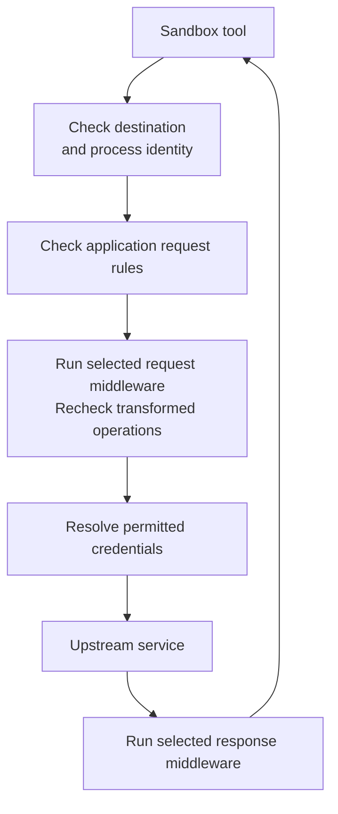

Network rules combine a destination and executable with optional
application-request checks. Each recipe on this page illustrates a permission
for a particular protocol and how to verify it. Choose the recipe that matches
your service and adapt it to your sandbox's policy.

## Choose a Protocol

OpenShell first checks whether a program can connect to a host and port
(Layer 4). For inspected protocols, it then checks the application request
(Layer 7).

| Reader goal | `protocol` | Inspected boundary |
|---|---|---|
| Allow HTTP methods and paths | `rest` | HTTP requests. |
| Connect a database or other native client | `tcp` | Connection only, without payload inspection. |
| Control an RFC 6455 client | `websocket` | Upgrade request and supported client messages. |
| Control GraphQL operations | `graphql` | GraphQL-over-HTTP operations. |
| Control MCP methods and tools | `mcp` | MCP Streamable HTTP client requests. |
| Control generic JSON-RPC methods | `json-rpc` | JSON-RPC-over-HTTP client requests. |

If you omit `protocol`, OpenShell does not apply protocol-specific request rules.
This does not disable the proxy's TLS handling or HTTP destination checks. Use
`protocol: tcp` for a native socket, or `tls: skip` when a client needs a raw
stream such as client-certificate mTLS. Provider-credentialed endpoints reject
uninspected traffic unless you explicitly set
`allow_uninspected_credentials: true`.

## Understand Inspected HTTP Flow

Inspected HTTP requests pass through several independent checks.



Network rules check the destination and the calling program before allowing a
connection. Protocol rules then check the application request. Middleware can
filter or transform allowed traffic, and credential checks determine whether
OpenShell can supply credentials to the destination. See the recipes below for
native TCP and WebSocket boundaries that differ from ordinary inspected HTTP
requests.

## Apply a Recipe

Each recipe can be applied independently. Its YAML supplies an entry for the
`network_policies` section of a complete policy file. The commands use
`my-sandbox` as a placeholder for your running sandbox's name. Before applying
a recipe, confirm that the sandbox contains its client executable and that the
destination service is available. Replace example domains with services you
control.

Start with the current base policy so you preserve startup settings and exclude
provider-owned rules:

```shell
openshell policy get my-sandbox --base
```

Copy the YAML below the `---` separator into `policy.yaml`, leaving out the
status metadata above it. Add the recipe to the `network_policies` section,
creating that section if needed. Replace example hosts, paths, and binaries
with your own values. Each recipe supplies a network rule; keep the other
sections of your complete policy file.

Keep unrelated rules, and replace an existing rule with the same key only when
that is your intent. Review the complete file, then apply it and confirm which
revision is active:

```shell
openshell policy set my-sandbox --policy policy.yaml --wait
openshell policy list my-sandbox
openshell policy get my-sandbox --full
```

For changes supported by `openshell policy update`, [incremental
updates](/reference/policy-updates) preserve the other policy sections without
requiring a complete replacement file. A successful parse or submission
does not prove that the runtime activated the policy, so inspect revision status
before testing traffic.

## Allow REST Reads

Use `protocol: rest` to match HTTP methods, paths, and optional query values.
Set `enforcement: enforce` whenever the rule must block a request.

Insert this entry under `network_policies`:

```yaml
github_readonly:
  name: github-readonly
  endpoints:
    - host: api.github.com
      port: 443
      protocol: rest
      enforcement: enforce
      access: read-only
  binaries:
    - path: /usr/bin/curl
```

[Apply this rule](#apply-a-recipe), then verify an allowed GET and a denied
POST from a sandbox with `/usr/bin/curl` installed:

```shell
openshell sandbox exec -n my-sandbox --no-login-shell -- \
  /usr/bin/curl --silent --show-error --fail \
  https://api.github.com/zen
openshell sandbox exec -n my-sandbox --no-login-shell -- \
  /usr/bin/curl --silent --show-error \
  --request POST https://api.github.com/zen
```

The POST must return an OpenShell `policy_denied` response. `read-only` is an
HTTP operation preset, not a guarantee that an upstream GET has no side effect.

For explicit rules, `*` in a request path can cross `/` boundaries. Quote globs
in shell commands so the local shell does not expand them.

### Observe a Rule Before Enforcing It

An endpoint with `enforcement: audit` logs applicable request-rule violations
and forwards the requests. For a REST endpoint with `access: read-only`, a POST
therefore produces a violation event but still reaches the upstream service if
the other checks allow it. The resulting HTTP status comes from that service.
Choose audit mode when you intend to observe violations without blocking them.

Inspect the policy event without a WARN filter:

```shell
openshell logs my-sandbox --since 5m --source sandbox
```

Look for an event identifying the request-policy violation even though the
request was forwarded. OCSF policy events are INFO-level tracing records; their OCSF
severity does not change the CLI's tracing-level filter. Audit does not bypass
destination, executable, credential, parser, or middleware checks. An endpoint
must use `enforcement: enforce` for its request rules to block traffic.

## Scope GitHub API Access to a Repository

An agent using the GitHub CLI may need repository API operations in addition to
Git clone, fetch, or push. This rule permits `gh` to make REST requests under
one repository's API path. Replace `<org>` and `<repo>` with its owner and name,
and keep only the executable paths used by your image:

```yaml
github_repository_api:
  name: github-repository-api
  endpoints:
    - host: api.github.com
      port: 443
      protocol: rest
      enforcement: enforce
      rules:
        - allow:
            method: "*"
            path: "/repos/<org>/<repo>/**"
  binaries:
    - path: /usr/bin/gh
    - path: /usr/local/bin/gh
```

The rule grants all HTTP methods within that path, including writes. Narrow the
methods and paths if the agent needs only specific operations. It does not
grant Git transport access or GraphQL mutations.

[Apply the rule](#apply-a-recipe) with a GitHub provider attached. Its profile
must permit credential use at the destination, and the token must authorize the
repository operation. Provider-contributed read permissions remain available.
Verify a permitted operation on the selected repository and confirm that a
write to a disposable second repository receives an OpenShell denial. Use `gh`
for both checks so the requests use the executable selected by this rule.

For a complete Git push example, see
[Grant GitHub Push Access to a Sandboxed Agent](/get-started/tutorials/github-sandbox).

## Match Query Values

REST query matchers run on decoded, case-sensitive values. This adaptable
template requires `/usr/bin/curl` and an HTTP service you control. Replace the
hostname, path, and accepted query values before applying it:

```yaml
download_query:
  name: download-query
  endpoints:
    - host: api.example.com
      port: 443
      protocol: rest
      enforcement: enforce
      rules:
        - allow:
            method: GET
            path: /api/v1/download
            query:
              slug: skill-*
              version:
                any: ["1.*", "2.*"]
  binaries:
    - path: /usr/bin/curl
```

For an allow rule, every value for a duplicate query key must match. For a deny
rule, every configured key must be present with at least one matching value; an
additional nonmatching duplicate does not cancel a matching value. Start with a
single query key when possible. [Apply the template](#apply-a-recipe), then test
the intended match and near misses against your service.

## Allow Native TCP

Use `protocol: tcp` when the application needs ordinary DNS resolution and a
native TCP socket. The rule checks the hostname, port, and executable but cannot
inspect the application payload.

Insert this entry under `network_policies`:

```yaml
postgres:
  name: postgres
  endpoints:
    - host: db.internal.example
      port: 5432
      protocol: tcp
  binaries:
    - path: /usr/bin/psql
```

Do not add `access`, `enforcement`, request rules, or credential-rewrite fields
to a TCP endpoint. This template requires `/usr/bin/psql` and a PostgreSQL
service reachable at the replacement hostname. [Apply the
template](#apply-a-recipe), verify that `psql` reaches the server, then verify
that another binary or port is denied at the connection boundary.

Docker and Podman support native TCP enforcement. The standard runtime prepares
DNS and TCP connection handling before the workload starts, even when the
initial policy has no TCP endpoints. You can therefore add the first endpoint
without recreating the sandbox. Other runtimes must provide the same support
and have it ready before activating a TCP rule.

Prefer exact hostnames. A wildcard authorizes DNS queries for every matching
name, which can expose a DNS-label exfiltration channel. An allowed hostname on
shared infrastructure can also reach other tenants or virtual services behind
the same connection because OpenShell does not inspect the payload's authority.

For a connection-only check, use a client command that fails before application
authentication when the policy is absent, then succeeds far enough to reach the
server when the rule is present. A database authentication error can demonstrate
that the TCP connection reached the server, but it does not prove that database
credentials are correct. After removing the rule, confirm the client cannot
reach the server and inspect the sandbox log for the denied hostname and binary.

Policy DNS returns a supervisor-owned synthetic address with a bounded TTL.
Clients must honor that TTL and resolve the hostname again before reconnecting;
a client that caches the synthetic address indefinitely can fail after its
mapping expires even while the endpoint remains allowed. Docker and Podman
currently advertise IPv4 egress for policy DNS, so AAAA queries return a
successful empty answer and dual-stack clients must continue with the A record.

`allowed_ips` can constrain the addresses accepted for a hostname, but it does
not replace hostname authorization. Account for DNS rotation and service
failover before pinning addresses. Review both the hostname and resolved address
in diagnostics instead of broadening the wildcard when an address changes.

## Allow WebSocket Messages

Use `protocol: websocket` for an RFC 6455 upgrade and client-to-server message
policy. This adaptable template requires `/usr/bin/node` and a WebSocket service
you control. It permits the `/v1/realtime` upgrade and client text messages on
that upgraded path while denying `/v1/admin/**`:

```yaml
realtime:
  name: realtime
  endpoints:
    - host: realtime.example.com
      port: 443
      protocol: websocket
      enforcement: enforce
      rules:
        - allow:
            method: GET
            path: /v1/realtime
        - allow:
            method: WEBSOCKET_TEXT
            path: /v1/realtime
      deny_rules:
        - method: "*"
          path: /v1/admin/**
  binaries:
    - path: /usr/bin/node
```

[Apply the template](#apply-a-recipe), then use your Node client to test a
successful upgrade and text message on `/v1/realtime` and a denied upgrade or
message on `/v1/admin/**`. The path on a `WEBSOCKET_TEXT` rule is the original
upgrade path, not text-frame content.

OpenShell inspects complete client text messages. It does not inspect binary
frames or upstream-to-client messages. Provider-credentialed endpoints remain
on the parsed relay and reject binary frames unless
`allow_uninspected_credentials: true` explicitly accepts the weaker boundary.
Set `websocket_credential_rewrite: true` only when client text messages contain
OpenShell credential placeholders that must be resolved.

## Allow GraphQL Operations

Use `protocol: graphql` for GraphQL-over-HTTP. This template requires
`/usr/bin/gh`, a GitHub credential with the required permissions, and the GitHub
GraphQL schema. It allows selected queries and `createIssue`, while denying
`deleteRepository`:

```yaml
github_graphql:
  name: github-graphql
  endpoints:
    - host: api.github.com
      port: 443
      path: /graphql
      protocol: graphql
      enforcement: enforce
      rules:
        - allow:
            operation_type: query
            fields: [viewer, repository]
        - allow:
            operation_type: mutation
            fields: [createIssue]
      deny_rules:
        - operation_type: mutation
          fields: [deleteRepository]
  binaries:
    - path: /usr/bin/gh
```

[Apply the template](#apply-a-recipe), then test an allowed query and the denied
mutation with the configured client. For allow rules, every selected root field
must match. For deny rules, one matching root field blocks the request. A
malformed, denied, or unregistered operation denies an entire batched HTTP
request.

GraphQL field names are application-specific. Do not treat a copied field list
as a verified safety boundary. Review and test it against the authoritative
schema for the deployed service version. Hash-only persisted queries require
`persisted_queries: allow_registered` and a trusted
`graphql_persisted_queries` registry.

For GraphQL-over-WebSocket, use `protocol: websocket`, allow the upgrade with a
GET rule, and add GraphQL operation rules for client operation messages. Client
operation messages fail closed when malformed or disallowed. Lifecycle messages
such as `connection_init`, `ping`, `pong`, and `complete` are allowed without
payload logging.

## Allow MCP Tools

Use `protocol: mcp` for sandbox-to-server MCP Streamable HTTP requests. This
adaptable template requires `/usr/bin/python3` with an MCP client and a
Streamable HTTP server you control. It allows initialization, tool discovery,
and `read_status`, while denying `delete_resource`:

```yaml
mcp_server:
  name: mcp-server
  endpoints:
    - host: mcp.example.com
      port: 443
      path: /mcp
      protocol: mcp
      enforcement: enforce
      rules:
        - allow:
            method: initialize
        - allow:
            method: notifications/initialized
        - allow:
            method: tools/list
        - allow:
            method: tools/call
            tool: read_status
      deny_rules:
        - method: tools/call
          tool: delete_resource
  binaries:
    - path: /usr/bin/python3
```

[Apply the template](#apply-a-recipe), then verify initialization and
`read_status` before confirming that `delete_resource` returns a policy denial.
Tool argument matching is not supported, so an allowed tool can receive any
arguments accepted by the server.

Omitting `mcp.versions` selects the exact `2025-11-25` revision. Supported
explicit values are `2025-03-26`, `2025-06-18`, and `2025-11-25`. This is an
allowlist, not a date range or moving `latest`. OpenShell checks one
`MCP-Protocol-Version` header on each request except a valid standalone
`initialize`; it does not negotiate every revision's complete wire profile or
bind server session state. Server responses and SSE messages are relayed without
MCP policy parsing.

## Allow JSON-RPC Methods

Use `protocol: json-rpc` for non-MCP JSON-RPC-over-HTTP. This adaptable template
requires `/usr/bin/python3` with a JSON-RPC client and an HTTP service you
control. It allows `reports.list` and `reports.search`, while denying
`reports.delete`:

```yaml
reports_rpc:
  name: reports-rpc
  endpoints:
    - host: rpc.example.com
      port: 443
      path: /rpc
      protocol: json-rpc
      enforcement: enforce
      rules:
        - allow:
            method: reports.list
        - allow:
            method: reports.search
      deny_rules:
        - method: reports.delete
  binaries:
    - path: /usr/bin/python3
```

[Apply the template](#apply-a-recipe), then verify `reports.list` succeeds and
`reports.delete` is denied. Method names are exact. Only `method: "*"` is
accepted as an all-method sentinel; other globs are rejected. Parameter matchers
are not supported. OpenShell evaluates every call in a batch and denies the full
batch if one call is denied. Server-to-client messages are not parsed for policy
enforcement.

## Understand Overlapping Rules

Network rules are not an ordered firewall list. More than one compatible rule
can match a connection or request, and matching allow rules can contribute
permission. An applicable request deny takes precedence over an allow. The
endpoint parser selected for a connection is a separate choice from whether the
parsed operation is allowed.

For example, suppose one rule permits `GET
/repos/**` and another matching rule denies
`GET /repos/private/**` for the same host, port, and executable. The private
path is denied regardless of which rule appears first in YAML. Keep related
exceptions close enough to review together.

For a sandbox configured with those two rules, the following requests test the
overlap. Replace `api.example.com` and the paths with routes on an HTTP service
you control:

```shell
openshell sandbox exec -n my-sandbox --no-login-shell -- \
  /usr/bin/curl --silent --show-error --fail \
  https://api.example.com/repos/public/project
openshell sandbox exec -n my-sandbox --no-login-shell -- \
  /usr/bin/curl --silent --show-error \
  https://api.example.com/repos/private/project
```

For a service configured with those routes, the first request should reach the
service and the second should return an OpenShell policy denial. When unexpected access remains,
compare `policy get --base` with `policy get --full`: provider-contributed rules
appear only in the effective view, and a gateway-global policy replaces normal
sandbox/provider composition.

## Keep Credentials Separate from Network Access

A matching network rule permits traffic; it does not authorize every provider
credential at that destination. Credential bindings, request placeholders, and
the inspected transport determine whether OpenShell may inject a value. If a
connection succeeds but credential resolution fails, inspect the provider and
binding diagnostics instead of granting a broader endpoint or setting
`allow_uninspected_credentials`.

Request-body and WebSocket credential rewriting apply only to their documented
text formats and size limits. Binary payloads and unsupported message
directions are not made safe by an allow rule. See [Provider
Profiles](/providers/profiles) for binding concepts and the [Policy Schema
Reference](/reference/policy-schema) for endpoint fields.

## Next Steps

- Use the [Policy Schema Reference](/reference/policy-schema) for protocol
  defaults, field constraints, and matcher semantics.
- Use [Troubleshoot Sandbox Policies](/sandboxes/troubleshoot-policies) to
  separate connection, request, credential, middleware, and activation errors.
