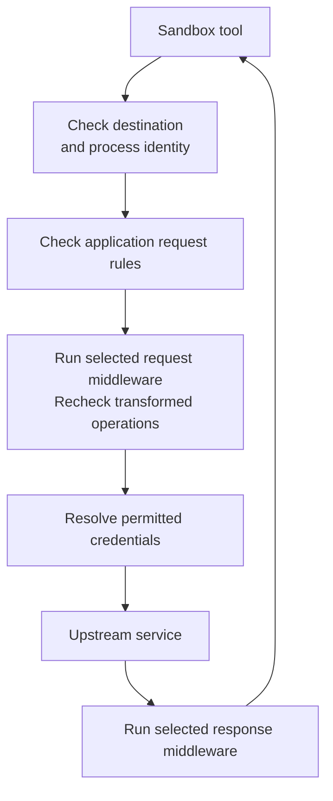
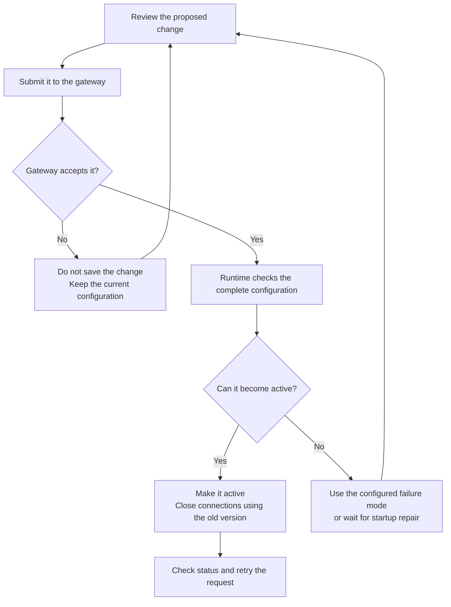

A sandbox policy is a declarative YAML document that defines what programs
inside an OpenShell sandbox can do. It controls which files they can read and
write, which user they run as, which network destinations each program can
reach, and which application requests it can send. OpenShell denies anything the
policy does not allow.

This page explains how policies work. To try one in a running sandbox, follow
[Write Your First Sandbox Network Policy](/get-started/tutorials/first-network-policy).
To create, change, and verify policies, refer to
[Manage Sandbox Policies](/sandboxes/manage-policies).

## What a Policy Controls

A policy contains up to five sections. Different parts of the sandbox runtime
enforce each section, and each section takes effect at a specific time:

| Section | Controls | Enforced by | Takes effect |
|---|---|---|---|
| `filesystem_policy` | Paths programs can read, or read and write. | Landlock LSM in the kernel. | At sandbox startup. |
| `landlock` | Whether an unsupported kernel or inaccessible path aborts startup. | Sandbox startup checks. | At sandbox startup. |
| `process` | User and group for sandbox processes. | Identity change before the workload starts. | At sandbox startup. |
| `network_policies` | Destinations each program can reach and requests it can send. | Sandbox supervisor proxy. | While the sandbox runs. |
| `network_middlewares` | Additional inspection or transformation of allowed traffic. | Sandbox supervisor proxy. | While the sandbox runs. |

The following policy uses every section:

```yaml showLineNumbers={false}
version: 1

# Startup: paths the workload can read, or read and write.
filesystem_policy:
  include_workdir: true
  read_only: [/usr, /lib, /etc]
  read_write: [/tmp]

# Startup: behavior when the kernel or a listed path cannot support a rule.
landlock:
  compatibility: best_effort

# Startup, optional: override the identity selected by the compute driver.
# process:
#   run_as_user: "1500"
#   run_as_group: "1500"

# Live: which programs can reach which destinations.
network_policies:
  github_api:
    name: github-api
    endpoints:
      - host: api.github.com
        port: 443
        protocol: rest
        enforcement: enforce
        access: read-only
    binaries:
      - path: /usr/bin/curl

# Live: middleware applied to allowed traffic, selected by destination host.
network_middlewares:
  regex-redactor:
    name: Redact API tokens
    middleware: openshell/regex
    order: 10
    config:
      mode: redact
    on_error: fail_closed
    endpoints:
      include: ["api.github.com"]
```

When a policy allows network access, OpenShell also adds baseline filesystem
paths that sandbox processes need, such as `/usr`, `/lib`, and `/tmp`, so a
policy can focus on the paths specific to its workload. The
[Default Policy](/reference/default-policy) page lists those paths. The
[Policy Schema Reference](/reference/policy-schema) defines every field.

## How Network Rules Work

Every outbound connection from a sandbox passes through the sandbox supervisor,
which checks it against `network_policies`. If no rule allows the connection,
the supervisor denies it.

### Rules Pair Programs with Destinations

Each entry in `network_policies` is a named rule with a list of `endpoints` and
a list of `binaries`. The rule allows each listed binary to reach each listed
endpoint. A rule with two binaries and two endpoints therefore grants four
connection pairs:

| Binary | Endpoint |
|---|---|
| `/usr/bin/curl` | `api.example.com:443` |
| `/usr/bin/curl` | `uploads.example.com:443` |
| `/usr/bin/python3` | `api.example.com:443` |
| `/usr/bin/python3` | `uploads.example.com:443` |

If Python should reach only `api.example.com`, put that binary and endpoint in a
separate rule.

OpenShell identifies the calling program by its canonical executable path, so a
symlink does not change which rule applies. A rule can also match a trusted
ancestor process, such as the agent that launched a tool. OpenShell pins each
authorized executable to the file digest it first observes, and denies access if
the file at that path later changes.

List the executable that makes the connection, which is not always the command
you type. A script such as `pip` runs under its interpreter, so a rule for
`pip` must list the Python interpreter. Any program that a listed binary
launches can also use the rule. A rule with an empty `binaries` list matches no
program in a sandbox.

### Connection and Request Checks

OpenShell checks network traffic in two layers. The connection check applies to
every connection, and requires the destination host and port and the calling
binary to match a rule. For an endpoint with an inspected `protocol`, OpenShell then
parses each application request and checks it against the endpoint's `access`
preset or `rules`.

The `protocol` field selects what OpenShell inspects after the connection check:

| `protocol` | What OpenShell checks |
|---|---|
| `rest` | HTTP method, path, and query values. |
| `websocket` | The upgrade request and complete client text messages. |
| `graphql` | GraphQL operation type, operation name, and root fields. |
| `mcp` | MCP methods and tool names in client requests. |
| `json-rpc` | JSON-RPC method names in client requests. |
| `tcp` | Nothing beyond the connection. The program gets a native TCP socket and OpenShell does not inspect the payload. |
| Omitted | No request rules. OpenShell still terminates TLS, parses HTTP requests, and checks that each request's authority matches the destination. |

Inspected protocols can allow reads while blocking writes on the same API, which
a connection-only rule cannot do. Use an inspected protocol when the request,
not only the destination, determines the risk.

### Enforce and Audit

The `enforcement` field on an inspected endpoint decides what happens when a
request violates the endpoint's rules:

- `enforce` blocks the request and returns an OpenShell `policy_denied` response.
- `audit` logs the violation and forwards the request. Audit is the default.

Audit mode lets you observe traffic before you enforce a rule, but it blocks
nothing. Set `enforcement: enforce` on every endpoint whose request rules must
block traffic. Audit applies only to request rules. It does not bypass the
destination, binary, credential, or middleware checks.

### Overlapping Rules

Network rules are not an ordered firewall list. Several rules can match the same
connection or request, and every matching allow contributes permission. An
applicable deny takes precedence over any allow, regardless of where either
appears in the file.

For example, suppose one rule allows `GET /repos/**` on a host and another rule
for the same host, port, and binary denies `GET /repos/private/**`. Requests
under `/repos/private/` are denied. When you restrict access, review every rule
that could allow the operation, including rules that providers contribute.

### Request Flow

For inspected HTTP traffic, OpenShell applies its checks in this order:



Middleware runs only on traffic that network rules already allow. It can inspect
or transform requests before OpenShell injects provider credentials, inspect
responses before they reach the sandbox, and inspect complete client WebSocket
text messages. Built-in middleware is available to every policy. External
middleware must be registered with the gateway first. Refer to
[Supervisor Middleware](/extensibility/supervisor-middleware).

### Network Access and Credentials

A network rule that allows traffic does not authorize every provider credential
at that destination. OpenShell supplies a provider credential only to the
destinations that its provider profile or an explicit credential binding
allows. Provider-credentialed endpoints also require inspected traffic unless
the endpoint sets `allow_uninspected_credentials: true`. When a request fails a
credential check, correct the provider binding instead of widening the network
rule. Refer to [Provider Profiles](/providers/profiles).

## Where the Active Policy Comes From

Every sandbox runs under a policy, even when you do not supply one. When more
than one policy is available, OpenShell uses the first applicable source in this
order:

1. A gateway-global policy set by an administrator.
2. The sandbox's saved policy. At creation, `--policy` takes precedence over
   `OPENSHELL_SANDBOX_POLICY`. Later policy changes update the saved policy.
3. A policy included in the sandbox image.
4. OpenShell's restrictive [default policy](/reference/default-policy).

An invalid image policy keeps the workload from starting until you repair it.
OpenShell does not skip it and use the default.

### Base and Effective Policies

The selected sandbox policy is the base policy. Attached providers can
contribute additional network rules, for example so that a GitHub provider can
reach the GitHub API. The effective policy combines the base policy with those
provider rules, and it is the policy the sandbox enforces.

Start edits from the base policy so you do not copy provider-owned rules into
your own configuration. Inspect the effective policy when you need to know what
the sandbox can reach. [Inspect the Current
Policy](/sandboxes/manage-policies#inspect-the-current-policy) shows both views.

### Gateway-Global Policy

A gateway administrator can apply one policy to every sandbox on the gateway.
The global policy replaces each sandbox's policy. It is not a ceiling
intersected with existing grants. While it is active, sandbox policy changes are
blocked and provider-contributed network rules are suppressed. Credential
authorization remains a separate check, so a global network grant does not make
a provider credential usable at a destination.

Deleting the global policy restores normal policy selection and provider rules.
Refer to [Apply a Gateway-Wide
Policy](/sandboxes/manage-policies#apply-a-gateway-wide-policy) for the
commands.

## How Changes Take Effect

Live sections and startup sections behave differently when a policy changes:

| Change | Effect on a running sandbox | Required action |
|---|---|---|
| Network rules | The sandbox receives the new rules. Connections that use the previous configuration close. | Apply the change, then retry the request. |
| Middleware in `network_middlewares` | You can add, remove, or reconfigure built-in middleware and external services already registered with the gateway. | Apply the change with `openshell policy set`. |
| External middleware registration | Policy changes cannot register a service or change its gateway connection settings. | Update the gateway configuration and restart the gateway. |
| Added filesystem paths | The saved policy can change, but the running workload keeps its existing filesystem permissions. | Recreate the sandbox. |
| Removed filesystem paths, or changed workdir, Landlock, or process settings | OpenShell rejects the change after the workload starts. | Recreate the sandbox. |

OpenShell calls each version of the active configuration a generation. When a
new generation becomes active, OpenShell closes HTTP keep-alive connections,
tunnels, upgrades, and long-lived streams that still use the previous one. A
parsed WebSocket relay closes with code `1012`. The client must reconnect so its
next request uses the new configuration.

Every change passes validation before it becomes active:



The gateway checks a proposed policy before saving it. The sandbox checks the
complete effective configuration again before activating it, because it also
sees provider changes and concurrent updates. If activation fails, the gateway's
`policy_validation_failure_mode` setting decides whether the sandbox blocks new
egress (`fail_closed`, the default) or keeps the last valid configuration
(`retain_last_valid`). [Troubleshoot Sandbox
Policies](/sandboxes/troubleshoot-policies) explains how to identify and repair
each kind of failure.

## Next Steps

- Use [Manage Sandbox Policies](/sandboxes/manage-policies) to create, update,
  verify, and roll back policies.
- Use [Network Policy Recipes](/sandboxes/network-policy-recipes) for rules you
  can adapt for REST APIs, package registries, WebSocket, GraphQL, MCP,
  JSON-RPC, and native TCP.
- Use [Policy Advisor](/sandboxes/policy-advisor) to let an agent propose narrow
  network changes for your review.
- Use the [Policy Schema Reference](/reference/policy-schema) for every field,
  default, and validation rule.
