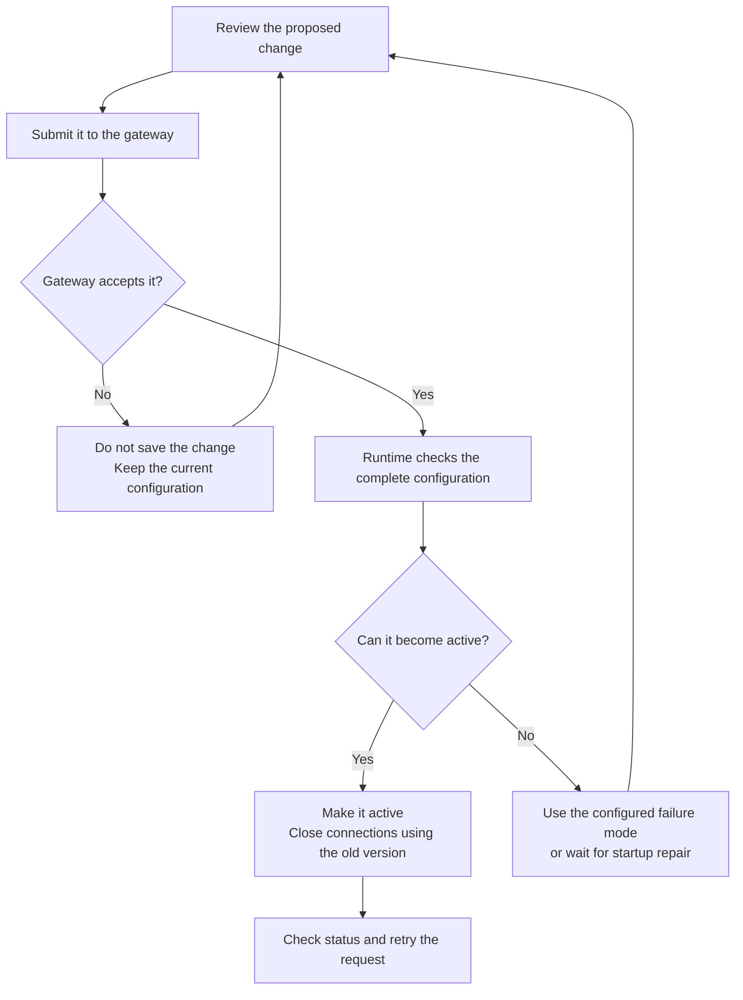

Sandbox policies define what programs can access and which actions they can take
within an OpenShell sandbox. OpenShell uses declarative YAML configurations to
specify which files programs can access, which network destinations they can
reach, and which application requests they can make.

This guide explains how to inspect, change, and verify those permissions.

## Policy Configuration

The policy configuration file groups related settings into sections, each
controlling a different aspect of how programs run and interact with their
environment.

Filesystem settings define where programs can read and write, and process
settings select the user and group they run as. Network rules define which
services each program can reach and which requests it can send. Optional
middleware can inspect or transform allowed traffic, for example to redact
sensitive content from a request.

The configuration contains the following policy sections:

```yaml
version: 1
filesystem_policy: { ... }   # Paths programs can read or write.
landlock: { ... }            # Linux filesystem enforcement settings.
process: { ... }             # User and group for sandbox processes.
network_policies: { ... }    # Network destinations and permitted requests.
network_middlewares: { ... } # Additional traffic processing.
```

Refer to the [Policy Schema Reference](/reference/policy-schema) for every
accepted field.

## Apply Policy Changes

Every sandbox runs under a policy, but you do not have to supply a policy file
when creating one. OpenShell uses an existing policy or falls back to its
restrictive default. See [How OpenShell Selects a Policy](#how-openshell-selects-a-policy)
for the selection order.

You can update network rules while a sandbox is running. Changes to filesystem
permissions and process identity require recreating the sandbox to take effect.
See [Understand Reloads](#understand-reloads) for the limits on each type of
change.

The OpenShell CLI provides three ways to apply changes. Choose based on whether
you are creating a sandbox, changing network permissions, or replacing its
configuration:

| Command | Use it when | Important behavior |
|---|---|---|
| `openshell sandbox create --policy` | You know the complete policy before creation. | The file supplies the sandbox's initial policy and can set startup-time controls. |
| `openshell policy update` | You need to add or remove network permissions. | It changes only `network_policies` and preserves every other section. |
| `openshell policy set` | You need to replace the complete policy, including middleware or startup settings. | Start from the current base so you preserve required startup settings and exclude provider-owned rules. |

### Inspect the Current Policy

The base policy is the policy configured for the sandbox. Attached providers can
contribute additional network rules; the effective policy includes those rules
alongside the base policy. Start sandbox policy edits from the base view so you
do not copy provider-owned rules into your configuration.

In the command examples, replace `my-sandbox` with the name of your sandbox:

```shell
openshell policy get my-sandbox --base
openshell policy get my-sandbox --full
```

Check the effective view's `Source` field for a gateway-global override, which
blocks sandbox policy changes. Review all rules that could allow the operation
you intend to restrict. Matching rules can contribute permissions together, and
an applicable request deny takes precedence over an allow. See
[Understand Overlapping Rules](/sandboxes/network-policy-recipes#understand-overlapping-rules)
for the matching rules.

For review or a [policy containment check](/reference/policy-prover), export the
effective policy as YAML:

```shell
openshell sandbox get my-sandbox --policy-only > effective-policy.yaml
```

The effective export can contain provider-owned rules. Prepare edits from the
base view, as described in [Replace the Policy](#replace-the-policy).

### Update Network Rules

To give a program access to a service, add an endpoint specifying its executable
path, destination, and permitted request types. For a sandbox containing
`/usr/bin/curl`, this command adds
read-only access to the GitHub API:

```shell
openshell policy update my-sandbox \
  --rule-name github_readonly \
  --binary /usr/bin/curl \
  --add-endpoint api.github.com:443:read-only:rest:enforce \
  --wait
```

Here, `rest` enables HTTP request inspection, `read-only` permits GET, HEAD, and
OPTIONS, and `enforce` blocks requests outside that set. The default enforcement
mode is `audit`, which logs an applicable request-rule violation but forwards the
request. Other matching rules can also grant permissions, so inspect the
effective policy before relying on a restriction.

The binary path must match the executable inside the sandbox. For other
protocols and their YAML configuration, see
[Configure Network Policy Rules](/sandboxes/network-policy-recipes).

For changes to an existing rule, take its name, binaries, and endpoint details
from the base policy. Request-rule edits require the complete affected scope so
the command identifies exactly which permissions will change. You can also
remove one named rule or remove a destination across rules.

To preview an incremental operation, use `--dry-run` instead of `--wait`. The CLI
fetches the current policy and shows the proposed result without saving it. This
preview does not run every check needed to activate the change. The
[Incremental Policy Update Reference](/reference/policy-updates) covers command
syntax, targeting requirements, and removal behavior.

### Replace the Policy

A full replacement supplies every section of the policy, including settings
you intend to keep. Begin with the current base:

```shell
openshell policy get my-sandbox --base
```

The base view prints status metadata followed by a `---` separator and the policy
in YAML. Copy only the YAML below the separator into `policy.yaml`. Keep the
complete policy, including its filesystem, Landlock, process, and unrelated
network settings, then edit the sections you intend to change. Do not redirect
the entire output into a policy file, because the metadata is not part of the
policy.

Submit the edited file with `--wait` to wait for its revision result:

```shell
openshell policy set my-sandbox --policy policy.yaml --wait
```

The new policy must pass validation before becoming active. Changes to startup
settings remain subject to the limits in [Understand Reloads](#understand-reloads).

To restore an earlier compatible base revision, follow [Restore an Earlier Base
Revision](/sandboxes/troubleshoot-policies#restore-an-earlier-base-revision).
For scripted exports, the command reference includes an optional
[JSON workflow](/reference/policy-updates#full-replacement) using `jq`.

### Verify the Change

A successful submission means the gateway accepted the change. With `--wait`,
the CLI also waits for a revision result, but success can mean the revision
loaded, made no change, or was superseded by another update. Inspect policy
history and the effective configuration before relying on new permissions:

```shell
openshell policy list my-sandbox
openshell policy get my-sandbox --full
```

Then test an operation that should be allowed and one that should be blocked.
Confirm any denial comes from OpenShell rather than the destination service or
a missing client tool. The [first network policy
tutorial](/get-started/tutorials/first-network-policy) demonstrates these checks
in a prepared sandbox.

## Understand Reloads

OpenShell validates a proposed policy before activating it. Network rules and
the policy's middleware settings can change while the workload runs. Filesystem
and process settings take effect at startup. External middleware registration is
a separate gateway operation.

| Change | Running workload behavior | Required action |
|---|---|---|
| Network request rules | The running workload receives the new rules. Connections using the previous active configuration close. | Use `update` or `set`, inspect status, and retry. |
| Middleware selected or configured in `network_middlewares` | You can add, remove, or reconfigure built-in middleware and external services already registered with the gateway. | Preserve the base and use `set`; `update` does not edit middleware. |
| External middleware registration in gateway TOML | Policy updates cannot register a new service or change its gateway connection settings. | Update the registration and restart the gateway. |
| First native TCP endpoint | The standard runtime can add it while the workload runs because policy DNS and transparent capture are already available. | Use `update` or `set`, inspect status, and retry. |
| Added filesystem paths | The saved policy can change, but the running workload keeps its existing filesystem permissions. | Recreate the sandbox to apply the new startup configuration. |
| Removed baseline paths or changed workdir, Landlock, or process identity | OpenShell rejects the change after the workload starts. | Recreate the sandbox with the intended startup configuration. |
| Repair before first activation | If the workload has never started, you can replace rejected startup settings. | Repair them before provisioning times out. |

OpenShell calls each version of the active configuration a generation. When a
new generation becomes active, OpenShell closes HTTP keep-alive connections,
tunnels, upgrades, and long-lived streams that still use the previous one. A
parsed WebSocket relay closes with code `1012`. The client must reconnect so its
next request uses the new configuration.



A no-op update may create no new revision. If validation fails, the effect on
existing access depends on the failure stage and the configured runtime failure
mode. [Troubleshoot Sandbox Policies](/sandboxes/troubleshoot-policies) explains
how to identify that stage and repair the configuration.

## How OpenShell Selects a Policy

When more than one policy is available, OpenShell uses the first applicable
policy in this order:

1. A gateway-global policy set by an administrator.
2. The sandbox's saved policy. At creation, `--policy` takes precedence over
   `OPENSHELL_SANDBOX_POLICY`; subsequent policy changes update the saved policy.
3. A policy included in the sandbox image.
4. OpenShell's [restrictive default policy](/reference/default-policy).

OpenShell then adds network rules from attached providers, unless a
gateway-global policy is active. A global policy replaces the sandbox's policy
and suppresses provider-added rules, as described below.

An invalid image policy must be repaired before the workload can start;
OpenShell does not skip it and use the default. See
[Troubleshoot Sandbox Policies](/sandboxes/troubleshoot-policies) for repair guidance.

## Global Policy Override

A gateway administrator can apply one policy across the gateway's sandboxes.
This global override replaces each sandbox policy; it is not a ceiling
intersected with existing grants. While it is active, sandbox policy updates
are blocked and provider-added network grants
are suppressed. Credential authorization remains a separate check, so a network
grant alone does not make a provider credential usable at a destination.

Deleting the global override restores normal sandbox selection and provider
composition. The gateway rejects restoration when the resulting effective
configuration is invalid. Inspect effective policy before, during, and after an
operator changes the override.

The OpenShell CLI provides separate operations for managing the override:

| Operation | Command |
|---|---|
| Inspect the current override. | `openshell policy get --global --full` |
| Apply a reviewed complete policy. | `openshell policy set --global --policy ./global-policy.yaml` |
| View global policy history. | `openshell policy list --global` |
| Remove the override and restore normal policy selection. | `openshell policy delete --global` |

The set and delete commands ask for confirmation unless you pass `--yes`. Keep
the prompt during interactive work because each operation changes the network
model for every sandbox on the gateway.

## Allow Native TCP Connections

Some applications, such as database clients, need a native connection rather
than an HTTP proxy. `protocol: tcp` provides ordinary DNS resolution and a native
TCP socket without application payload inspection. It supports Docker and
Podman. The standard runtime prepares DNS and TCP connection handling even when
the initial policy has no TCP endpoints, so you can add the first endpoint
without recreating the sandbox. Refer to
[Configure Network Policy Rules](/sandboxes/network-policy-recipes#allow-native-tcp)
for the recipe and shared-hosting limitations.

## Supervisor Middleware

For traffic that needs additional inspection or transformation,
`network_middlewares` selects middleware, the destination hosts it applies to,
and its configuration. Network rules must allow the traffic
before middleware can process it.

Middleware can inspect HTTP requests before credential injection, HTTP responses
before they reach the sandbox, and complete client WebSocket text messages. Each
implementation declares which operations it supports; matching a destination
host does not enable unsupported operations. Binary and upstream-to-client
WebSocket messages are not inspected.

Built-in middleware is available without registration. External middleware must
be registered in the gateway configuration before a policy can use it. Once it
is registered, a policy change can add it to or remove it from a running sandbox,
or change its policy settings. Adding or changing the gateway registration
requires restarting the gateway. Refer to
[Supervisor Middleware](/extensibility/supervisor-middleware) for registration,
processing order, supported transformations, and failure behavior.

## Validation Failures

A local parse error, gateway preflight rejection, initial configuration failure,
runtime rejection, wait timeout, credential denial, and middleware denial have
different effects. Do not widen endpoint access to repair a credential or
middleware problem.

Use [Troubleshoot Sandbox Policies](/sandboxes/troubleshoot-policies) to identify
the stage, whether the previous policy remains active, and the corrective action.
Gateway failure-mode settings are defined in
[Gateway Configuration](/reference/gateway-config).

## Next Steps

- Use [Configure Network Policy Rules](/sandboxes/network-policy-recipes) for
  REST, native TCP, WebSocket, GraphQL, MCP, and JSON-RPC recipes.
- Use the [Policy Schema Reference](/reference/policy-schema) for fields,
  defaults, matching rules, and constraints.
- Use [Policy Advisor](/sandboxes/policy-advisor) to let a sandbox propose a
  narrow network change for review.
- Use the [Standalone Policy Prover](/reference/policy-prover) as an optional
  containment check. Its result covers only the modeled domains and does not
  apply policy or attest runtime state.
