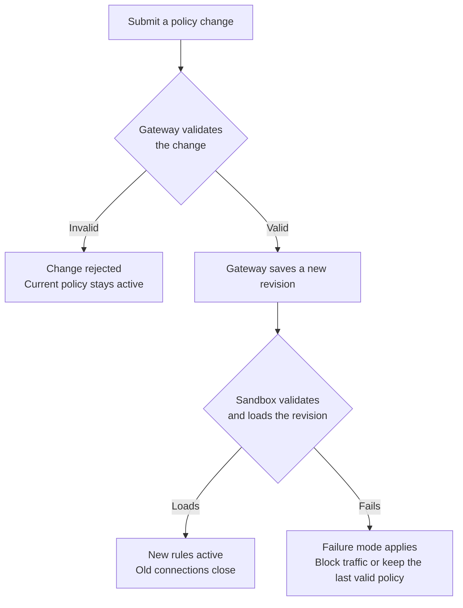

A sandbox policy is a YAML configuration that controls what a sandbox can
access. It defines which files processes in the sandbox can read and write,
which user they run as, which network destinations each binary can reach, and
which requests it can send. OpenShell denies anything the policy does not allow.

This page explains how policies work. To try one in a running sandbox, follow
[Write Your First Sandbox Network Policy](/get-started/tutorials/first-network-policy).
To create and change policies, refer to
[Manage Sandbox Policies](/sandboxes/manage-policies).

## What a Policy Controls

A policy file has up to five top-level sections. Each section controls a
different part of the sandbox and takes effect at a specific time:

| Section | Controls | Enforced by | Takes effect |
|---|---|---|---|
| `filesystem_policy` | Paths that sandbox processes can read, or read and write. | Landlock LSM in the kernel. | At sandbox startup. |
| `landlock` | Whether an unsupported kernel or an inaccessible path stops the sandbox from starting. | Sandbox startup checks. | At sandbox startup. |
| `process` | User and group that sandbox processes run as. | Identity change before the workload starts. | At sandbox startup. |
| `network_policies` | Destinations each binary can reach, and the requests it can send. | Sandbox network proxy. | While the sandbox runs. |
| `network_middlewares` | Additional inspection or transformation of allowed network traffic. | Sandbox network proxy. | While the sandbox runs. |

Network rules make up most of a typical policy. OpenShell denies every outbound
connection from a sandbox unless a rule in `network_policies` allows it. Each
rule lists the destinations it allows and the binaries that can reach them, and
can also restrict the requests those binaries send, for example to allow reading
from an API but not writing to it. [Network Rules](/sandboxes/network-rules)
explains how OpenShell evaluates rules and gives examples you can adapt.

The startup sections are fixed once the sandbox starts. The network sections
can change while it runs. The [Policy Schema Reference](/reference/policy-schema)
describes the complete file format, and [Supervisor
Middleware](/extensibility/supervisor-middleware) explains how middleware
processes traffic.

## Where the Active Policy Comes From

Every sandbox runs under a policy, even when you do not supply one. When more
than one policy is available, OpenShell uses the first applicable source in this
order:

1. A gateway-global policy set by an administrator.
2. The sandbox's saved policy. At creation, `--policy` takes precedence over
   `OPENSHELL_SANDBOX_POLICY`. Later policy changes update the saved policy.
3. A policy included in the sandbox image.
4. OpenShell's restrictive [default policy](/reference/default-policy).

An invalid image policy keeps the workload from starting until you repair it.
OpenShell does not skip it and use the default.

### Base and Effective Policies

The selected sandbox policy is the base policy. Attached providers can
contribute additional network rules, for example so that a GitHub provider can
reach the GitHub API. The effective policy combines the base policy with those
provider rules, and it is the policy the sandbox enforces.

Start edits from the base policy so you do not copy provider-owned rules into
your own configuration. Inspect the effective policy when you need to know what
the sandbox can reach. [Inspect the Current
Policy](/sandboxes/manage-policies#inspect-the-current-policy) shows both views.

### Gateway-Global Policy

A gateway administrator can apply one policy to every sandbox on the gateway.
The global policy replaces each sandbox's policy. It is not a ceiling
intersected with existing grants. While it is active, sandbox policy changes are
blocked and provider-contributed network rules are suppressed. Deleting the
global policy restores normal policy selection and provider rules. Refer to
[Apply a Gateway-Wide
Policy](/sandboxes/manage-policies#apply-a-gateway-wide-policy) for the
commands.

## How Changes Take Effect

The network sections of a policy can change while a sandbox runs. The startup
sections cannot:

| Change | Effect on a running sandbox | Required action |
|---|---|---|
| Network rules | The sandbox loads the new rules. Connections opened under the previous rules close. | Apply the change, then retry the request. |
| Middleware in `network_middlewares` | You can add, remove, or reconfigure built-in middleware and external services already registered with the gateway. | Apply the change with `openshell policy set`. |
| External middleware registration | Policy changes cannot register a service or change its gateway connection settings. | Update the gateway configuration and restart the gateway. |
| Added filesystem paths | The saved policy can change, but the running workload keeps its existing filesystem permissions. | Recreate the sandbox. |
| Removed filesystem paths, or changed workdir, Landlock, or process settings | OpenShell rejects the change after the workload starts. | Recreate the sandbox. |

When new network rules take effect, OpenShell closes connections that were
opened under the previous rules, including HTTP keep-alive connections, tunnels,
WebSocket connections, and long-lived streams. Clients must reconnect, and their
next requests are checked against the new rules.

OpenShell validates every change twice before it takes effect:

The sandbox validates the revision again because it also accounts for provider
rules and other changes that arrive at the same time. If the sandbox cannot load
a revision, the gateway's `policy_validation_failure_mode` setting decides what
happens. With `fail_closed`, the default, the sandbox blocks network traffic
until you submit a valid policy. With `retain_last_valid`, the last valid policy
stays active. [Troubleshoot Sandbox Policies](/sandboxes/troubleshoot-policies)
explains how to identify and repair each kind of failure.

## Next Steps

- Use [Network Rules](/sandboxes/network-rules) to learn how OpenShell
  evaluates network rules and to adapt examples for common services.
- Use [Manage Sandbox Policies](/sandboxes/manage-policies) to create, update,
  verify, and roll back policies.
- Use [Policy Advisor](/sandboxes/policy-advisor) to let an agent propose narrow
  network changes for your review.
- Use the [Policy Schema Reference](/reference/policy-schema) for every field,
  default, and validation rule.
