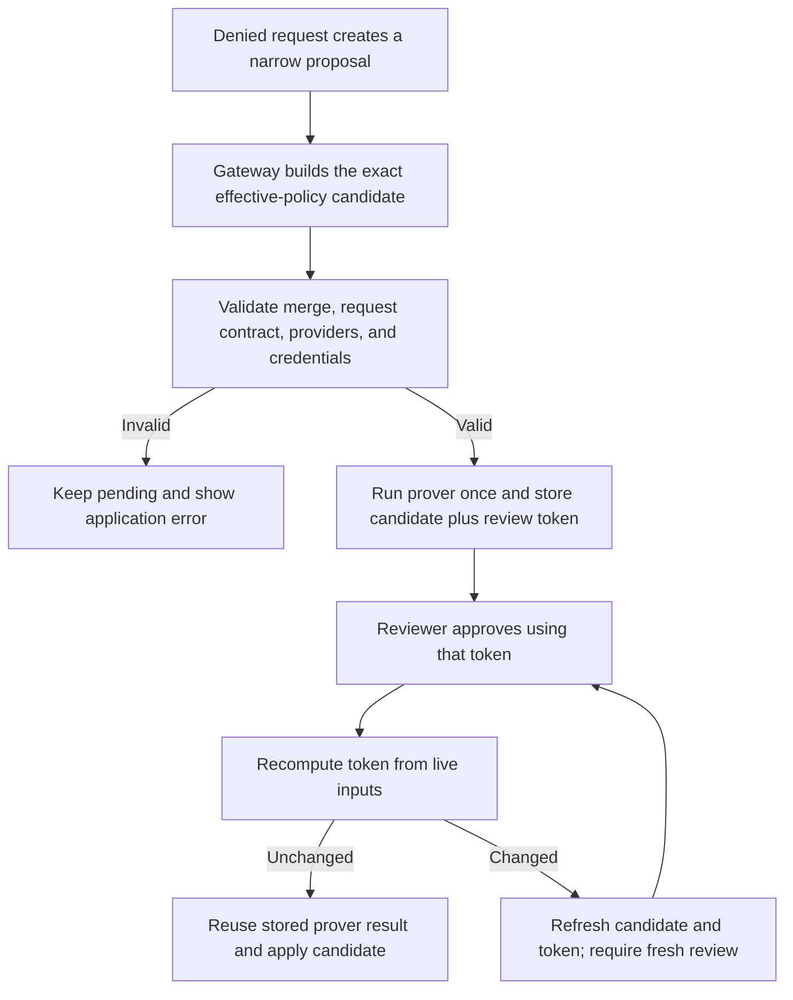

Policy advisor lets a running sandboxed agent ask for a narrow network policy
change after OpenShell denies a request. The agent submits a draft through
`policy.local`, a developer approves or rejects it from outside the sandbox, and
approved network policy hot-reloads into the same sandbox.

Policy advisor preserves OpenShell's default-deny posture. The structured rule
is the approval contract, and the agent's rationale is supporting context. By
default, every accepted proposal waits in the draft inbox for human review.
Opt-in [auto mode](#automatic-approval) approves a proposal without a reviewer
only when the policy prover finds no new risk and the rule produces no security
notes.

## How It Works

When policy advisor is enabled, the sandbox supervisor turns on these
agent-facing surfaces:

- It installs `/etc/openshell/skills/policy_advisor.md` inside the sandbox.
- It installs `/etc/openshell/skills/policy-advisor/SKILL.md` as a short
  Codex and generic-agent pointer, and writes a root `/AGENTS.md` pointer only
  when the image does not already provide one.
- It serves `http://policy.local` from inside the sandbox.
- It adds `agent_guidance` and `next_steps` to request-level `policy_denied`
  response bodies so the agent can find the skill and local API.

A proposal moves through this loop:

1. A sandboxed process attempts a network request that policy denies. For
   inspected REST traffic, OpenShell returns a structured `403` body with fields
   such as `layer`, `host`, `port`, `binary`, `method`, `path`, `rule_missing`,
   `agent_guidance`, and `next_steps`.
2. The agent reads the policy advisor skill, inspects the current policy, and
   optionally reads recent denial log lines.
3. The agent submits one or more `addRule` proposals to
   `http://policy.local/v1/proposals`.
4. The gateway turns each proposal into the exact effective-policy candidate it
   would apply, validates it, and runs the [policy prover](#automatic-approval)
   against it.
5. A developer approves or rejects the proposal. In auto mode, the gateway
   approves an eligible proposal without review.
6. The agent waits on `/v1/proposals/{chunk_id}/wait` until a decision is
   available.

When a proposal is approved, `/wait` reports `policy_reloaded: true` only after
the local sandbox policy covers the approved rule. At that point the agent can
retry the original denied action once. If a proposal is rejected, `/wait`
returns `rejection_reason` and `validation_result` so the agent can revise or
stop. `validation_result` carries the categorical prover findings, so the agent
can narrow the next attempt to the specific concern the prover flagged.

## Enable Policy Advisor

Policy advisor is disabled by default. Enable it globally when you want every
sandbox on the selected gateway to expose the agent proposal surface:

```shell
openshell settings set --global \
  --key agent_policy_proposals_enabled \
  --value true \
  --yes
```

You can also enable it for one sandbox, unless the key is managed globally:

```shell
openshell settings set <sandbox-name> \
  --key agent_policy_proposals_enabled \
  --value true
```

Check the effective setting for a sandbox:

```shell
openshell settings get <sandbox-name>
```

The output shows whether `agent_policy_proposals_enabled` is `global`,
`sandbox`, or `unset`. A global value overrides sandbox-scoped values. To return
control to sandbox-scoped settings, delete the global key:

```shell
openshell settings delete --global \
  --key agent_policy_proposals_enabled \
  --yes
```

Set the value before creating a sandbox when you want the first denied request
to include policy advisor guidance. Running sandboxes poll settings and can
enable the surface after startup, but startup enablement gives the agent the
clearest first-denial path.

## Review Proposals

Review pending proposals from the host:

```shell
openshell rule get <sandbox-name> --status pending
```

The output shows the chunk ID, status, rationale, binary, endpoint summary,
prover result, application error (if any), and candidate hash. For request-level
proposals, the endpoint summary includes the protocol, method, and path:

```text
Endpoints: api.github.com:443 [L7 rest, allow PUT /repos/NVIDIA/OpenShell/contents/docs/**]
```

Approve only when the structured rule matches the access you intend to grant:

```shell
openshell rule approve <sandbox-name> --chunk-id <chunk-id>
```

Reject with guidance when the rule is too broad or points at the wrong target:

```shell
openshell rule reject <sandbox-name> \
  --chunk-id <chunk-id> \
  --reason "Scope this to docs/ paths only."
```

The rejection reason is returned to the agent through `policy.local`. The agent
can use it to draft a narrower proposal.

Reviewers see the same guidance in the terminal UI. Run `openshell term`, open
the sandbox's draft inbox, and select a rejected chunk to open its detail popup.
The stored reason appears on a `Guidance:` line, and the list row shows a
shortened copy of it. Rejection reasons have no length limit, so long guidance
wraps and the popup body scrolls with `j`/`k`, `PageUp`/`PageDown`, and
`g`/`G`. The approve and close controls stay pinned below the body, and the
bottom border shows the scroll position.

### Review Tokens

Each stored proposal records its candidate policy, prover result, any
application error, and a review token tied to the live base policy, provider
rules, and non-secret credential metadata. Provider rules remain immutable
inputs.



`openshell rule approve` fetches the current review token and submits it with
the approval. Before applying the proposal, the gateway recomputes the token
from live inputs. When the token is unchanged, it reuses the stored prover
result. When policy, provider, or credential inputs changed after the proposal
was displayed, the gateway evaluates and stores the refreshed candidate, leaves
the proposal pending, and asks you to review it again. Run `rule get` before
retrying. Bulk approval binds each selected proposal to its own review token in
the same way, and edits and deduplicated resubmissions follow the same path.

Merge, policy-shape, provider-composition, credential, or prover failures are
shown as application errors and cannot be approved.

## Automatic Approval

Every proposal, whether mechanistic or agent-authored, is routed through the
policy prover. The gateway also recalculates security notes from the current
draft rule. The `proposal_approval_mode` setting decides whether proposals that
pass both checks still require human review:

| Proposal | `manual` or unset | `auto` |
|---|---|---|
| Empty prover delta and no security notes | Waits in the draft inbox for human review. | Approved automatically. The sandbox hot-reloads the new rule and the agent retries. |
| Any prover finding or security note | Waits in the draft inbox. | Remains pending for human review. |

`manual` is the default. Enable auto mode at gateway scope when you want every
sandbox on this gateway to auto-approve eligible proposals:

```shell
openshell settings set --global \
  --key proposal_approval_mode \
  --value auto \
  --yes
```

Enable it for one sandbox when no global value is set:

```shell
openshell settings set <sandbox-name> \
  --key proposal_approval_mode \
  --value auto
```

The create-time shorthand writes the sandbox-scoped setting for you:

```shell
openshell sandbox create --approval-mode auto <name>
```

Only `manual` and `auto` are accepted, and typos such as `autom` are rejected
when you set the value. Stale or unknown values found in storage are treated as
`manual` at runtime as a defense-in-depth measure. Gateway scope wins over
sandbox scope, so a reviewer can pin `manual` for a fleet by setting it
globally. Per-sandbox values apply only when no global value is set.

Under `auto` mode, approved proposals appear under
`openshell rule get <sandbox-name> --status approved` with auto-approval audit
fields. Under `manual` mode, every accepted proposal appears as pending
regardless of the prover verdict or security notes.

### What the Prover Checks

Auto-approval requires all three conditions: the effective mode is `auto`, the
prover delta is empty, and recalculating security notes from the current stored
rule produces none.

The prover asks four formal questions about the proposed change. Each "yes" is
one categorical finding, and any finding blocks auto-approval:

| Category | Triggered when |
|---|---|
| `link_local_reach` | A rule reaches `169.254.0.0/16`, `fe80::/10`, or a known metadata hostname. |
| `l7_bypass_credentialed` | A binary using a wire protocol the request proxy cannot inspect (`git-remote-https`, `ssh`, `nc`) gains reach to a host where a credential is in scope. |
| `credential_reach_expansion` | A binary gains credentialed reach to a `(host, port)` it could not reach before. |
| `capability_expansion` | On a `(binary, host, port)` that already had credentialed reach, the proposal adds a new HTTP method. The finding cites the specific method. |

Findings are categorical, with no severity tier. The reviewer reads the category
and the structured evidence to decide.

Security notes flag concerns such as internal or private destinations and
`allowed_ips`, wildcard hosts, hostless `allowed_ips`, ephemeral ports, and
well-known database or service ports. Any prover finding or security note keeps
the proposal pending in auto mode.

The full reasoning model is in
[`crates/openshell-prover/README.md`](https://github.com/NVIDIA/OpenShell/blob/main/crates/openshell-prover/README.md).
Provider profiles composed in through [Profiles](/providers/profiles) are part
of the effective policy the prover reasons over.

## What Agents Can Propose

OpenShell has two proposal paths:

| Path | Source | Typical rule shape |
|---|---|---|
| Mechanistic mapper | Aggregated denial summaries from the sandbox. | Groups by host, port, and binary. If request samples are available, it can draft REST method and path rules. Otherwise it drafts an endpoint-only rule. |
| Agent-authored proposal | The in-sandbox agent, using `policy.local`. | Usually a REST `addRule` with exact host, port, binary, method, and path from the structured denial. It can also omit `protocol` for endpoint-only access through the explicit proxy. |

For REST APIs, prefer request rules over broad endpoint access. A good proposal
allows one method and the smallest safe path:

```json
{
  "intent_summary": "Allow gh to update documentation in NVIDIA/OpenShell.",
  "operations": [
    {
      "addRule": {
        "ruleName": "github_contents_docs_write",
        "rule": {
          "name": "github_contents_docs_write",
          "endpoints": [
            {
              "host": "api.github.com",
              "port": 443,
              "protocol": "rest",
              "enforcement": "enforce",
              "rules": [
                {
                  "allow": {
                    "method": "PUT",
                    "path": "/repos/NVIDIA/OpenShell/contents/docs/**"
                  }
                }
              ]
            }
          ],
          "binaries": [
            {
              "path": "/usr/bin/gh"
            }
          ]
        }
      }
    }
  ]
}
```

The `policy.local` proposal shape covers explicit-proxy endpoints and REST
method or path rules. Agent-authored proposals cannot set `protocol: tcp` or
`tls: skip`, because those modes bypass application-authority inspection. When a
task requires native TCP or a raw TLS tunnel, a developer must add the rule
through the normal [policy workflow](/sandboxes/manage-policies). Omitting
`protocol` remains supported and keeps the explicit proxy's default TLS
termination and HTTP authority checks. Other fields, such as WebSocket
credential rewrite, GraphQL operation matching, endpoint path scoping, and
provider-owned policy bundles, are also outside the proposal surface.

### Private and Blocked Destinations

Policy advisor proposals do not add `allowed_ips` automatically. If an
advisor-proposed hostname resolves to an internal or private address, OpenShell's
SSRF protections block the connection until a developer explicitly adds the
required `allowed_ips` entry.

Private RFC 1918, CGNAT, IPv6 ULA, and other special-use destinations classified
as internal produce advisory security notes when they appear as literal endpoint
IPs or in `allowed_ips`. CIDR intersections are included, and hostless
`allowed_ips` rules receive an additional warning because they can match any
hostname resolving into the configured range.

Always-blocked destinations are not advisory. Loopback, link-local, and
unspecified IPs or CIDRs, plus `localhost` and known metadata endpoint
hostnames, are excluded from security notes. Submit and edit can store such a
draft, but approval fails when merge validation prevents it from entering the
active policy. Runtime SSRF protections continue to enforce the same boundary.

### Proposal Provenance

OpenShell records internally whether policy advisor introduced an endpoint or a
binary. Provenance is not a policy YAML field. When an advisor proposal overlaps
an endpoint that a user or provider declared explicitly, the explicit
declaration wins and a provider rule stays immutable. For example, a GitHub
provider can declare read access to `api.github.com:443`, and an approved
proposal for `PUT /repos/NVIDIA/OpenShell/contents/docs/**` on the same endpoint
is stored in the sandbox policy layer.

Provenance does not hide a real conflict. Overlapping declarations still fail
validation if they disagree on settings that must have one value, such as TLS
mode, `allowed_ips`, an equally specific protocol or parser contract, credential
binding, or enforcement mode. Compatible allow and deny rules can combine.

Advisor-introduced endpoints and binaries do not establish exact-host SSRF
trust, which requires an explicit exact endpoint and matching binary in the same
rule. A proposal cannot extend a provider's binary identity to a different
binary. For example, if a provider declares `api.github.com:443` for
`/usr/bin/gh` and the advisor proposes the same endpoint for `/usr/bin/curl`,
the proposed rule for `curl` remains subject to the normal SSRF checks.

## Agent API

`policy.local` is available only inside the sandbox and uses plain HTTP:

| Endpoint | Purpose |
|---|---|
| `GET /v1/policy/current` | Returns the current effective sandbox policy as YAML. |
| `GET /v1/denials?last=10` | Returns recent denied OCSF shorthand log lines, newest first. Query strings are redacted before lines are returned to the agent. |
| `POST /v1/proposals` | Submits `addRule` operations. The response includes `accepted_chunk_ids` and `rejection_reasons`. |
| `GET /v1/proposals/{chunk_id}` | Returns one proposal's current `pending`, `approved`, or `rejected` status. |
| `GET /v1/proposals/{chunk_id}/wait?timeout=300` | Holds one HTTP request open until the proposal is approved, rejected, or the timeout expires. |

If policy advisor is disabled, every route returns `404 feature_disabled`, the
skill is not installed for new sandboxes, and request-level deny bodies do not
advertise `policy.local` routes or include `agent_guidance`.

## Audit Events

Approved network rules hot-reload without restarting the sandbox. Connections
attached to the previous policy generation close at the reload boundary, so a
retry opens against the current generation. Refer to [How Changes Take
Effect](/sandboxes/policies#how-changes-take-effect) for HTTP, WebSocket,
tunnel, and long-lived stream behavior.

Policy advisor emits audit events into the sandbox log. Use these lines to
trace the full loop:

```shell
openshell logs <sandbox-name> --since 10m
```

Look for `HTTP:* DENIED`, `CONFIG:PROPOSED`, `CONFIG:APPROVED` or
`CONFIG:REJECTED`, `CONFIG:LOADED`, and the final allowed request if the agent
retries successfully. Every auto-approval emits `CONFIG:APPROVED` with
`auto=true`, `source=<mechanistic|agent_authored>`, `prover_delta=empty`, and
`resolved_from=<gateway|sandbox|default>`, so operators can reconstruct why an
approval ran without human review.

## Next Steps

- Use [Manage Sandbox Policies](/sandboxes/manage-policies) for manual policy
  changes.
- Use [Network Rules](/sandboxes/network-rules) and the
  [Policy Schema Reference](/reference/policy-schema) for rule syntax outside
  the proposal surface.
- Use the [Standalone Policy Prover](/reference/policy-prover) for optional
  boundary checks and its explicit modeled-domain limits.
- Use [Logging](/observability/logging) to interpret OCSF shorthand log entries.
